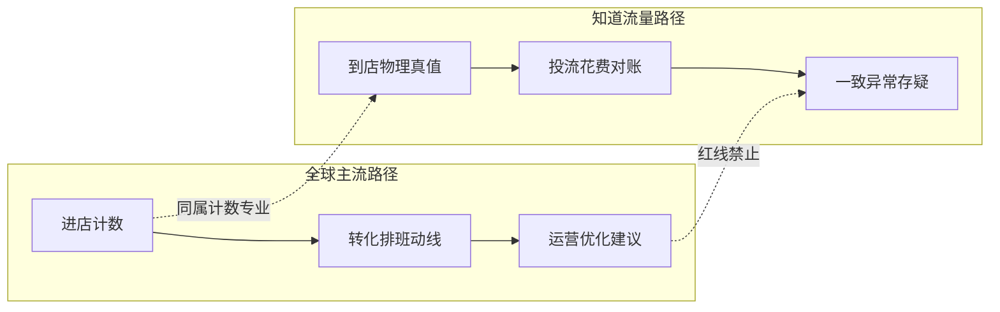

# 知道流量 · 全球商业计数发展趋势研究（2026）

> 版本：2026-08-16｜对齐文档：[知道流量系统性综合报告-V4](./知道流量系统性综合报告-V4.md)  
> 定位：V4 的**外部市场附录**——不改写 V4 财务/BOM/生死参数定案  
> 研究性质：公开二次研究；市场体量为多源区间，非付费完整报告摘录

---

## 一、执行摘要

全球商业计数（People Counting / Footfall Analytics）已从「门口红外计数器」升级为零售、交通与智慧建筑的**基础设施级运营数据源**。2025–2026 市场体量约 **15–25 亿美元**量级，中长期 CAGR 约 **14–16%**，零售仍是最大需求盘，亚太是主要增量引擎。

技术上呈现**双轨并行**：

1. **视觉/立体视觉 + AI** 仍占主流份额，向转化率、动线、排班、营销归因延伸；
2. **隐私优先的 mmWave（尤其 60GHz）** 在欧美零售与公共空间加速替代摄像头方案。

**对知道流量的核心判断**：

| 判断 | 依据 |
|---|---|
| Plan A（60GHz 门神）与全球「privacy-by-design」同向 | GDPR/CCPA/PIPL 推动非成像传感 |
| 行业主流是「运营 BI」，知道流量应坚持「投流审计」错位 | 海外巨头几乎不做本地生活广告费用独立审计 |
| 「误差带披露制」是稀缺公信力资产 | 全球主流厂商极少公布可核查的误差% |
| 员工剔除/净客流已成企业级标配 | 强化积木 D 在服务升级路径中的叙事 |
| 99 元 A+B 切入 SMB 餐饮是正确战场 | 海外方案多为企业级高 CAPEX，SMB 本地生活几乎空白 |

**一句话**：全球在卖「更好的客流运营软件」；知道流量应卖「同一把物理标尺上的投流费用审计」——**以计数为专业，以审计为商业模式**（V4 定位不变）。

---

## 二、市场体量与结构

### 2.1 规模区间（多源对照）

公开市场报告口径不一（含传感器硬件、软件订阅、集成服务的范围不同），宜按**区间**理解：

| 来源口径（公开摘要） | 近期体量 | 展望 |
|---|---|---|
| TBRC / Research and Markets（People Counting System） | 2025 ≈ $2.12B → 2026 ≈ $2.45B（CAGR ~16%） | 2030 ≈ $4.36B（CAGR ~15.4%） |
| Fortune Business Insights | 2025 ≈ $1.46B → 2026 ≈ $1.66B | 2034 ≈ $4.69B（CAGR ~13.9%） |
| IndexBox 定性结论（2026） | — | 至 2035 持续扩张；零售主导、交通/智慧办公增速更高 |

**采用建议（对内口径）**：对外表述用「全球商业计数及相关分析市场约 **20 亿美元量级（2025/26），中长期双位数增长**」，避免绑定单一卖方数字。

### 2.2 需求结构（约值）

| 终端场景 | 份额量级 | 主需求 |
|---|---|---|
| 零售 / 购物中心 | ~35–40% | 进店量、转化率、排班、租售谈判、营销效果 |
| 交通枢纽 / 公交 | ~20–22% | 上下客、安检排队、运力与安全 |
| 企业办公 / 智慧楼宇 | ~15–18% | 占用率、暖通节能、混合办公面积优化 |
| 文旅场馆 / 文体 | ~10–12% | 容量与疏导、体验动线 |
| 公共与政务 | ~10% | 利用率证明、开放时长与编制 |

### 2.3 价值重心迁移

```
硬件计数（红外/热成像）
        ↓
传感器 + 边缘 AI（视频 / 立体 / 雷达）
        ↓
云端分析平台（转化、对标、告警）
        ↓
与 POS / CRM / BMS / 广告平台 的集成服务   ← 软件与服务增速 > 硬件
```

**启示**：单纯卖「更准的计数器」会被硬件卷价格；可持续毛利在**可信标尺 + 报告订阅**。V4 的「硬件决定采什么、报告订阅决定看多深」与全球价值迁移一致。

---

## 三、六大发展趋势（对齐 V4）

### 趋势 1：传感技术双轨 —— 视觉仍主流，60GHz 雷达成隐私标准选项

**全球在发生什么**

- 传统红外/热成像份额被 AI 视频与 3D 立体视觉挤压（更高双向精度、更丰富行为维度）。
- 同步出现明确的**反摄像头迁移**：零售与公共空间因 GDPR、消费者信任、合规成本，转向 **60GHz mmWave** 等非成像方案（SensMax TAC-B、Pemberton Digital 等公开叙事均为「不采图、天然合规」）。
- 60GHz 在占用/感知细分中增速突出（公开研究称 60GHz 在 mmWave 占用传感中份额与增速领先），适合近距门口绊线与区域占用。

**对 V4**

- Plan A（LD6001C 4T4R / 60GHz）技术选型与全球隐私趋势**同向**。
- 风险不在「方向错了」，而在 **SRRC、千片价、自建验收**（V4 R1/R2/R3）——Plan B（24GHz 巍泰等）作为「换锚不换尺」备选，符合供应链韧性常识。
- 绿区（mmWave/红外/BLE）叙事可对外写成「全球 privacy-by-design 路线在中国餐饮门店的落地」。

### 趋势 2：从「数人头」到「经营决策层指标」

**全球在发生什么**

头部平台（RetailNext、ShopperTrak、V-Count 等）把卖点从准确率转移到：

- 真实转化率（客流 ÷ 交易）
- 劳动力排班与队列
- 区域热力 / 停留 / 动线
- 跨店对标与租赁谈判
- 营销活动前后的客流归因

零售公式被反复强调：`营收 ≈ 客流 × 转化 × 客单`——客流是最上游分母。

**对 V4**

- 行业默认买家是「运营与零售 BI」；知道流量的买家应是「被平台投流账单困扰的餐饮老板 / 连锁运营」。
- **红线 1–3（不做代投、不做数据变现、不做 AIGC 投流优化）必须守住**：一旦产品话术滑向「帮你投得更好」，就变成 Arthur Andersen 式利益冲突，审计溢价归零。
- 产品分层可借用行业语言，但终点不同：  
  - 行业：客流 → 转化 → 排班建议  
  - 知道流量：到店人次 → **投流花费交叉对账** → 一致/异常/存疑三态

### 趋势 3：误差带公开几乎空白 —— 方法论公信力稀缺

**全球在发生什么**

- 厂商常宣称「95–99% 准确率」，但**极少发布可独立复核的误差带、测试协议与场景边界**。
- 采购方更关注跨店可比、安装验收与长期漂移，而非实验室峰值。

**对 V4**

- 「误差带披露制」（A±7% / B±20–35% 仅趋势 / C&lt;±6% / E±3–5%）与「统一标准 &gt; 绝对精度」是**差异化公信力**，建议在 Phase 0 验收治具白皮书中固化为对外资产。
- 审计客户买的不是「全世界最准」，而是「跨店、跨平台、同一把尺」。

### 趋势 4：员工剔除与净客流成为企业级标配

**全球在发生什么**

- ShopperTrak 等明确提供 Employee Exclusion：剔除员工走动后，转化率才可信。
- 餐饮场景额外噪声更大：骑手、保洁、老板家属进出频繁。

**对 V4**

- 积木 **D（腰牌）** 不是「可有可无的配件」，而是进入「净客流层 / 审计对账升级」的必要台阶。
- 报告强制首行标注「含员工/骑手流量」（无 D 时）与全球最佳实践一致，应作为信任设计而非免责声明。

### 趋势 5：边缘计算 + 云看板 + 系统集成

**全球在发生什么**

- 边缘推理降低带宽与隐私风险；云端提供多店看板、API、与 POS/BMS 对接。
- 软件订阅与集成服务毛利高于一次性硬件。

**对 V4**

- 双轨模型（硬件买断 × 报告订阅）正确。
- 集成优先级应是：**平台投流花费（手动 Excel / 可用 API）× 到店真值**，而非优先做 POS 深度顾问集成（避免滑向运营 SaaS）。
- B 积木（回传 + 趋势）承担「边缘网关」角色，与全球架构同构。

### 趋势 6：区域格局 —— 北美高价值、亚太高增速；中国出现本地生活特有切口

**全球在发生什么**

- 北美份额最大（企业连锁与分析软件付费能力强）。
- 亚太增速最快（城市化、新开店、智慧城市）。
- 中国餐饮同时面临：本地生活平台投流占比高、平台 API 不稳定（V4 已记美团接口暂停）、商户对「钱花得值不值」极度敏感。

**对 V4**

- **全球厂商几乎没有「跨平台本地生活投流费用独立审计」产品**——这是结构性空白，不是功能清单缺口。
- Phase 1 坚持 S1/S2/S3 业态、不做 S5 纯外卖，与「审计强度 vs 通胀强度」权衡一致。

---

## 四、竞争图谱（精简）

### 4.1 海外：运营分析巨头

| 玩家 | 重心 | 与知道流量关系 |
|---|---|---|
| RetailNext | 企业零售分析、POS 转化、预测 | 同属计数，终点是运营 BI |
| ShopperTrak / Sensormatic | 连锁客流、员工剔除、品类对标 | 标杆级「净客流」叙事 |
| V-Count | 3D/AI 传感器 + BoostBI 云 | 中市场连锁；强调隐私 AI |
| Xovis | 高精度 3D 人流 / 队列 | 交通与大型场馆强 |
| SensMax 等雷达厂商 | mmWave 替代视频 | 技术路线近亲；场景仍偏运营 |

### 4.2 国内：门店数字化与模组生态

| 类型 | 代表 | 备注 |
|---|---|---|
| 视频客流 / 门店 SaaS | 全客通、万店掌、InfiSight 等 | 强运营与连锁管理 |
| 网络 / Wi‑Fi 人流 | 锐捷 RBIS 等 | 热力与驻留，精度与隐私模型不同 |
| mmWave 模组 / 整机 | 海凌科生态、巍泰 WTR 系列等 | 与 Plan A/B 供应链直接相关 |
| 云视觉 API | 百度人体流量等 | 偏能力层，非审计品牌 |

### 4.3 空白位（知道流量应占领的一句话）

> **用门店物理传感器建立到店人次真值，跨美团/抖音等平台校准投流花费，只出审计三态，不给出代投建议。**

这一定位在全球公开产品谱系中基本未被占据。

---

## 五、技术路线对标结论

### 5.1 绿区 mmWave（A/B/C/D）

- 与 GDPR「数据最小化」、国内 PIPL 合规叙事正交且友好。
- 抗光照、不存图、安装心理负担低 —— 适合餐饮老板「不愿被装摄像头」的真实阻力。
- 60GHz 分辨率优势支撑门口双向绊线；24GHz Plan B 用距离分辨率换合规与供应确定性。

### 5.2 黄区双目 Re‑ID（E）

- 全球视觉方案仍在卖「更高上限」；同时监管与舆论压力上升。
- V4 将 E 置于黄区、不存图不识脸、服务升级才解锁，符合「能力可选、合规前置」。
- R9（法律意见书）应视为旗舰层上线闸门，而非售后补丁。

### 5.3 统一标准 &gt; 绝对精度

- 连锁采购逻辑是：同一方法论下的跨店可比 + 可解释误差。
- 审计商业模式同样依赖方法论一致性；与 V4 审计哲学完全同构。



---

## 六、对 Phase 0–3 的战略启示

### Phase 0（当前）

1. **验收治具 + 误差带白皮书**：把「全球厂商不公开误差%」写成对外卖点；对内绑定 V3 日总量偏差 ≤±7%。
2. **SRRC / 千片价 / 巍泰询价**：技术方向被全球趋势背书，但供应与认证仍是生死开关——按 V4 切换触发线执行。
3. **话术分层**：对投资人/伙伴讲全球 20 亿级市场与隐私雷达趋势；对商户只讲「平台说的到没到，我们用门上的尺子量」。

### Phase 1（试点）

1. 用**通胀比周间 CV&lt;15%** 验证「审计标尺」是否成立；不稳则按 V4 降级为计数 + 时段粗归因，勿硬撑 ROI 神话。
2. 对外材料明确区分：**运营客流软件 ≠ 投流审计工具**，防止销售为了好签单承诺排班/代投。
3. 样例报告必须展示「无 D / 有 D」差异，推动 99→服务升级漏斗。

### Phase 2–3（量产与规模）

1. 保持 SMB 订阅定价优势，不与 RetailNext 类企业级方案正面拼功能清单。
2. 连锁方案可提供「多店同一把尺」的审计对标，仍禁止代投与数据外卖。
3. 软件价值深挖优先顺序：审计报告深度 → 商圈/同比维度 →（谨慎）区域行为；POS 顾问级能力保持克制。

### 明确不做（与全球主流错位）

- 排班优化 SaaS、货架动线顾问、代投与素材 AIGC、客流数据二次售卖。

---

## 七、风险对照（全球视角补强 V4）

| V4 风险 | 全球视角补强 |
|---|---|
| R1/R2 成本与 SRRC | 60GHz 需求上升会改善模组供给，但认证与价格仍可能滞后；备选锚点不可省 |
| R5 通胀比不稳 | 全球也缺少「广告花费→到店」的稳定归因产品，说明命题难但护城河高 |
| R9 E 黄区 | 欧美人脸/生物识别监管趋严，黄区策略比「全面视觉」更可持续 |
| 红线 1–3 | 全球运营分析玩家靠建议变现；知道流量靠独立性溢价——路径不可混用 |

---

## 八、结论

1. **市场**：商业计数进入稳态高增，价值向软件与集成迁移。  
2. **技术**：视觉与 mmWave 双轨；隐私雷达与 Plan A 同向。  
3. **竞争**：巨头做运营 BI；**投流费用独立审计仍是空白**。  
4. **动作**：守住审计红线，用误差带与净客流（D）做信任，用 99 元 A+B 打 SMB 餐饮，用四生死参数决定是否加码。

V4 架构（A+B 绑定 × C/D/E 买断 × 服务升级）与全球趋势**相容且刻意错位**——相容在计数专业化与隐私硬件，错位在商业模式终点。

---

## 九、主要公开来源

- IndexBox：People Counters Market Forecast … Toward 2035（2026-03）  
- The Business Research Company / Research and Markets：People Counting System Global Market Report 2026  
- Fortune Business Insights：People Counting System Market（至 2034）  
- SensMax / IoT Business News：60GHz 雷达与 privacy-first 替代视频分析的公开文章（2025–2026）  
- RetailNext、ShopperTrak/Sensormatic、V-Count：产品与转化率/员工剔除公开材料  
- 国内：巍泰毫米波客流应用案例、餐饮客流数字化行业文章（公开网络）

*本文件为二次研究整理，数字为公开摘要区间，落地决策仍以 V4 与 RFQ/Phase 1 实测为准。*
