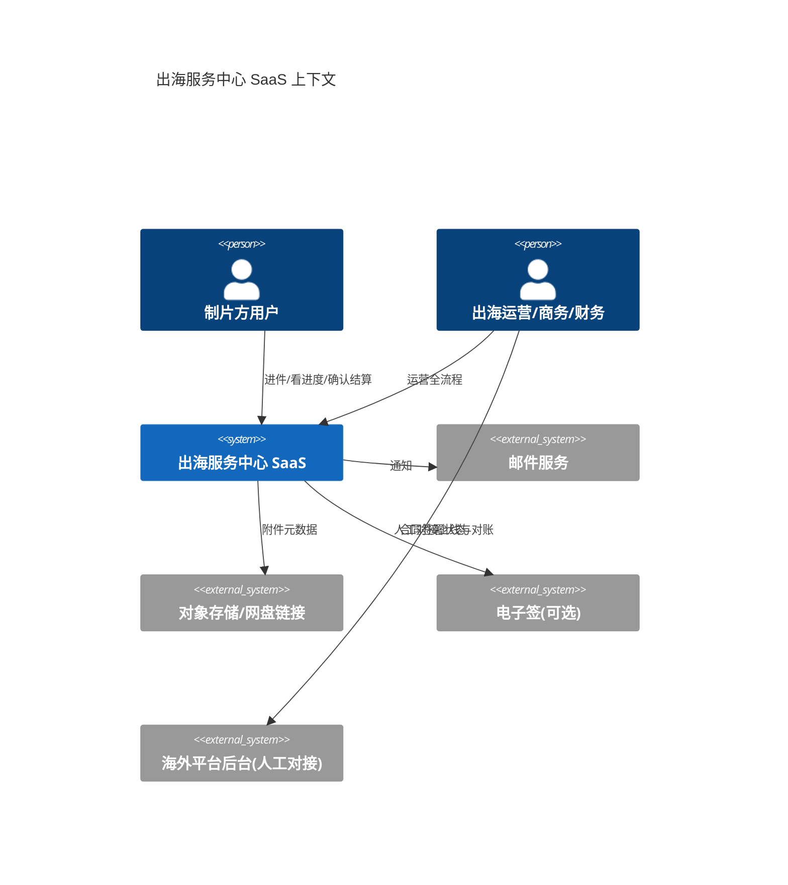
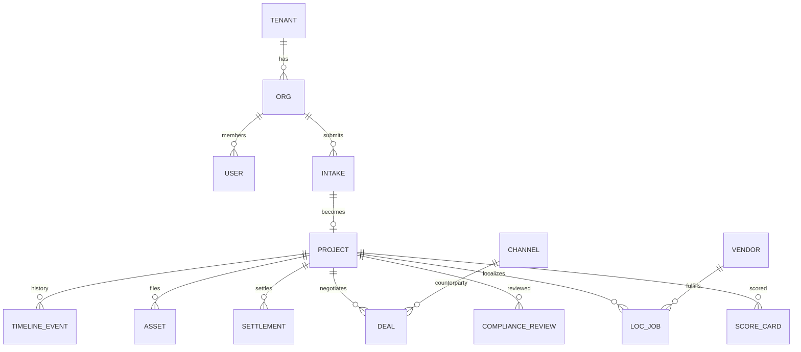

# 微短剧出海服务中心 SaaS · 技术设计文档

> 版本：V1.0 Draft  
> 日期：2026-07-24  
> 对应需求：[PRD.md](./PRD.md)  
> 原则：先可运营、可审计、可扩展；拒绝继续堆演示页。

---

## 1. 设计目标与约束

### 1.1 目标

1. 支撑 PRD Phase 1 端到端闭环（进件→结案）
2. 数据模型表达真实业务对象与状态机，而不是“一张宽表 + stage 字符串”
3. 权限与租户隔离作为一等公民
4. 可测试：领域规则不依赖 UI
5. 可从当前 JSON 演示平滑迁移种子数据

### 1.2 约束

- 部署形态：单区域 Web + PostgreSQL（Render/Railway/自建 Docker 均可）
- 一期团队规模假设：1–2 名全栈，优先少而硬的后端领域层
- 成片大文件不进应用库；链接/对象存储元数据入库
- 不自研工作流引擎；用显式状态机 + 领域服务

### 1.3 非目标（技术）

- 一期不上微服务拆分
- 一期不做多写多活
- 一期不做实时协同编辑

---

## 2. 系统上下文



说明：与 ReelShort/DramaBox 等**无官方开放 API 时**，系统定位为运营中枢，平台侧数据以导入/登记为主，预留 `IntegrationAdapter` 接口。

---

## 3. 逻辑架构

```
┌─────────────────────────────────────────────────────┐
│ Web App (React + TS)                                │
│  Ops Console · Client Portal · Admin                │
└───────────────────────┬─────────────────────────────┘
                        │ HTTPS / JSON
┌───────────────────────▼─────────────────────────────┐
│ API Gateway 层（Express/Fastify 或 Nest）            │
│  AuthN · RBAC · RateLimit · Audit Middleware        │
└───────────────────────┬─────────────────────────────┘
                        │
┌───────────────────────▼─────────────────────────────┐
│ Application Services（用例）                        │
│  IntakeService · ScoringService · ComplianceGate    │
│  LocalizationService · DealService · SettlementSvc  │
│  KpiService · ReportService                         │
└───────────────────────┬─────────────────────────────┘
                        │
┌───────────────────────▼─────────────────────────────┐
│ Domain Model + State Machines                       │
│  Project · Deal · LocalizationJob · Settlement      │
└───────────────────────┬─────────────────────────────┘
                        │
┌───────────────────────▼─────────────────────────────┐
│ Infrastructure                                      │
│  PostgreSQL · Redis(可选) · S3兼容存储 · Mailer     │
└─────────────────────────────────────────────────────┘
```

### 3.1 对当前代码的改造策略

| 现状 | 目标 |
|------|------|
| `server/*.mjs` + JSON 文件 | PostgreSQL schema + Repository |
| React 页面直接改 stage | 调用用例 API，UI 不直接改非法状态 |
| `overseas` 独立 JSON portal | 并入统一 `tenant/org` 模型，模块化路由 |
| 演示 seed 写死 | seed + migration + factory |

建议：**保留前端路由信息架构**，重写后端领域与表结构；前端按 PRD IA 逐步替换表单为真实工作台。

---

## 4. 多租户与权限

### 4.1 隔离模型

采用 **共享库 + `tenant_id` + `org_id`**（与 `property_saas` 设计一致）：

- `tenant_id`：服务中心实例（西安中心 = 一个租户）
- `org_id`：制片方机构；运营账号 `org_id` 可空，靠角色访问中心内多机构
- 所有业务查询强制带 `tenant_id`；客户角色强制 `org_id = 当前机构`

### 4.2 RBAC

表：`users` / `roles` / `permissions` / `user_roles` / `org_members`

权限示例（资源:动作）：

- `intake:create` `intake:triage`
- `project:read` `project:transition`
- `compliance:review`
- `localization:manage`
- `channel:write`
- `deal:negotiate` `deal:approve`
- `settlement:reconcile` `settlement:confirm`
- `report:export` `admin:config`

### 4.3 鉴权

- Phase 1：JWT（Access + Refresh）或 session + HttpOnly cookie
- 密码：argon2id
- 审计中间件记录：`actor_id, action, resource_type, resource_id, ip, payload_digest`

---

## 5. 领域模型（核心实体）

### 5.1 ER 概览



### 5.2 表设计要点

#### `orgs`

| 字段 | 类型 | 说明 |
|------|------|------|
| id | uuid | |
| tenant_id | uuid | |
| name | text | |
| uscc | text | 统一社会信用代码，可空 |
| member_tier | enum | 核心/专业/观察/非会员 |
| status | enum | active/disabled |

#### `intakes`

| 字段 | 类型 | 说明 |
|------|------|------|
| id | uuid | |
| public_no | text | IN-2026-0001 |
| org_id | uuid | |
| product_code | text | P07/P08 |
| title | text | |
| markets | text[] | |
| genres | text[] | |
| episodes | int | |
| status | enum | draft/submitted/triage/... |
| sla_due_at | timestamptz | |
| assignee_id | uuid | |
| payload | jsonb | 扩展问卷 |

#### `projects`

| 字段 | 类型 | 说明 |
|------|------|------|
| id | uuid | |
| public_no | text | OS-2026-0001 |
| intake_id | uuid | |
| org_id | uuid | |
| status | enum | 见 PRD 状态机 |
| priority | enum | |
| owner_id | uuid | 运营负责人 |
| compliance_status | enum | pending/passed/blocked |
| score_total | numeric | 冗余便于列表 |
| launched_at | timestamptz | |
| closed_at | timestamptz | |

#### `score_cards`

多行维度分 + `total` + `recommendation` + `report_richtext` + `created_by`

#### `compliance_reviews`

`result` / `comments` / `blocker_codes[]` / `reviewed_by` / `reviewed_at`

#### `localization_jobs`

`type` / `language` / `vendor_id` / `quote_amount` / `currency` / `status` / `qa_status` / `due_at` / `version`

#### `channels`

对齐渠道库字段；`last_contacted_at` / `activity_level` / `risk_notes` / `cooperation_model`

#### `deals`

结构化条款：

```json
{
  "territories": ["NA"],
  "term_months": 24,
  "exclusive": false,
  "model": "rev_share",
  "rev_share_pct": 45,
  "mg_amount": null,
  "currency": "USD",
  "delivery_items": ["master", "en_sub"]
}
```

`status`: intent → term_sheet → pending_approval → signed → performing → closed

#### `settlements`

`period_start/end` / `gross` / `share` / `currency` / `fx_rate` / `status` / `client_confirmed_at`

#### `settlement_discrepancies`

差异处理闭环。

#### `assets`

`kind`（pitch/cut/subtitle/contract/report） / `uri` / `expires_at` / `classification` (L1–L4) / `checksum`

#### `timeline_events`

不可变事件流：状态变更、评论、文件、审批。

#### `audit_logs`

安全审计，与 timeline 分离（timeline 业务可读，audit 安全只读）。

---

## 6. 状态机实现

集中定义于 `domain/projectTransitions.ts`（或 `.py`）：

```ts
const PROJECT_TRANSITIONS: Record<ProjectStatus, ProjectStatus[]> = {
  draft: ["submitted", "cancelled"],
  submitted: ["triage", "cancelled"],
  triage: ["scoring", "rejected", "cancelled"],
  scoring: ["compliance", "rejected", "on_hold"],
  compliance: ["approved", "rejected", "on_hold"],
  approved: ["localizing", "dealmaking", "on_hold"], // 无译制需求可直达商务
  localizing: ["dealmaking", "on_hold"],
  dealmaking: ["launched", "on_hold"],
  launched: ["settling", "on_hold"],
  settling: ["closed"],
  on_hold: ["triage", "scoring", "compliance", "localizing", "dealmaking", "launched"],
  rejected: [],
  cancelled: [],
  closed: [],
};
```

守卫（Guard）示例：

- `→ dealmaking`：`compliance_status === 'passed'`
- `→ launched`：存在 `deal.status === 'signed'`
- `→ closed`：复盘字段满足最小条数

所有转换走 `ProjectService.transition(id, to, actor, reason)`，写 `timeline_events` + 可选通知。

---

## 7. API 设计（Phase 1 摘要）

前缀：`/api/v1`

### 7.1 认证

- `POST /auth/login`
- `POST /auth/refresh`
- `POST /auth/logout`
- `GET /me`

### 7.2 进件

- `POST /intakes`
- `GET /intakes`（过滤：status/assignee/org/sla）
- `GET /intakes/:id`
- `POST /intakes/:id/submit`
- `POST /intakes/:id/triage`
- `POST /intakes/:id/return`（退回补件）

### 7.3 项目

- `POST /projects`（由通过的 intake 立项）
- `GET /projects`
- `GET /projects/:id`
- `POST /projects/:id/transition`
- `POST /projects/:id/score-cards`
- `POST /projects/:id/compliance-reviews`

### 7.4 本地化 / 渠道 / 交易 / 结算

- `/localization-jobs` CRUD + `qa`
- `/channels` CRUD + `touch`（更新最近联系）
- `/deals` CRUD + `submit-approval` + `sign`
- `/settlements` CRUD + `confirm` + `discrepancies`

### 7.5 报表

- `GET /kpi/overseas?from&to`
- `GET /reports/weekly`
- `POST /reports/weekly/export`

### 7.6 错误约定

```json
{
  "error": {
    "code": "COMPLIANCE_BLOCKED",
    "message": "版权联审未通过，禁止进入渠道推介",
    "details": { "projectId": "..." }
  }
}
```

业务拒绝用 409/422；鉴权 401/403。

---

## 8. 前端架构

### 8.1 应用分区

- `/app/ops/*` 运营台
- `/app/client/*` 制片方
- `/app/admin/*` 配置

现有 `/overseas/*` 路由可映射迁移，避免运营习惯断裂。

### 8.2 状态管理

- 服务器状态：TanStack Query（推荐）或轻量 SWR
- 禁止把业务规则只写在组件 `onChange` 里
- 表单：React Hook Form + Zod（与 API schema 共享）

### 8.3 UI 原则（可用性，而非演示感）

- 列表必须：筛选、排序、分页、空态、错误态、权限隐藏
- 详情页：左主信息 / 右待办与 SLA
- 所有危险操作二次确认
- 关键字段变更显示 diff

---

## 9. 工作流与通知

Phase 1：

- 同步领域事件 → `notifications` 表 → 用户铃铛
- 可选邮件：SMTP/API（SendGrid 等）

Phase 2：

- Outbox 模式异步投递
- 企微/飞书机器人

SLA 扫描：定时任务（每 15 分钟）标记 `sla_breached`，写入 KPI 原始事件。

---

## 10. 文件与安全

1. 上传：浏览器直传对象存储（预签名 URL）或登记外部链接
2. `assets.classification` 控制下载权限
3. 外链默认 `expires_at`；过期后仅管理员可续期
4. 导出：异步任务 + 下载短链 + 审计
5. 密钥：环境变量 / KMS；禁止入库明文密钥
6. PII：手机号/证件脱敏展示；L4 字段列级加密（P1）

---

## 11. 集成边界

```ts
interface ChannelPerformanceImporter {
  importCsv(projectId: string, file: Buffer): Promise<ImportResult>;
}

interface ContractSignProvider {
  createEnvelope(dealId: string): Promise<{ externalId: string; url: string }>;
  webhook(payload: unknown): Promise<void>;
}
```

一期可只实现 `NullSignProvider`（人工上传 PDF）。

---

## 12. 数据迁移（从演示 JSON）

1. 将 `overseas-seed.json` 映射为：
   - projects ← projects
   - localization_jobs ← localizations
   - channels ← platforms
   - deals ← deals
   - settlements ← settlements
   - intakes ← intakes
2. 补齐缺失必填：`tenant_id`、`org_id`、合规默认 `pending`
3. 历史 stage 字符串映射到新枚举（写转换表）
4. 迁移脚本可重复执行（idempotent upsert by public_no）

---

## 13. 技术选型建议

| 层 | 推荐 | 备选 | 理由 |
|----|------|------|------|
| 前端 | React + TS + Vite | — | 与现仓一致 |
| 后端 | NestJS + Prisma | Fastify + Drizzle | 模块/守卫/DTO 适合 RBAC 与校验 |
| DB | PostgreSQL 16 | — | JSONB + 约束 + 报表 |
| 缓存/队列 | Redis（P1） | — | 通知与导出 |
| 对象存储 | S3 兼容 | 外链模式 | |
| 测试 | Vitest + Playwright | — | 领域单测 + 关键 E2E |
| 可观测 | OpenTelemetry + 结构化日志 | — | |

若要降低迁移成本，可短期保留 Express，但**必须引入**：

- zod/openapi 校验
- 独立 domain 目录
- prisma/drizzle migrations

不建议继续扩展无 schema 的 JSON 文件存储作为正式交付。

---

## 14. 部署架构

```
Internet → CDN(可选) → Web/API Container
                           ↓
                     PostgreSQL
                           ↓
                     Object Storage
```

环境：

- `APP_ENV` / `DATABASE_URL` / `JWT_SECRET` / `STORAGE_MODE` / `S3_*` / `SMTP_*`
- 健康检查：`/api/v1/health`（含 db ping）
- 迁移：容器启动前 `prisma migrate deploy`

与现有 `Dockerfile` / `render.yaml` 兼容：Root `xian-drama-saas`，增加 migrate 与密钥即可。

---

## 15. 测试策略

| 类型 | 覆盖 |
|------|------|
| 单元 | 状态机守卫、评分汇总、SLA 工作日计算、权限判断 |
| 集成 | API + 测试库：进件到立项、版权阻断、结算确认 |
| E2E | 制片方提交 → 运营评分 → 联审 → 译制 → 签约 → 结算 |
| 安全 | 越权读取他机构项目、导出审计存在 |

CI：PR 必跑单测+集成；main 跑 E2E 冒烟。

---

## 16. Phase 1 模块落地顺序（工程排期逻辑）

1. 基础：tenant/org/user/rbac/audit + migrations  
2. 进件 + 分诊 + SLA  
3. 评分卡 + 报告  
4. 项目 + 状态机 + 时间线  
5. 合规门禁  
6. 本地化任务  
7. 渠道 + Deal  
8. 结算台账  
9. KPI/周报  
10. 制片方门户对接真实 API  
11. 演示数据迁移与 E2E  

完成 Definition of Done：PRD §11 验收用例全部自动化通过。

---

## 17. 风险与缓解

| 风险 | 缓解 |
|------|------|
| 继续堆 UI 无领域层 | 评审卡点：无状态机不得合入主功能 |
| 文件链路失效 | expires + 续期流程 + 本地校验任务 |
| 商务条款过于复杂 | Phase 1 只结构化 8 个核心字段，其余进附件 |
| 平台无 API | 导入模板 + 人工登记，不假装自动同步 |
| 与联盟系统账号分裂 | Phase 1 独立账号；预留 `external_member_id` |

---

## 18. 附录：目录建议（重构后）

```
xian-drama-saas/
  docs/
    PRD.md
    ARCHITECTURE.md          # 本文档
  apps/web/                  # 前端（可由 src/ 演进）
  apps/api/                  # 后端
    src/
      modules/
        identity/
        intake/
        project/
        localization/
        channel/
        deal/
        settlement/
        reporting/
      domain/
      infrastructure/
  packages/shared/           # zod types, enums
```

过渡期可先在现仓 `server/` 下建 `domain/` 与 `db/`，不必一次 mono-repo 大搬迁。

---

## 19. 文档变更记录

| 版本 | 日期 | 说明 |
|------|------|------|
| V1.0 Draft | 2026-07-24 | 首版技术设计：领域模型、状态机、API、权限、迁移与分期落地 |
