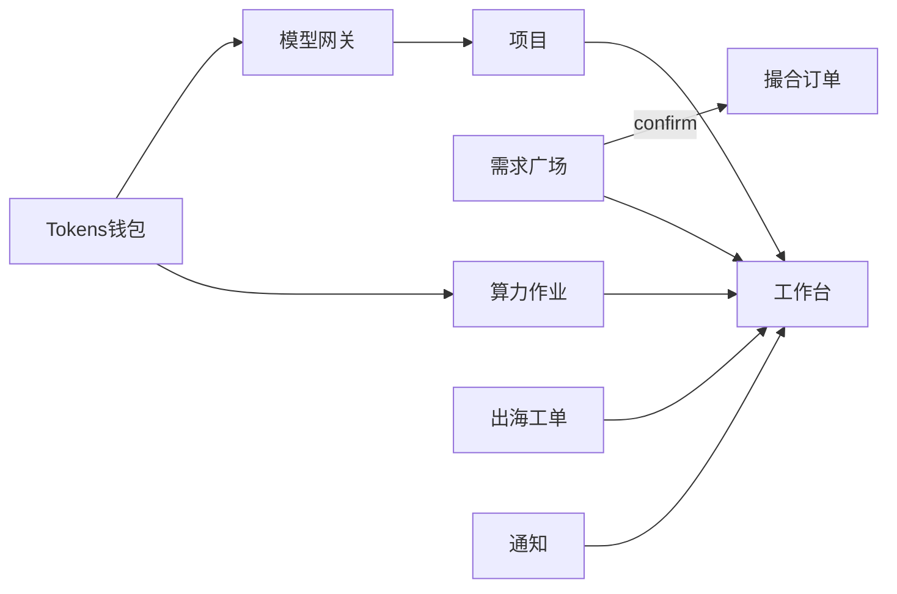

# 微短剧会员协作中枢 · 需求+技术文档合集

> **发给：MiniMax / Trae** · 合集 **P1.3** · `cursor/overseas-drama-saas-8928` · https://github.com/horizoncove/openclaw-lite/pull/12

## 0. 封面

**北极星：** 撮合适配保障 × 信任保障  
**主飞轮 A：** 发布→应征→确认→T托管→放款→再来  
**监管视角：** 秘书处/运维 `/app/supervision` 盯主轮健康与待介入队列  
**禁：** 挂单/互兑/兑换所  

1. 核心价值北极星（第一性原理）
2. 商业闭环 × 生态飞轮
3. 监管者监督视角
4. 结算拍板（必守）
5. 需求规格总册
6. SaaS 技术架构总册
7. 产品功能规格（界面/字段）
8. 验收放行清单
9. 现行 HTTP 契约（实现对照）
10. 现状 vs 目标边界

---


---

# 【合集篇章】核心价值北极星（第一性原理）

> `docs/CORE_VALUE_MATCHING.md`

# 撮合平台核心价值 · 第一性原理（贴近真实用户）

> 版本：**C1.1**  
> 日期：2026-07-25  
> 用途：回答「撮合交易平台最该先实现什么」——给产品、商务、MiniMax/Trae 同一把尺子  
> 上游：[PAIN_FIRST_PRINCIPLES.md](./PAIN_FIRST_PRINCIPLES.md) · [USER_REQUIREMENTS.md](./USER_REQUIREMENTS.md)  
> 约束：[DECISION_TOKEN_SETTLEMENT.md](./DECISION_TOKEN_SETTLEMENT.md) D1.3  

---

## 0. 北极星（拍板）

> 整站功能必须围绕第一性原理的两根柱子展开，而不是围绕「页面清单」或「Token 玩法」展开：  
>  
> 1. **信任保障（Trust Guarantee）** —— 谈妥了算数：有单据、有托管、有节点、有结清、争议可裁决。  
> 2. **撮合适配保障（Match Compatibility Guarantee）** —— 对得上、接得住：需求能被对的人看见，应征可跟踪，确认后进入可履约状态机。  
>  
> **所有其他能力（工作台、钱包、网关、算力、出海、回收、通知、报表）都是卫星：要么服务这两根柱子，要么明确后置。**

用户听得懂的一句话：

> 「在联盟里找人干活，**人对得上**，谈妥了**有保障**，做到哪看得见，做完能结清。」

最小闭环（核）：

**需求表达 → 应征 → 确认成交 → 托管订单 → 验收放款**  
（且供需双方愿意下周再来一次）

---

## 0.1 两根柱子分别保证什么

| 柱子 | 消掉的摩擦 | 系统必须长出的能力 | 用户体感 |
|------|------------|--------------------|----------|
| **撮合适配保障** | 协调摩擦 | 全联盟需求、品类/条件表达、应征、我应征的、确认成交、（弱）推荐/秘书冷启动 | 「找得到对的人，不是对着空气喊」 |
| **信任保障** | 信任摩擦 | 订单对象、T 冻结托管、验收放款、时间线、禁互转/挂单、争议仲裁 | 「敢成交、敢先履约、做完能拿到」 |

信息可见（工作台/通知）是两根柱子的**仪表盘**，不是第三根柱子。  
产能（网关/算力）与出海（C 环）是履约时的**工具与重交付出口**，必须挂回订单/项目，不得自成「另一个主站」。

---

## 0.2 整站功能如何「匹配」到核上（卫星图）

```
                    ┌──────────────────────────┐
                    │  核：适配保障 × 信任保障   │
                    │  发布→应征→确认→托管→放款  │
                    └────────────┬─────────────┘
           ┌─────────────────────┼─────────────────────┐
           ▼                     ▼                     ▼
     工作台/通知              钱包/结算域              项目/任务
     （把人拉回核：            （购额供托管；            （履约容器；
       待确认/订单节点）        放款造 earned；           成本挂订单）
                                回收服务供给留存）
           ▼                     ▼                     ▼
     秘书处治理               网关/算力                 出海工单
     （仲裁·禁令·冷启动）      （履约产能，计量可信）    （法币重交付，回写核）
```

| 模块 | 必须回答的一句话 | 若不服务核则… |
|------|------------------|---------------|
| 需求/应征/订单 | 适配 + 信任的主战场 | 平台不成立 |
| 钱包/托管/回收 | 信任的结算介质与出口 | 订单是假单据 / 供给留不住 |
| 工作台/通知 | 把注意力拉回待确认与订单 | 核有了也没人回访 |
| 项目/任务 | 履约过程容器 | 成交后仍回群催 |
| 网关/算力 | 降低履约产能摩擦 | 可后置，不可替代托管 |
| 出海服务 | 重交付现金通道（C） | 不可抢中枢当主场 |
| 报表/信誉 | 降低重复适配/信任成本 | P2 |
| Token 挂单/兑换所 | —— | **禁止**（破坏信任柱） |

排期口令：**先立两柱，再挂卫星；卫星不得反向定义产品。**

---

## 1. 用户真实在交换什么？

剥掉页面，会员之间交换的最小单元不是「信息」，而是：

| 原子 | 用户语言 |
|------|----------|
| **能力时段** | 「这两周我能译 20 集阿拉伯语」 |
| **承诺** | 「谁在什么条件、什么期限交付什么」 |
| **履约风险** | 「我怕先付钱对方不做 / 我怕先做对方不结」 |
| **结算权** | 「做完我能拿到可花的 T，或可变现的现金通道」 |

群聊很擅长**广播**（「有没有译者」），极不擅长：

- 结构化发现（按品类/期限筛）  
- 不可抵赖的确认  
- 钱与承诺绑定  
- 履约节点可查  

所以平台该取代的不是「聊天」，而是聊天里**永远做不稳的那四步：发现 → 确认 → 托管 → 结清**。

---

## 2. 从摩擦反推：撮合核要消什么？

| 摩擦 | 用户原话 | 撮合核必须提供的对象 |
|------|----------|----------------------|
| **协调** | 「群里喊半个月没人对」 | 可发布的需求 + 可浏览的广场 + 可跟踪的应征 |
| **信任** | 「谈妥了也怕不算数 / 怕白干」 | **确认瞬间生成的订单** + **T 冻结托管** + 验收放款 |
| **信息** | 「应征石沉大海」「做到哪了」 | 「我应征的」状态 + 订单节点时间线 |
| （非核）产能 | 「翻译还要用好多工具」 | 网关/算力——服务履约，但**没有订单闭环也可以后做** |
| （非核）现金 | 「我接单要付房租」 | 官方回收 / 法币合同——**有 earned 之后才有意义** |

**推论：**  
先做「漂亮服务目录 / Token 玩法 / 出海官网」，而订单闭环不转 —— 对真实用户是**零核心价值**。  
先做「发布-应征-确认-托管-放款」哪怕 UI 简陋 —— 已经在解真痛。

---

## 3. 核心价值公式（可用来排优先级）

对撮合平台，任一功能打分：

```
价值 ≈ 是否缩短「找到靠谱对手方并完成一次可结算履约」的路径
       × 双方是否因此更敢下一次再来
```

| 功能 | 是否碰核 | 说明 |
|------|----------|------|
| 发布需求（全联盟可见） | ✅ 核 | 没有表达，就没有市场 |
| 应征 +「我应征的」 | ✅ 核 | 供给方要看见自己没被吞没 |
| 确认 → 自动生成订单 | ✅ **最硬的核** | 承诺从会话变成对象 |
| 冻结 / 托管 / 验收放款 | ✅ **信任核** | 没有它，订单是假单据 |
| 工作台「待确认应征」 | ✅ 核配套 | 需求方注意力入口 |
| 争议/秘书仲裁 | ◎ 信任增强 | 有单量后再厚 |
| 评价/信誉 | ◎ 降重复信任成本 | P2，冷启动靠秘书处运营 |
| 智能推荐/匹配算法 | △ 锦上添花 | 冷启动期人工撮合更有效 |
| Token 挂单/互兑 | ❌ 负价值 | 把履约市场扭曲成套利市场 |
| 热度榜/版权链 | ❌ 离核 | 不缩短履约路径 |

---

## 4. 供需两边各要什么（贴近实际）

### 4.1 需求方（制片/负责人）

真实决策链：

1. 戏卡住了（缺译者/配音）→ **要快**  
2. 怕找到的人不靠谱 → **要可跟踪、可换人有据**  
3. 怕付了没交付 → **要托管，不是先全额私转**  
4. 怕内部混乱 → **要进项目/工作台，而不是散落在群里**

他为「撮合」买单的心理账户是：**省下来的 Renqing/时间 + 降低白付钱风险**，不是买 Tokens 概念。

### 4.2 供给方（译制/配音团队）

真实决策链：

1. 要稳定看见活 → **广场要有真需求，不是空壳**  
2. 应征不能石沉大海 → **状态可查**  
3. 谈妥要有单 → **订单**  
4. 做完要能结 → **放款到 earned**；要现金再走回收/法币合同  

他留下的原因是：**「这里出单可预期」**，不是「这里积分好玩」。

### 4.3 联盟秘书处

真实工作：拉郎配、劝架、发通知。  
系统价值：把「反复私聊确认」变成「点确认/点放款/点争议」，秘书处管**例外**而不是管每笔撮合。

---

## 5. 最小不可再分的「撮合成功」定义

一次撮合**成功**，当且仅当：

```
需求被看见
  → 至少一笔有效应征
  → 需求方确认
  → 订单创建且需求方 T 被冻结（托管）
  → 履约后验收
  → 供给方 earned 到账（扣撮合费）
  → 双方不需要回到群里截图证明「谈妥了/结清了」
```

缺任何一环，都只是「信息站」，不是撮合交易平台。

**冷启动特例：** 前 N 单可由秘书处代为促进应征与确认，但系统对象（需求/应征/订单/托管）仍必须落库——运营不能代替账本。

---

## 6. 因此：最核心该先实现的价值（排期尺子）

### P0 · 撮合核（没有就没有平台）

1. **全联盟可发布/可浏览的工作需求**（品类 + 期限 + 预算表述）  
2. **应征与「我应征的」跟踪**  
3. **确认成交 → 撮合订单**  
4. **Tokens 冻结托管 → 验收放款至 earned**（D1.3「转」）  
5. **工作台露出「待确认应征 / 进行中订单」**（否则需求方不回访）

### P0' · 核的信用底座（可与核同迭代，不可长期缺）

6. 无订单互转、无挂单（防把平台做成黄牛盘）  
7. 订单时间线（最少：托管/进行中/已放款/争议）

### P1 · 核转起来之后才增值

8. 争议与秘书仲裁  
9. 官方回收（供给方现金出口，服务 A 环留存）  
10. 项目成本挂接、通知跳转  
11. 评价信誉  

### 明确后置（不抢核）

- 智能匹配、多中心营销站、多模态网关、账期复杂授信、热度/链  

网关/算力很有价值，但是 **B 环**；它们让履约更好做，**不能替代**「确认+托管+放款」这个 A 环心脏。

---

## 7. 和「Tokens / 回收」的关系（避免跑偏）

| 误解 | 纠正 |
|------|------|
| 核心是发 Token | Token 是**结算与计量介质**，核心是履约交换 |
| 核心是回收兑法币 | 回收是供给方**出口**，没有成交放款就没有可回收的 earned |
| 核心是自由交易 T | 自由交易会吃掉履约市场；D1.3 已禁 |

口令：

> **撮合核造 earned；回收核兑现金；购额核造 purchased；网关核耗 T。**  
> 没有撮合核，后三者都是空转。

---

## 8. 验收「是否碰到核」（用户语言）

问实现方/演示方三句：

1. **需求方：** 「不用截群聊天，我也能证明跟谁成交了、钱托管了吗？」  
2. **供给方：** 「应征之后我能知道有没有下文？做完 T 是否到账？」  
3. **下周：** 「他们是否愿意再发一单 / 再应征一单？」  

三句都「是」→ 核心价值成立。  
只有广场浏览、没有托管放款 → **尚未实现撮合平台**。

---

## 9. 一句话给 MiniMax / Trae

> Organize the whole product around **Match Compatibility Guarantee × Trust Guarantee**.  
> Ship **publish → apply → confirm → escrow → release** first;  
> every other module is a satellite of that core.  
> Do not invent a token marketplace or a second “overseas home” that competes with the hub.

---

## 变更记录

| 版本 | 说明 |
|------|------|
| C1.0 | 撮合核第一性原理：协调+信任；最小成功定义；P0 排期尺子 |
| **C1.1** | 拍板北极星：信任保障 × 撮合适配保障；整站卫星图与排期口令 |


---

# 【合集篇章】商业闭环 × 生态飞轮

> `docs/FLYWHEEL_AND_BUSINESS_LOOP.md`

# 商业闭环 × 生态飞轮（优化总册）

> 版本：**W1.0**  
> 日期：2026-07-25  
> 北极星：[CORE_VALUE_MATCHING.md](./CORE_VALUE_MATCHING.md) C1.1（**适配保障 × 信任保障**）  
> 结算：[DECISION_TOKEN_SETTLEMENT.md](./DECISION_TOKEN_SETTLEMENT.md) D1.3  
> 关联：[BUSINESS_LOGIC.md](./BUSINESS_LOGIC.md) · [ECOSYSTEM_AND_USAGE.md](./ECOSYSTEM_AND_USAGE.md)

---

## 0. 一句话

> **主飞轮只转一件事：可信成交的次数变多、变快、变敢再来。**  
> 钱从「购额 + 撮合费 + 服务合同」留下；Tokens 是润滑与结算介质，不是飞轮本身。  
> 一切卫星环（产能 B、服务 C、治理 D、回收 R）只做三件事之一：**加速主飞轮 / 留住供给 / 守住信任闸门**。

---

## 1. 主飞轮（A）· 必须先转

主飞轮由两根柱子驱动，缺一不可：

| 柱子 | 在飞轮里的作用 |
|------|----------------|
| **撮合适配保障** | 提高「发得出、找得到、应征得上」的概率与速度 |
| **信任保障** | 提高「敢确认、敢履约、做完能结」的概率与复购 |

```
                    ┌──────────── 信誉/案例沉淀 ────────────┐
                    ▼                                         │
         需求方再发布                                    供给方再蹲守
                    │                                         ▲
                    ▼                                         │
            发布需求（适配）                             应征有回音
                    │                                         ▲
                    ▼                                         │
              应征汇聚 ──────► 确认成交 ──────► 托管冻结（信任）
                                                    │
                                                    ▼
                                              履约可见节点
                                                    │
                                                    ▼
                                         验收放款 → 供给 earned
                                                    │
                    ┌───────────────────────────────┘
                    ▼
         「比群靠谱」体感 → 双方下周还来 → 密度↑ → 匹配更快
```

### 1.1 双边激励相容（飞轮能转的条件）

| 角色 | 单次为什么来 | 为什么**再来**（飞轮齿） | 什么会让他离开 |
|------|--------------|-------------------------|----------------|
| 需求方 | 缺译者/配音，戏卡住 | 比群更快找到人；托管不怕白付；进度在中枢 | 应征没人；确认后仍像私聊；钱托了不放/乱放 |
| 供给方 | 要接活 | 应征有下文；放款到 earned；可回收或再投入 | 石沉大海；做完结不到；被迫场外倒 T |
| 平台/联盟 | 收撮合费+购额 | 成交密度↑ → 费+购额↑；治理成本因单据↓ | 做成黄牛盘/兑换所，履约用户逃 |

**设计律：** 每个版本上线前问——这齿是让「再来」更容易，还是只让「第一次好看」？

### 1.2 主飞轮的最小完整圈（不可裁）

```
发布 → 应征 → 确认 → 冻结托管 → 履约节点 → 验收放款 → 再发布/再应征
```

裁掉「托管/放款」= 信息站，飞轮无信任齿。  
裁掉「应征跟踪」= 供给逃离，飞轮无密度齿。  
只有「广场浏览」= **不转**。

### 1.3 主飞轮加速器（按优先级）

| 加速器 | 作用 | 阶段 |
|--------|------|------|
| 工作台「待确认/订单」 | 把需求方注意力拉回成交动作 | 与核同发 |
| 秘书处冷启动 | 前 N 单代促进应征与确认 | E1 |
| 订单时间线 | 降低「做到哪了」追问 | E1 |
| 争议仲裁 | 极端信任恢复，防口碑坍塌 | E1.1 |
| 互评/完成率 | 降低重复适配成本 | E3 |
| 弱推荐 | 提高对接率 | E3（冷启动期不如运营） |

---

## 2. 卫星飞轮 · 如何咬住主轮（优化后的咬合）

旧模型把 A/B/C/D/R 并列，容易做成「五个产品」。优化后：**A 是发动机；其余是变速箱与油箱。**

```
                         ┌──── D 治理闸门（禁兑·仲裁·通知）────┐
                         │         保护主轮不被套利打穿          │
                         └──────────────────┬───────────────────┘
                                            │
     ¥ 购额 ──► B 产能消耗 ◄──┐             │
         ▲                    │             ▼
         │              ┌─────┴──── 主飞轮 A ─────┐
         │              │ 适配×信任：成交→放款    │
         │              └─────┬──────────┬───────┘
         │                    │          │
         │              earned│          │撮合费→平台
         │                    ▼          ▼
         │              ┌────────┐   平台收入
         └──── 再投入 B │ 供给方 │
                        └───┬────┘
                     ┌──────┴──────┐
                     ▼             ▼
                   R 回收¥      C 法币重交付
              （留住纯现金型）  （复杂单不挤爆 A）
```

### 2.1 B · 产能飞轮（给主轮加油，不替代主轮）

```
购额(purchased) → 履约中耗网关/算力 → 账单可信 → 再购额
        ▲                                      │
        └──── 项目成本可见 ← 绑定 project_id ←──┘
```

**咬合 A：** 成交后的译制/试译在**同一项目**耗 T → 需求方感知「找人+借机器」一体 → 更愿在中枢成交。  
**商业：** 购额加价是中枢主现金流之一；**没有 A 时 B 仍可转**（工具站），但联盟网络价值薄。  
**断裂：** 失败闷扣、转售、Key 失控 → B 停且反噬 A 信任。

### 2.2 R · 回收飞轮（留住供给，服务 A 密度）

```
A 放款 → earned ↑ →（部分）官方回收 ¥ → 供给敢接更多联盟单
                  └→（部分）再投入 B/再当需求方 → 生态内循环
```

**咬合 A：** 没有可靠 earned，回收无意义；没有回收/C，纯现金供给离开 → A 供给密度崩。  
**商业：** 折价差 + 未兑沉淀；**绝不能**做成市价兑换所（否则 A 信任柱断）。  
**策略：** 鼓励「赚 T 优先再投入履约」；回收是安全阀不是主叙事。

### 2.3 C · 服务飞轮（重交付旁路，减轻 A 过载）

```
复杂出海/总包需求 → 法币工单 → 验收回写中枢 → 复购/升级年框
```

**咬合 A：**  
- 简单双边人力单走 A（T 托管）；  
- 重交付、要发票/渠道的走 C（¥）；  
- C **必须回写**项目/工作台，否则心智被服务站扯走，A 回访下降。  

**商业：** 服务中心项目毛利；可外采时花 T 进 A/B，把卫星买回主轮。

### 2.4 D · 治理飞轮（降熵，护栏）

```
规则/机会/告警 → 通知触达 → 跳进订单/应征/余额动作 → 逾期与违规↓
         ▲
         └── 监管监督视角：主轮健康分 + 待介入队列 + 护栏灯
```

**咬合 A：** 待确认、放款提醒、争议通知直接推主轮动作；禁兑/禁挂单保护信任柱。  
**监督视觉：** 秘书处/运维每日看 `/app/supervision`，而不是翻群（见 [SUPERVISION_VIEW.md](./SUPERVISION_VIEW.md)）。  
**商业：** 会费续得下；仲裁成本可控。

---

## 3. 商业闭环（钱怎么转一圈还留下）

### 3.1 闭环总式

```
机构付 ¥（购额/会费/服务合同）
    → 平台提供适配×信任（成交）+ 产能 + 重服务
    → 机构获得可验收产出（字幕/配音/发行进度…）
    → 机构愿意再付 ¥
同时：撮合费(T)与购额毛利、服务毛利、回收折价 留下平台/联盟收入
```

### 3.2 收入栈与飞轮依赖（优化表述）

| 收入 | 依赖哪齿 | 健康时的样子 | 危险依赖 |
|------|----------|--------------|----------|
| 购额加价 | B 转 + A 带动的用量 | 净消耗↑、402 少、再购额 | 只靠囤 T 不消耗 |
| 撮合费（T） | **A 主轮** | 跨机构订单↑ | 空单刷量、无托管假成交 |
| 服务合同 ¥ | C | 工单验收↑、从中枢进件 | 服务站独立获客带走心智 |
| 回收折价 | R←A | 真实 earned 兑出有序 | 购入桶兑出、市价兑 |
| 会费 | D+A 体感 | 续费因「场子有用」 | 只会费无成交 |

**收入优先级（与飞轮一致）：**  
先让 **A 产生真实托管成交** → 购额与撮合费才有厚土 → C/R 做结构补充。

### 3.3 单位经济（直觉，非精确财务模型）

单笔撮合健康时：

```
需求方付出：P_buy×T_order（其购额成本）+ 时间
供给方得到：T_earned ≈ T_order − fee  （或再 ×P_redeem 变现）
平台得到：fee(T) 的价值 + 购额环节毛利分摊 − 上游/支付/仲裁成本
```

若 `P_redeem` 过高且购入可兑 → 套利齿咬断主轮。  
故商业闭环与 D1.3 闸门是同一设计，不是两套政策。

---

## 4. 增强回路 vs 调节回路（系统动力学简表）

| 类型 | 回路 | 含义 |
|------|------|------|
| **R1 增强** | 成交↑ → 信誉↑ → 对接更快 → 成交↑ | 主飞轮 |
| **R2 增强** | 放款可信↑ → 供给驻留↑ → 应征密度↑ → 需求方更爱发 | 信任→适配 |
| **R3 增强** | 项目内耗 T↑ → 成本可见↑ → 统一购额↑ → 更易托管成交 | B→A |
| **R4 增强** | 中枢进件 C↑ → 回写↑ → 日常留在中枢↑ → 再发 A 单 | C→A |
| **B1 调节** | 争议↑ → 仲裁/冷却 → 盲信成交↓ | 防失控 |
| **B2 调节** | 回收帽/折价 → 兑出过快↓ | 防挤兑式套利 |
| **B3 调节** | 限流/余额预检 → 滥用产能↓ | 护 B |

产品只做增强、不做调节 → 黄牛与坏账会放大。  
优化原则：**增强回路拉满主轮；调节回路写进结算与治理，不靠口头。**

---

## 5. 反飞轮（必须设计性杀死）

| 反飞轮 | 机制 | 杀死办法 |
|--------|------|----------|
| 黄牛盘 | 挂单/互兑 → 履约用户退出 | 无 API、无 UI、购入不可兑 |
| 信息站 | 有广场无订单/无托管 | P0 强制确认生成订单+冻结 |
| 心智分裂 | 出海站当主页 | C 只进件回写；登录心智在 `/app` |
| 供给干旱 | 结不到钱 | R+C 双出口；放款时效可监测 |
| 需求沉默 | 应征无回音 | 工作台待确认；超时提醒；秘书抽检 |
| 计量失信 | 失败闷扣 | 402 预检；failed 释放；流水可解释 |

---

## 6. 冷启动：飞轮怎么从 0 转到 1

不要同时点燃五个环。顺序：

| 步 | 动作 | 点燃 |
|----|------|------|
| 1 | 秘书处组织 **10～30 个真实需求** 上广场（可代发） | 适配侧有货 |
| 2 | 签约/动员 **一批供给** 承诺 24h 应征 | 适配侧有人 |
| 3 | 强制走 **确认→托管→放款**（可小额 T） | 信任齿咬合 |
| 4 | 工作台打穿待确认/放款提醒 | 回访 |
| 5 | 允许供给小额 **回收** 或给一笔 C 单示范现金 | 供给敢留 |
| 6 | 再推 B 购额（履约工具）与更多自发需求 | 卫星加油 |

**冷启动 KPI：** 不是 PV，而是「完整托管放款笔数」与「7 日复购/再应征率」。

---

## 7. 健康仪表盘（飞轮是否在转）

### 7.1 主轮（A）

| 指标 | 健康方向 |
|------|----------|
| 跨机构托管订单数 / 周 | ↑ |
| 发布→首应征时长 | ↓ |
| 发布后 7 日成交率 | ↑ |
| 放款时长（验收→earned） | ↓ 且稳定 |
| 需求方 30 日再发布率 | ↑ |
| 供给方 30 日再应征率 | ↑ |

### 7.2 卫星与护栏

| 指标 | 环 | 健康方向 |
|------|----|----------|
| Tokens 净消耗 | B | ↑ |
| 扣费争议率 | B | ↓ |
| 中枢发起的服务工单占比 | C | ↑ |
| 回收申请通过率 / 逾期阻回收次数 | R | 合理；阻套利 |
| 通知→跳转订单/应征率 | D | ↑ |
| 场外倒 T 工单/举报 | 护栏 | → 0 |

---

## 8. 与功能排期的映射（避免做飞轮无关功能）

| 飞轮齿 | 对应能力（SRS） | 阶段 |
|--------|-----------------|------|
| 适配 | DM 发布/广场/应征/确认 | MVP |
| 信任 | MO 托管放款、WA 分桶、禁互兑 | MVP |
| 回访 | WS 工作台、NT 通知 | MVP |
| 履约容器 | PJ/TK 项目任务 | MVP |
| 供给出口 | WA 回收、SV 服务合同 | P1.1 |
| 产能加油 | RT/CP 网关算力 | MVP 可并行，勿抢核 |
| 降重复成本 | 互评、推荐、报表 | P2 |
| 护栏 | AD 双价/审批、GV 仲裁 | P1.1 |

---

## 9. 给商务与实现的口令

**商务：**  
讲故事顺序 = 主飞轮故事（找人对得上、钱有托管）→ 再讲购额工具 → 再讲出海总包 → 最后讲回收安全阀。  
不要先讲 Token 金融。

**实现：**  
每个 PR 注明推动哪条回路（R1–R4 / B1–B3）。  
推不动主轮指标的「大功能」默认降级。

**验收：**  
飞轮成立 = 真实托管放款在发生 + 双边再来率上升 + 无兑换所路径。

---

## 变更记录

| 版本 | 说明 |
|------|------|
| **W1.0** | 主飞轮（适配×信任）+ 卫星咬合；商业闭环收入栈；增强/调节回路；反飞轮；冷启动与仪表盘 |


---

# 【合集篇章】监管者监督视角

> `docs/SUPERVISION_VIEW.md`

# 监管者监督视角（Regulator View）

> 版本：**S1.0**  
> 日期：2026-07-25  
> 北极星：[CORE_VALUE_MATCHING.md](./CORE_VALUE_MATCHING.md) C1.1  
> 飞轮：[FLYWHEEL_AND_BUSINESS_LOOP.md](./FLYWHEEL_AND_BUSINESS_LOOP.md) W1.0  
> 入口：`/app/supervision`（角色：`secretariat` / `ops`）  
> API：`GET /api/v1/supervision/overview`

---

## 0. 为什么需要单独「监督视觉」

会员工作台回答的是：**我今天要处理什么？**  
监管视角回答的是：**主飞轮是否在转？哪里要人介入？护栏是否被捅破？**

监管者不该再做一个「更大的会员工作台」，而应看到：

1. **适配柱**是否干旱（无应征 / 无人确认）  
2. **信任柱**是否卡住（托管/争议/放款）  
3. **护栏**是否仍关闭（转售/互兑/汇率）  
4. **待介入队列**按严重度排序，一点进业务对象  

---

## 1. 信息架构（一屏）

```
┌─ Hero：主轮健康分 + 两根柱子文案 ─────────────────────┐
├─ 三柱指标：适配 | 信任 | 产能会员 ────────────────────┤
├─ 快捷行动条：催确认 / 激活需求 / 发通知 / 失败作业 ───┤
├─ 队列区（左→右、上→下）────────────────────────────────┤
│  待确认成交 │ 无应征需求 │ 争议单 │ 逾期任务 │ 失败作业 │ 护栏状态 │
└────────────────────────────────────────────────────────┘
```

视觉原则（监督感，非营销感）：

- 深色监管侧栏 + 墨蓝 Hero；预警用琥珀/朱红，健康用翠绿  
- **禁止**兑换所 K 线、紫光科技风、堆砌无行动 KPI  
- 每个数字必须能点进队列或业务页  

---

## 2. 角色与权限

| 角色 | 可见 | 动作 |
|------|------|------|
| `secretariat` | 全量监督概览 | 催办、发通知、进仲裁（P1.1） |
| `ops` | 同左 + 作业失败更突出 | 推进作业 transition |
| 会员 | **403 / 无导航** | — |

---

## 3. 需求条目（写入 SRS）

| ID | 需求 | 优先级 |
|----|------|--------|
| GV-S01 | 监督概览 API 与页面 | P0（演示）/ P1 |
| GV-S02 | 主轮健康分（可解释规则） | P1 |
| GV-S03 | 待确认 / 无应征队列 | P0 |
| GV-S04 | 争议订单队列 | P1（随订单上线） |
| GV-S05 | 护栏状态只读灯 | P0 |
| GV-S06 | 行动条跳转业务对象 | P0 |
| GV-S07 | 回收审批队列进监督页 | P1.1 |
| GV-S08 | 导出监管周报 | P2 |

---

## 4. 与飞轮的映射

| 监督模块 | 飞轮 |
|----------|------|
| 开放需求 / 无应征 / 待确认 | A 适配齿 |
| 成交 / 托管 / 争议 / 放款 | A 信任齿 |
| 失败作业 / 用量 | B |
| 护栏灯 + 通知行动 | D |
| （后续）回收待审 | R |

监管成功标准：秘书处**每天打开监督页**，而不是翻群问「有没有单子卡住」。

---

## 5. 演示路径

1. `/app/login` 选 **陈希（秘书处）** 或 **韩磊（运维）**  
2. 侧栏第一项 **监督视角**  
3. 可见：待确认应征（丝路→长安需求）、无应征需求、护栏全关  
4. 点「催办待确认应征」进入需求广场  

---

## 变更记录

| 版本 | 说明 |
|------|------|
| **S1.0** | 监督视角 IA、API、角色、与飞轮映射；P1 页面落地 |


---

# 【合集篇章】结算拍板（必守）

> `docs/DECISION_TOKEN_SETTLEMENT.md`

# 商业决策：Tokens 结算总逻辑（进 / 转 / 出）

> 版本：**D1.3**  
> 日期：2026-07-25  
> 状态：**采纳**  
> 关联：[BUSINESS_LOGIC.md](./BUSINESS_LOGIC.md) · [ECOSYSTEM_AND_USAGE.md](./ECOSYSTEM_AND_USAGE.md) · [PRD.md](./PRD.md)

---

## 0. 一句话

> Tokens 是平台内的**履约与产能积分**，不是可交易货币。  
> **官方管两道闸门**：购入（¥→T）与回收（T→¥）；中间只做**订单托管与生产消耗**。  
> 会员之间**不能**互兑、挂单、议价买卖 T。

---

## 1. 总逻辑：三层，而不是「兑换所」

把整条链路压成三层，所有规则都挂在这三层上：

```
┌─────────────────────────────────────────────────────────────┐
│  进  ENTRY                                                  │
│  客户用 ¥（现款/账期）向官方购 T → 入账 Purchased            │
└────────────────────────────┬────────────────────────────────┘
                             ▼
┌─────────────────────────────────────────────────────────────┐
│  转  CIRCULATE                                              │
│  ① A 环：下单冻结 → 托管池 → 验收放款 → 供应商 Earned       │
│  ② B 环：网关 / 算力消耗（扣钱包可用）                        │
│  ③ 撮合费：从订单中扣 T，归平台（不进入会员可回收余额）       │
└────────────────────────────┬────────────────────────────────┘
                             ▼
┌─────────────────────────────────────────────────────────────┐
│  出  EXIT（二选一或组合，互不替代）                            │
│  R 回收：Earned 销毁 → 官方按 P_redeem 打 ¥ 到对公            │
│  C 合同：不经钱包，直接法币服务合同（稳定现金主通道）          │
└─────────────────────────────────────────────────────────────┘
```

| 层 | 允许 | 禁止 |
|----|------|------|
| **进** | 官方目录价购额；信用账期赊购 | 会员卖 T 给你；场外充值盘 |
| **转** | 订单托管放款；生产消耗；退款/争议调账 | 无订单互转；挂单；私下划转 |
| **出** | 官方回收（仅 Earned）；C 环法币合同 | 购入即兑；市价提现；打到私人卡 |

**心智口令：**  
- 要干活 → 花 T（转）  
- 要现金 → 接 C 合同，或把**赚来的** T 交给官方销毁回收  
- 要倒卖 → 走不通

---

## 2. 角色路径（谁怎么赚钱）

| 角色 | 进 | 转 | 出 |
|------|----|----|----|
| **需求方（制片/发行）** | ¥/账期购 T | 付供应商 + 自用算力 | 一般不回收；余量继续生产 |
| **供给方（译制等）** | 通常不购，靠接单赚 T | 可再下单/耗算力 | **Earned → 官方回收 ¥**；或主要接 C 环总包 |
| **服务中心** | — | 外采时可花 T | **主收入 = 法币合同**，不靠回收过日子 |
| **平台/中枢** | 收购额 ¥ | 收撮合费 T；耗用进上游成本 | 回收时付 ¥（按折价），赚价差与未兑沉淀 |
| **联盟** | 会费 | 担保/仲裁 | 不经手 T↔¥ 兑换 |

### 供给方三选一（运营话术）

1. **生产型**：赚 T → 优先再投入 B/A（最顺）  
2. **混合型**：部分生产 + 部分官方回收  
3. **现金型**：优先 C 环法币总包；偶发撮合单再用回收  

套利型（买 T→转一圈→兑出）被分桶 + 折价 + 冷却挡掉。

---

## 3. 钱包分桶（实现必做）

| 桶 | 来源 | 可耗生产 | 可付订单 | 可官方回收 |
|----|------|----------|----------|------------|
| **purchased** | 官方购额 / 账期入账 | ✅ | ✅ | ❌ |
| **earned** | 撮合订单验收放款 | ✅ | ✅ | ✅（过冷却、在额度内） |
| **frozen** | 下单托管中 | ❌ | — | ❌ |
| **bonus** | 活动赠送 | ✅（可配置） | 可配置 | ❌（默认） |

**扣减顺序（生产 / 下单冻结）：**  
`bonus（若允许）→ purchased → earned`  

含义：先花「不可兑」的，留下 earned 作为供给方可选的现金出口；不是鼓励囤币炒作。

**可用余额：** `purchased + earned + (允许的 bonus) − 冻结占用`。  
展示给用户时可用「可用 / 冻结 / 其中可回收」三行，避免做成交易所资产页。

---

## 4. 官方双价（不是汇率）

| 价格 | 符号 | 含义 |
|------|------|------|
| 购入官价 | `P_buy` | 客户买 1T 付多少 ¥（目录价，运营定） |
| 回收官价 | `P_redeem` | 官方收 1 个可回收 T 退多少 ¥ |

硬约束：

- `P_redeem ≤ P_buy`（建议区间如 90%～95%，运营公布，**非用户议价**）  
- **禁止**按外部行情浮动、K 线、会员自订价  
- UI 文案用「官方回收价」，不用「汇率 / 行情 / 提现」

**平台毛利直觉（简化）：**

| 路径 | 平台大致留存 |
|------|----------------|
| 购入后在 B 环耗尽 | ≈ `P_buy − 上游成本` |
| 购入 → 付给供应商 → 供应商回收 | ≈ `P_buy − P_redeem` + 撮合费 − 支付成本 |
| C 环服务合同 | 与 T 无关的项目毛利 |

故回收不是「亏本提现」，而是**有价差的官方回购注销**。

---

## 5. 转：撮合托管（A 环）

```
需求方确认成交
  → 冻结其钱包（按扣减顺序从可用转入 frozen / 托管池）
  → 履约中
  → 验收通过：托管 T − 撮合费 → 供应商 earned；撮合费 → 平台收入桶（不可被会员回收）
  → 争议/取消：按规则解冻退回需求方原桶或按仲裁结果调账
```

要点：

- 订单标价与结算单位 = **T**（不是订单内再套一层 ¥ 汇率）  
- 无订单则无机构间 T 转移  
- 法币若出现在订单旁，仅作「参考报价 / 合同附件」，**不以法币托管成交**（C 环另走工单）

---

## 6. 出：官方回收（R）

### 6.1 流程

```
redeem_requested
  → under_review（分桶/冷却/月帽/对公/信用/逾期）
  → rejected（T 不动）
  → approved → burning（销毁 earned）
  → payout_pending → paid | payout_failed
```

账本：`earn_release` · `burn_redeem` · `fiat_payout`（法币出纳，不叫「兑换流水」）。

### 6.2 风控闸门

| 闸门 | 规则 |
|------|------|
| 来源 | 仅 earned；purchased/bonus/frozen 一律拒 |
| 冷却 | 放款后 T₀ 日（如 7 日）方可计入可回收 |
| 额度 | 月回收帽（earned 比例帽和/或绝对帽） |
| 主体 | 企业会员；打款仅备案对公账户；个人户默认关 |
| 信用 | 信用等级门槛；严重争议中禁止 |
| 应收 | 有逾期 ¥ 应收 → **禁止打款**或先冲应收再付余款 |
| 审批 | 小额自动；超阈值人工 |
| 税务 | 供应商自负；平台出具结算凭证 |

### 6.3 与账期的分轨

| 机制 | 方向 | 本质 |
|------|------|------|
| 账期购额 | 先 T 后付 ¥ | **赊购应收**，不是卖回 T |
| 官方回收 | 销毁 T 后退 ¥ | **受控回购注销** |

二者可交叉风控，但单据与科目必须分开，禁止做成「同一兑换按钮」。

---

## 7. 禁止清单（红线）

1. 会员间 ¥↔T、场外收 T  
2. 挂单售 T、浮动汇率、兑换所式 UI  
3. purchased / bonus 兑出  
4. 回收打到非备案账户（默认含私人卡）  
5. 用户自定回收价  
6. 把账期还款包装成「卖 T」  

---

## 8. 系统对象（实现清单）

```
wallets: { purchased, earned, frozen, bonus }
orders: match_orders（标价 T，托管状态机）
fees: platform_fee_t（订单扣费，入平台桶）
redeem_requests / redeem_payouts
credit_profiles + receivables（账期）
ledger: purchase, freeze, release, consume, earn_release, burn_redeem, fiat_payout, adjust
```

---

## 9. 验收用例

1. 购入 T 申请回收 → **拒绝**  
2. 订单赚取 T，过冷却 → 回收 → T **销毁** → 对公收到 ¥（`amount_t × P_redeem`）  
3. 生产扣费顺序符合 §3；冻结不影响可回收统计（frozen 不计）  
4. 无市价兑换页；无会员互兑接口  
5. 逾期应收机构：回收打款阻断或先冲应收  
6. 撮合费 T **不能**出现在会员可回收余额里  

---

## 10. 与生态闭环的对齐

| 环 | 在本决策中的位置 |
|----|------------------|
| **A 匹配** | 转：T 托管撮合 |
| **B 产能** | 转：T 消耗生产 |
| **C 服务** | 出：法币合同主通道（不经钱包兑） |
| **D 治理** | 进/出闸门：信用、禁令、通知、仲裁 |
| **R 回收** | 出：Earned 销毁退 ¥ |

D 管秩序，R 管现金出口；R **不是**自由兑换市场。

---

## 变更记录

| 版本 | 说明 |
|------|------|
| D1.0 | Token 撮合结算 + 账期 |
| D1.1 | 硬禁自由转化；默认无兑出 |
| D1.2 | 增加官方回收销毁→退法币；分桶/折价/限额 |
| **D1.3** | **总逻辑优化**：统一为进/转/出；厘清双出口（R+C）；修正扣桶顺序；明确撮合费归平台；双价与毛利直觉；角色路径一张表 |


---

# 【合集篇章】需求规格总册

> `docs/REQUIREMENTS_SPEC.md`

# 微短剧产业会员协作中枢 · 需求规格总册（SRS）

> 版本：**R1.2**  
> 日期：2026-07-25  
> 状态：**产品/研发共用入口**  
> 北极星：[CORE_VALUE_MATCHING.md](./CORE_VALUE_MATCHING.md) **C1.1**（信任保障 × 撮合适配保障）  
> 对齐结算：[DECISION_TOKEN_SETTLEMENT.md](./DECISION_TOKEN_SETTLEMENT.md) **D1.3**  
> 对齐商业：[BUSINESS_LOGIC.md](./BUSINESS_LOGIC.md) **B1.4**  
> 派生详规：[PRD.md](./PRD.md) · 用户侧真源：[USER_REQUIREMENTS.md](./USER_REQUIREMENTS.md)  
> 技术总册：[SAAS_ARCHITECTURE.md](./SAAS_ARCHITECTURE.md)

---

## 0. 文档怎么用

| 读者 | 先读 | 再读 |
|------|------|------|
| 商务/联盟 | 本文 §1–§4 | BUSINESS_LOGIC、DECISION |
| 产品 | 全文 | PRD、ECOSYSTEM、ACCEPTANCE |
| 研发 | 本文 §5–§8 + 禁区 | SAAS_ARCHITECTURE、API_CONTRACT |
| 验收 | 本文 §9 | ACCEPTANCE |

冲突时：用户目标 → 痛点 → 生态闭环 → **商业/结算拍板（D1.3）** → 本文/PRD → 实现契约。

---

## 1. 产品定义

### 1.1 一句话

> **西安微短剧产业联盟的会员协作中枢（SaaS）**：以 **撮合适配保障 × 信任保障** 为核，让机构在联盟里找人对得上、谈妥有托管单据、履约可结清；工作台/产能/出海/回收均为围绕该核的卫星能力，不另做第二套「唯一平台」。

### 1.2 北极星 → 产品三角

| 层 | 名称 | 相对核的位置 | 本期要求 |
|----|------|--------------|----------|
| **核** | **撮合履约网络** | 适配保障 + 信任保障 | 需求→应征→确认→T 托管→放款；争议可裁决 |
| 主场 | **会员协作中枢** | 核的日常入口与仪表盘 | `/app`：工作台、项目、订单、钱包、通知 |
| 卫星·产能 | 网关 / 算力 | 服务履约 | Tokens 计量；失败不闷扣 |
| 卫星·现金 | 官方回收 + C 环服务 | 信任出口 / 重交付 | earned 回收；出海工单回写中枢 |

### 1.3 明确不是什么

- 不是 C 端看剧/充硬币 App  
- 不是 Token 交易所、挂单盘、黄牛转售市场（破坏信任柱）  
- 不是「出海营销站」替代日常 OS（卫星反客为主）  
- 不是司法级版权链/热度生产系统（可展望，不进 MVP 主路径）

---

## 2. 用户与成功标准

| 角色 | 要办成的事 | 成功标准（可验收） |
|------|------------|-------------------|
| 机构管理员 | 管预算、开通额度、看全局 | 1 分钟看清今日待办；购额与回收有据 |
| 执行人 | 做任务、发/应征需求、调 AI | 待办清晰；失败知是否扣费 |
| 供给方 | 接单、履约、拿结算 | 有订单节点；earned 可官方回收或走法币合同 |
| 秘书处 | 公告、协助、争议、秩序 | 通知可达；禁令由系统守住 |
| 服务/运维 | 推工单、推算力队列 | 状态可改；会员侧可见 |

非目标：观众、倒卖套利者、要求「链上存证已上线」的法务承诺场景。

详画像与 Jobs：[USER_REQUIREMENTS.md](./USER_REQUIREMENTS.md)。

---

## 3. 核心问题（痛点 → 需求命题）

| ID | 痛点 | 需求命题 |
|----|------|----------|
| P1 | 进度散落群/表 | 中枢工作台聚合逾期、待确认、作业、未读 |
| P2 | 找人靠人脉、无单据 | 全联盟需求广场 + 应征 + **撮合订单** |
| P3 | 结算说不清 / 供给方要现金 | Tokens **进/转/出**；C 环合同 + R 官方回收 |
| P4 | 多家 AI 控制台碎片化 | 统一网关 + 算力作业 + Tokens 计量 |
| P5 | 出海服务与日常经营割裂 | 服务进件挂项目并回写工作台 |

详见 [PAIN_FIRST_PRINCIPLES.md](./PAIN_FIRST_PRINCIPLES.md)。

---

## 4. 业务规则总纲（必须进系统）

### 4.1 Tokens：进 / 转 / 出（D1.3）

```
进  ¥/账期 → 官方购 T → purchased
转  冻结托管 → 放款 earned；或耗网关/算力
出  C 法币服务合同  |  R：earned 销毁 → 官方按 P_redeem 打对公
```

| 规则 | 要求 |
|------|------|
| 分桶 | `purchased` / `earned` / `frozen` / `bonus` |
| 扣序 | 生产/下单：`bonus → purchased → earned` |
| 撮合订单 | 标价与托管单位 = **T**；验收放款至供给方 earned；撮合费归平台（不可回收） |
| 回收 | 仅 earned；`P_redeem ≤ P_buy`；冷却、月帽、对公、审批；逾期先冲应收 |
| 禁止 | 会员互兑、挂单、无订单互转、purchased 兑出、浮动汇率 UI |
| 账期 | 赊购 ¥ 应收，与回收分轨分科目 |

### 4.2 可见性与成交

- 需求发布后 `visibility=alliance`，全联盟可见  
- 应征确认后 **必须** 生成撮合订单  
- 无「私下改两家余额」冒充放款  

### 4.3 专业服务（C 环）

- 主计费 = **法币项目/年框合同**  
- 工单进度回写中枢项目/工作台  
- 服务中心不另持会员钱包账本、不抢中枢登录心智  

### 4.4 计量与退款

- 网关：余额不足不调上游（402）；上游失败不扣或自动退  
- 算力：预扣；`failed`/`cancelled` 释放；成功实扣并通知  

---

## 5. 功能需求清单（按模块）

优先级：P0 = MVP 必达；P1 = 紧随；P2 = 展望。  
**仍禁止：** Token 挂单/互兑/购入即兑、兑换所 UI、版权链当主卖点。

### 5.1 账号、机构与入驻

| ID | 需求 | 优先级 | 说明 |
|----|------|--------|------|
| AC-01 | 机构/用户/角色 | P0 | `org_admin` `member` `secretariat` `ops` |
| AC-02 | 登录与会话 | P0 | 生产不可伪造身份；演示标注风险 |
| AC-03 | 机构数据隔离 | P0 | 广场与秘书权为显式例外 |
| AC-04 | 成员邀请与停用 | P1 | 邮箱/链接邀请；停用立即失效 Key 权限（角色级） |
| AC-05 | 机构资料页 | P1 | 名称、简介、擅长品类、联系窗口（脱敏规则） |
| AC-06 | 对公账户备案 | P1 | 回收打款唯一去向；变更需复审 |
| AC-07 | 企业认证/KYC 状态 | P1 | 未认证限制回收与高额账期 |
| AC-08 | 新手引导 | P1 | 首登：建项目 → 购额/看广场 三步指引 |
| AC-09 | 操作审计（机构侧） | P2 | 管理员可查本机构关键操作（购额、发 Key、确认成交） |

### 5.2 工作台 / 项目 / 任务

| ID | 需求 | 优先级 | 说明 |
|----|------|--------|------|
| WS-01 | 工作台摘要 | P0 | 逾期、阻塞、待确认应征、未读、开放需求、活跃作业、钱包 |
| WS-02 | 一键跳转行动 | P0 | 每条摘要可进入对应业务对象 |
| WS-03 | 今日待办列表 | P1 | 按截止排序的可勾选行动项 |
| WS-04 | 余额/作业告警条 | P1 | 可用 T 低于阈值、作业失败待处理 |
| PJ-01 | 项目 CRUD | P0 | 阶段、挂接订单/工单/用量 |
| PJ-02 | 项目成员 | P1 | 本机构内授权可见/可编辑 |
| PJ-03 | 里程碑 | P1 | 节点日期与完成标记 |
| PJ-04 | 项目附件 | P1 | 剧本/字幕等文件元数据（大文件走对象存储） |
| PJ-05 | 项目成本视图 | P1 | 汇总：订单 T + 网关/算力消耗 + 服务工单状态 |
| PJ-06 | 项目模板 | P2 | 按品类预置任务清单 |
| TK-01 | 任务状态 | P0 | 截止、阻塞、逾期信号 |
| TK-02 | 任务指派 | P1 | 指到本机构成员 |
| TK-03 | 任务评论/动态 | P1 | 简短协作留言，非独立 IM |
| TK-04 | 从订单生成任务 | P1 | 确认成交后可选生成履约任务 |

### 5.3 需求广场与撮合

| ID | 需求 | 优先级 | 说明 |
|----|------|--------|------|
| DM-01 | 发布需求 | P0 | 品类枚举；可直接发布 |
| DM-02 | 广场 / 我发布的 / 我应征的 | P0 | `scope=plaza\|mine\|applied` |
| DM-03 | 应征与确认 | P0 | 禁本机构自应征；确认→deal |
| DM-04 | 筛选与搜索 | P1 | 品类、状态、关键词、预算区间 |
| DM-05 | 需求草稿与关闭 | P0 | 草稿仅本机构；关闭退出广场 |
| DM-06 | 应征留言与附件 | P1 | 报价说明、样片链接（非站内转 T） |
| DM-07 | 沟通纪要 | P1 | 成交前关键协商留痕（文本） |
| DM-08 | 需求模板 | P2 | 翻译/配音等常用字段预填 |
| DM-09 | 收藏/订阅品类 | P2 | 供给方关注品类有新需求时通知 |
| DM-10 | 推荐匹配（规则） | P2 | 按品类/历史成交弱推荐，禁止付费插队黄牛位 |
| MO-01 | 撮合订单状态机 | P0 | 冻结→托管→进行→放款/争议/关闭 |
| MO-02 | 秘书协助 | P0/P1 | 标注/仲裁入口 |
| MO-03 | 交付节点勾选 | P1 | 双方确认阶段性交付后再放款（可配置一次放款） |
| MO-04 | 验收放款 | P0 | 需求方（或秘书仲裁后）触发 release |
| MO-05 | 争议单 | P1 | `disputed`：双方陈述 + 秘书裁决（全放/部分/退回） |
| MO-06 | 订单时间线 | P1 | 状态变更与关键操作只读时间线 |
| MO-07 | 部分放款/分期 | P2 | 大单按里程碑多次 release |

### 5.4 钱包、信用与回收

| ID | 需求 | 优先级 | 说明 |
|----|------|--------|------|
| WA-01 | 官方购额套餐 | P0 | 目录价 `P_buy` |
| WA-02 | 分桶余额与流水 | P0 | purchased/earned/frozen/bonus |
| WA-03 | 订单冻结/放款账本 | P0 | 与 MO 联动 |
| WA-04 | 官方回收全流程 | P1 | 申请→审→销毁→打款状态；仅 earned |
| WA-05 | 信用账期与应收 | P1 | 赊购 T；逾期阻回收或先冲应收 |
| WA-06 | 禁转售/禁互兑 | P0 | 无 API、无 UI |
| WA-07 | 低余额提醒 | P1 | 站内通知；可选邮件（P2） |
| WA-08 | 结算凭证/对账单 | P1 | 购额、消耗、回收、撮合费导出 CSV/PDF |
| WA-09 | 可回收额度预览 | P1 | 展示冷却中 / 本月剩余帽 |
| WA-10 | 发票信息登记 | P2 | 购额与服务合同开票资料（不出票引擎也可） |
| WA-11 | 预算包（机构内） | P2 | 按项目/团队分配可用 T 上限 |

### 5.5 API 聚合与算力

| ID | 需求 | 优先级 | 说明 |
|----|------|--------|------|
| RT-01 | OpenAI 兼容 Chat | P0 | `/v1/chat/completions` |
| RT-02 | 模型列表与标价 | P0 | Tokens 单价可见 |
| RT-03 | 机构 API Key | P0 | 创建/轮换；目标存 hash |
| RT-04 | 用量记录 | P0 | `usage_records` |
| RT-05 | 在线试玩台 | P1 | 浏览器内试调用，计入同一钱包 |
| RT-06 | 调用绑定项目 | P1 | 请求带 `project_id`，进成本视图 |
| RT-07 | RPM/TPM 限流 | P1 | 超限 429；机构级配额 |
| RT-08 | 子 Key / 范围权限 | P2 | 只读模型列表 vs 可调用 |
| RT-09 | 多模态路由 | P2 | translate/tts/image 等 |
| CP-01 | 算力作业状态机 | P0 | queued→running→succeeded\|failed；可取消 |
| CP-02 | 预扣/释放 | P0 | 与钱包一致 |
| CP-03 | 作业重试 | P1 | failed→queued；费用规则明示 |
| CP-04 | 作业模板 | P1 | 常用转码/批量字幕参数 |
| CP-05 | 成功回写项目 | P1 | 结果链接/状态进项目动态 |
| CP-06 | 队列优先级 | P2 | 会员等级/年框影响排队 |

### 5.6 通知、机会与触达

| ID | 需求 | 优先级 | 说明 |
|----|------|--------|------|
| NT-01 | 公告与业务通知 | P0 | 已读、跳转业务对象 |
| NT-02 | 作业/订单节点通知 | P0 | 触达执行人 |
| NT-03 | 通知偏好 | P1 | 按类型开关（不阻断强制合规公告） |
| NT-04 | 未读红点与批量已读 | P1 | 工作台一致 |
| OP-01 | 联盟机会 | P1 | 路演/试点等非人力需求；意向报名 |
| OP-02 | 定向触达 | P2 | 秘书处按品类/等级推送机会 |

### 5.7 专业服务（出海等）

| ID | 需求 | 优先级 | 说明 |
|----|------|--------|------|
| SV-01 | 服务进件 | P1 | 挂 `project_id` |
| SV-02 | 工单状态机 | P1 | intake→…→settled\|closed |
| SV-03 | 回写工作台/项目 | P1 | 防数据孤岛 |
| SV-04 | 服务目录 | P1 | OS-EVAL/TRANS/DIST 等可配置 |
| SV-05 | 报价与合同编号 | P1 | 法币报价字段；不写入会员 T 钱包 |
| SV-06 | 交付物清单 | P2 | 验收勾选 |
| SV-07 | 多中心进件 | P2 | 审批/发行等中心同一 `service_requests` 模型 |

### 5.8 信誉、会员与治理

| ID | 需求 | 优先级 | 说明 |
|----|------|--------|------|
| RP-01 | 成交后互评 | P2 | 订单关闭后评分+短评；防刷单规则 |
| RP-02 | 机构信誉摘要 | P2 | 完成单量、争议率（广场可弱展示） |
| MB-01 | 会籍状态 | P1 | 有效/到期提醒；影响发需求或账期 |
| GV-01 | 秘书处仲裁台 | P1 | 争议订单队列 |
| GV-02 | 违规处置 | P2 | 禁发需求/禁回收等策略开关 |
| GV-03 | 规则公告版本 | P2 | 关键规则变更可追溯 |
| **GV-S01** | **监管监督视角** | **P0/P1** | `/app/supervision`：主轮健康、待介入队列、护栏灯；仅秘书处/运维 |
| GV-S02 | 主轮健康分 | P1 | 可解释规则，映射适配/信任齿 |
| GV-S03 | 待确认 / 无应征队列 | P0 | 监管每日主队列 |
| GV-S05 | 护栏状态灯 | P0 | 转售/互兑/汇率/购入兑出只读 |

详见 [SUPERVISION_VIEW.md](./SUPERVISION_VIEW.md)。

### 5.9 报表与导出

| ID | 需求 | 优先级 | 说明 |
|----|------|--------|------|
| RP-T01 | 机构用量报表 | P1 | 按日/项目汇总网关与算力 T |
| RP-T02 | 撮合成交报表 | P1 | 秘书处：订单数、金额 T、争议率 |
| RP-T03 | 回收与购额报表 | P1 | 进/出对照，供财务 |
| RP-T04 | 导出 | P1 | CSV；PDF 对账 P2 |

### 5.10 管理端（平台/运维）

| ID | 需求 | 优先级 | 说明 |
|----|------|--------|------|
| AD-01 | 模型与路由策略 | P1 | 上下架、默认路由 |
| AD-02 | 算力池/节点 | P1 | 池状态；transition/lease |
| AD-03 | 套餐与双价 | P1 | `P_buy` / `P_redeem`、回收帽、冷却天数 |
| AD-04 | 调账 | P1 | 仅超管+审计原因 |
| AD-05 | 回收审批台 | P1 | 超阈值人工审 |
| AD-06 | 演示重置保护 | P0 | 非 development 禁止裸 `/reset` |
| AD-07 | 系统健康面板 | P2 | 402 率、作业失败率、上游延迟 |

### 5.11 明确不做（功能级红线）

| 不做 | 原因 |
|------|------|
| Token 挂单市场 / OTC 聊天成交 | 破坏 D1.3 闸门 |
| 会员间余额转让 | 无订单即禁止 |
| 浮动汇率/K 线 | 回收是官价回购不是兑换所 |
| C 端观众币 / 打赏 | 非目标用户 |
| 「司法级上链已采信」默认开关 | 无证据不承诺 |

---

## 6. 非功能需求

| 类别 | 要求 |
|------|------|
| 安全 | 无公网裸 `reset`；Key 不落明文；审计购额/调账/放款/回收 |
| 多租户 | `org_id` 强隔离；广场为显式联盟可见 |
| 可审计 | Tokens 任一变动有 ledger；回收有 redeem 单 |
| 可用性 | 工作台主路径移动端可完成关键确认（响应式） |
| 性能 | 广场列表 P95 < 2s（千级需求）；工作台摘要 < 1s（缓存可接受） |
| 可演示 | 种子账号与验收脚本；对外材料区分「演示/目标」 |
| 合规话术 | 不宣称司法级链上存证已上线；回收不作「汇率兑换」宣传 |
| 可观测 | 关键计量：购额、消耗、402、放款、回收申请量 |

---

## 7. 用户旅程（端到端）

### J1 一部戏找译者并结算

发布需求 → 应征 → 确认生成订单 → T 冻结托管 → 履约（可耗网关）→ 验收放款 earned → 供给方耗生产或申请官方回收。

### J2 机构采纳统一 AI 入口

购额 → 发 Key → 试调用见扣费 → 生产调用/作业 → 再购额。

### J3 出海重交付

中枢进件 → 法币合同履约 → 进度回写项目/工作台。

### J4 供给方月度兑现

多笔 earned 过冷却 → 查看可回收额度 → 申请回收 → 审批销毁 → 对公到账；对账单可导出。

### J5 争议与秘书仲裁

交付分歧 → 订单 `disputed` → 双方陈述 → 秘书裁决（放款/退回/部分）→ 账本与通知一致。

### J6 反用例（必须失败）

挂单卖 T、会员互兑、purchased 申请回收、无订单改余额「放款」—— 一律拒绝。

---

## 8. 范围与分期

| 阶段 | 范围 | 出口标准 |
|------|------|----------|
| **MVP (Phase 1)** | AC-01–03；WS/PJ/TK 最小；DM-01–03/05；MO-01/04；WA-01–03/06；RT-01–04；CP-01–02；NT-01–02；AD-06；禁转售 | ACCEPTANCE 主路径绿 |
| **Phase 1.1** | 分桶完善；WA-04/07–09；MO-02/03/05/06；SV-01–05；RT-05–07；CP-03–05；PJ-02–05；AC-04–08；报表 RP-T01–04；AD-01–05；安全加固 | D1.3 回收用例 + 工单回写 |
| **Phase 2** | 账期 WA-05/10–11；信誉 RP-01–02；MO-07；DM-08–10；多模态 RT-08–09；多中心 SV-06–07；机会 OP；治理 GV 增强 | 单独立项 |

延期白名单：版权链、热度生产、BYOK、大存储控台、独立 IM、UI 精修 —— 不挡 MVP 主路径。

---

## 9. 验收要点（摘要）

1. 全联盟需求可见；确认成交必有订单  
2. 购额增加 purchased；消耗有流水；无转让 API  
3. 订单放款只增加对方 earned，不走「自由转账」  
4. purchased 回收拒绝；earned 过冷却可回收销毁并生成法币打款单（Phase 1.1）  
5. 余额不足 402 且不调上游；作业失败释放预扣  
6. 无兑换所/挂单 UI；出海工单能回写（Phase 1.1）  
7. 项目成本视图能看到订单 T + 工具消耗（Phase 1.1）  
8. 争议单可进入秘书裁决并留下时间线（Phase 1.1）  
9. 对账单/用量报表可导出（Phase 1.1）  

完整表：[ACCEPTANCE.md](./ACCEPTANCE.md)。

---

## 10. 文档地图（本套需求）

```
PAIN_FIRST_PRINCIPLES     为何痛
USER_REQUIREMENTS         谁、场景、Jobs
ECOSYSTEM_AND_USAGE       功能 F1–F25 与闭环 A/B/C/D/R
BUSINESS_LOGIC            谁向谁付什么钱
DECISION_TOKEN_SETTLEMENT 进/转/出拍板
★ REQUIREMENTS_SPEC（本文） 汇总成可评审 SRS
PRD                       界面与字段级功能规格
ACCEPTANCE                放行清单
```

---

## 变更记录

| 版本 | 说明 |
|------|------|
| R1.0 | 首版需求规格总册；对齐 D1.3 进/转/出与产品三角 |
| R1.1 | 扩充功能清单与旅程 |
| **R1.2** | 北极星写入产品定义：信任保障 × 撮合适配保障；三角改为核+卫星 |


---

# 【合集篇章】SaaS 技术架构总册

> `docs/SAAS_ARCHITECTURE.md`

# 微短剧产业会员协作中枢 · SaaS 技术架构总册

> 版本：**T1.0**  
> 日期：2026-07-25  
> 状态：**目标架构 + 现行实现对照**  
> 需求入口：[REQUIREMENTS_SPEC.md](./REQUIREMENTS_SPEC.md) R1.1  
> 结算：[DECISION_TOKEN_SETTLEMENT.md](./DECISION_TOKEN_SETTLEMENT.md) D1.3  
> 现行 HTTP：[API_CONTRACT.md](./API_CONTRACT.md) · 差距：[P1_BOUNDARY.md](./P1_BOUNDARY.md)  
> 模块级旧稿：[ARCHITECTURE.md](./ARCHITECTURE.md)（保留；以本文为准做总览）

---

## 0. 架构一句话

> 单仓 **Web + API** 的多租户会员 SaaS：以 **撮合适配 × 信任保障** 为核（需求/应征/订单托管放款），中枢体验与结算域围核运转；**XD-Router** / **Compute** 为履约产能卫星；出海工单与官方回收为出口卫星。详见 [CORE_VALUE_MATCHING.md](./CORE_VALUE_MATCHING.md) C1.1。

---

## 1. 系统上下文

```
┌──────────── 会员浏览器 ────────────┐     ┌──── 上游 LLM/算力 ────┐
│  /app 中枢  · 演示壳(/overseas等)   │     │ OpenAI兼容 Provider等 │
└─────────────────┬──────────────────┘     └──────────▲───────────┘
                  │ HTTPS                              │
                  ▼                                    │
┌─────────────────────────────────────────────────────┴──────────┐
│                    会员协作中枢 SaaS                            │
│  ┌──────────────┐  ┌─────────────┐  ┌──────────────────────┐  │
│  │ Platform API │  │  XD-Router  │  │ Compute Scheduler    │  │
│  │ 业务+结算    │  │ /v1/chat…   │  │ jobs / transition    │  │
│  └──────┬───────┘  └──────┬──────┘  └──────────┬───────────┘  │
│         └─────────────────┼────────────────────┘               │
│                           ▼                                    │
│              PostgreSQL · (Redis) · Object Storage             │
└────────────────────────────────────────────────────────────────┘
         │                                      │
         ▼                                      ▼
   联盟秘书处运营动作                    对公打款/账期应收
   (通知·仲裁·审批回收)                  (出纳，可先半人工)
```

**边界外：** 真正银行打款网关、税务开票系统、司法存证链 —— 本期接口预留或人工出纳，不伪称已全自动合规。

---

## 2. 逻辑架构（分层）

```
┌─────────────────────────────────────────────────────────┐
│ 体验层  Experience                                       │
│  React SPA：工作台/项目/需求/订单/钱包/算力/通知/进件     │
│  演示壳：出海/联盟/五中心（只进件，不持账本）             │
└───────────────────────────┬─────────────────────────────┘
                            │ /api/v1  ·  /v1
┌───────────────────────────▼─────────────────────────────┐
│ 应用层  Application Services                             │
│  Identity · Workspace · Project · Demand · MatchOrder    │
│  Wallet/Settlement · RouterBilling · Compute · Notice    │
│  ServiceRequest · Admin · Redeem（回收）                 │
└───────────────────────────┬─────────────────────────────┘
                            │
┌───────────────────────────▼─────────────────────────────┐
│ 领域层  Domain                                           │
│  多租户 Org · 撮合状态机 · Tokens 分桶账本 · 作业状态机   │
│  规则：禁互转、购入不可兑、托管放款、冷却回收            │
└───────────────────────────┬─────────────────────────────┘
                            │
┌───────────────────────────▼─────────────────────────────┐
│ 基础设施  Infrastructure                                 │
│  JSON Store(P1) → PostgreSQL · 文件/对象存储 · 队列(后)  │
│  Provider Adapter · 审计日志 · 配置/密钥                 │
└─────────────────────────────────────────────────────────┘
```

### 2.1 有界上下文（Bounded Contexts）

| 上下文 | 职责 | 关键聚合 |
|--------|------|----------|
| **Identity** | 用户、机构、角色、会话 | User, Org, Membership |
| **Collaboration** | 项目、任务、工作台 | Project, Task |
| **Marketplace** | 需求、应征、撮合订单 | Demand, Application, MatchOrder |
| **Settlement** | 购额、分桶、托管、回收、账期 | Wallet, Ledger, RedeemRequest, Receivable |
| **Capacity** | 网关计量、算力作业 | ApiKey, UsageRecord, ComputeJob |
| **Engagement** | 通知已读跳转 | Notice, NoticeReceipt |
| **ProService** | 出海等工单 | ServiceRequest |
| **Governance** | 秘书协助、调账、审批 | AuditLog, Moderation |

结算上下文是**唯一**允许变更会员 Tokens 余额的写入口（Router/Compute 经其扣减）。

---

## 3. 部署与运行时（现行 → 目标）

### 3.1 现行（Phase 1 演示）

| 组件 | 实现 |
|------|------|
| 前端 | Vite + React 19 + React Router，静态由 Express 同服或分离 |
| API | Node `server/index.mjs` + `server/p1/*` |
| 数据 | 默认 JSON seed store；可选 `pg` 迁移 |
| 进程 | `npm run dev` = API + Web 并发；`npm start` 生产同仓 |

```
[Browser] → [Express: static + /api/v1 + /v1] → [p1/store JSON | PostgreSQL]
```

### 3.2 目标（可运营）

| 组件 | 建议 |
|------|------|
| Web | CDN / 静态托管 |
| API | 无状态水平扩展；会话 JWT/Session |
| DB | PostgreSQL 主库；Redis 限流/队列 |
| Worker | Compute lease 独立进程 |
| 对象存储 | 译制交付物/附件（P1.1+） |
| 观测 | 结构化日志 + 计量指标（RPM、402 率、作业失败率） |

```
CDN(Web) ──► API(N) ──► PostgreSQL
                │            ▲
                ├── Redis ───┘
                └── Worker(Compute) ──► Provider / GPU池
```

---

## 4. 前端信息架构

```
/app/login
/app/workspace          工作台
/app/projects           项目
/app/demands            广场 | 我发布的 | 我应征的
/app/orders             撮合订单
/app/wallet             购额 · 分桶 · 流水 · 回收（P1.1）
/app/compute            算力作业
/app/notices            通知
/app/services           专业服务进件（P1）
```

演示壳 `/overseas` `/alliance` `/center`：**只读营销 + 进件**，不复制钱包账本。

权限感知导航：秘书处见协助/发通知；运维见作业 transition；管理员见购额与 Key。

---

## 5. 后端模块与 API 平面

### 5.1 双平面

| 平面 | 前缀 | 鉴权 | 用途 |
|------|------|------|------|
| Platform | `/api/v1/*` | 用户会话（目标 JWT；现行 `x-user-id`） | 中枢业务 |
| Router | `/v1/*` | `Authorization: Bearer <org_api_key>` | 模型调用 |

### 5.2 模块 ↔ 路由（目标）

| 模块 | 主要路径 |
|------|----------|
| Auth | `/auth/login` `/me` |
| Workspace | `/workspace/summary` |
| Projects/Tasks | `/projects` `/tasks` |
| Demands | `/demands?scope=` `/apply` `/confirm` |
| Orders | `/match-orders` `/match-orders/:id/release|dispute` |
| Wallet | `/wallet` `/wallet/purchase` `/wallet/ledger` |
| Redeem | `/wallet/redeems` （申请/列表；审批管理端） |
| Compute | `/compute/jobs` `/transition` `/internal/lease…` |
| Notices | `/notices` |
| Services | `/service-requests` |
| Admin | `/admin/models|policies|pools|packages|adjust|redeems` |
| Router | `/v1/chat/completions` `/v1/models` |

现行有无见 [API_CONTRACT.md](./API_CONTRACT.md)。

---

## 6. 结算域设计（D1.3 落地）

### 6.1 钱包分桶

```
wallets (
  org_id,
  purchased, earned, frozen, bonus,   -- 非负；单位 Tokens
  api_key_hash,
  status
)
```

**可用** = purchased + earned + bonus(若允许) ；下单/消耗不得动 frozen。

扣减顺序：`bonus → purchased → earned`（写入 ledger 明细可带 `bucket`）。

### 6.2 撮合订单资金流

```
confirm deal
  → match_orders.status = escrowed
  → 需求方：available 按扣序转入 frozen（或托管池账户）
  → in_progress …
  → release:
        frozen -= amount
        platform_fee → platform_org（不可 redeem）
        supplier.earned += (amount - fee)
        ledger: freeze / release / fee / earn_release
  → dispute/cancel: 解冻规则按仲裁
```

**禁止** `transfer(orgA, orgB)` 无订单接口。

### 6.3 官方回收

```
redeem_requests: requested → under_review → approved → burning → payout_pending → paid
                                                                  ↘ rejected / payout_failed
```

- 校验：仅 earned、冷却、月帽、对公、信用、应收冲抵  
- `burn_redeem` 销毁 T；`fiat_payout` 记出纳（可先人工标记 paid）  

### 6.4 账本类型

`purchase` `freeze` `unfreeze` `consume` `earn_release` `fee`  
`burn_redeem` `fiat_payout_offset` `refund` `adjust`

任一余额变化必须落 ledger。

---

## 7. 产能平面

### 7.1 XD-Router 流水线（目标）

```
Auth(Key) → RateLimit → Quote/Estimate → BalancePrecheck
  → Route → ProviderInvoke
  → Success: usage_records + consume(ledger)
  → Fail: no charge / auto refund
```

错误：`402 INSUFFICIENT_BALANCE` · `429` · 上游 5xx 默认不扣。

### 7.2 Compute 状态机

```
queued ──► running ──► succeeded
   │           │
   └cancelled  └──► failed ──(retry)──► queued
```

- 创建：预扣（frozen 或 hold 记录）  
- succeeded：预扣转消耗  
- failed/cancelled：释放预扣 + 通知  

Phase 1 可用运维 `transition` 模拟 Worker；其后 `/internal/compute/lease`。

---

## 8. 数据模型总览

```
orgs ──< memberships >── users
  │
  ├── projects ──< tasks
  │       │
  │       ├── demands ──< demand_applications
  │       │       └── match_orders
  │       ├── service_requests
  │       └── usage_records / compute_jobs (project_id 可选)
  │
  ├── wallets ──< token_ledger
  │       ├── token_orders (购额)
  │       └── redeem_requests ── redeem_payouts
  ├── credit_profiles / receivables
  ├── api_keys
  └── notice_receipts

notices (global or targeted)
llm_models / routing_policies / compute_pools
audit_logs
```

索引建议：`demands(status, visibility)` · `match_orders(orgs, status)` · `ledger(org_id, created_at)` · `jobs(status, org_id)`。

---

## 9. 安全架构

| 项 | 要求 |
|----|------|
| 身份 | 生产废弃可伪造 `x-user-id`；JWT/Session + CSRF 策略 |
| API Key | 仅存 hash；明文一次性展示；范围 `router:invoke` |
| 租户 | 所有查询默认带 `org_id`；秘书/运维显式提权 |
| 危险接口 | `/reset` 仅 development 或受保护 |
| 审计 | 购额、调账、放款、回收审批、改路由、撤 Key |
| 演示 | 对外标明「演示身份模型 ≠ 生产」 |

---

## 10. 多租户与权限

**隔离键：** `org_id`（机构）。联盟广场为数据上的**受控共享读**（published 需求），不是弱隔离。

| 角色 | 能力摘要 |
|------|----------|
| `org_admin` | 购额、Key、成员、确认成交、看本机构全部 |
| `member` | 项目任务、应征、调用、本机构读 |
| `secretariat` | 通知、协助、争议、（可选）回收审批 |
| `ops` | 作业推进、池与模型运维 |

逻辑权限名见旧 ARCH §3；**删除** `token:resell`。

---

## 11. 技术选型

| 层 | 选型 | 说明 |
|----|------|------|
| 前端 | React 19 · Vite · React Router | 中枢 SPA |
| 后端 | Node.js · Express 5 | 与现仓一致 |
| 语言 | JS(API) + TS(Web) | 可逐步 TS 化 API |
| DB | PostgreSQL | 目标真源；P1 可以 JSON 过渡 |
| 缓存/限流 | Redis | 目标 |
| 对象存储 | S3 兼容 | 附件/交付物 |
| 部署 | Docker / Railway 等 | 已有 Dockerfile、railway.toml |

---

## 12. 目录与代码映射（现行仓库）

```
xian-drama-saas/
├── src/                 # 前端（pages/p1 中枢，演示壳）
├── server/
│   ├── index.mjs        # 入口：挂载 /api/v1 /v1 与静态
│   ├── p1/
│   │   ├── routes.mjs   # P1 API
│   │   └── store.mjs    # JSON 领域存储
│   ├── db/              # pg 迁移与 repo（可选）
│   └── data/*-seed.json
├── docs/                # 需求与架构真源
└── scripts/             # smoke / 验收辅助
```

新领域（match_orders 托管、分桶、redeem）应优先落在 `server/p1` 领域函数，避免页面直接改余额。

---

## 13. 关键时序

### 13.1 成交并托管

```
Client → POST /demands/:id/confirm
API → 校验应征 → 创建 match_order
    → Settlement.freeze(publisher, amount)
    → 通知双方
← order
```

### 13.2 Chat 计费

```
Client → POST /v1/chat/completions (Bearer Key)
Router → precheck → provider → consume → usage_records
← completion | 402
```

### 13.3 回收（目标）

```
Client → POST /wallet/redeems { amount_t }
API → 校验 earned/冷却/帽 → redeem_requests
Admin → approve → burn → payout_pending
Ops/Finance → mark paid (bank_ref)
```

---

## 14. 演进路线（工程）

| 阶段 | 架构动作 |
|------|----------|
| **Now / MVP** | JSON/PG 存储；订单最小状态；单余额可先映射为 purchased+earned 字段；Router 预检扣费；Compute transition |
| **P1.1** | 分桶强制；托管放款账本；redeem 状态机；service_requests 回写；JWT；Key hash；禁裸 reset |
| **P2** | Worker 租赁协议；Redis 限流队列；账期应收；多模态路由；只读副本/备份 |

验收与放行以 [ACCEPTANCE.md](./ACCEPTANCE.md) 为准；契约变更必须回写 API_CONTRACT。

---

## 15. 质量与运维

| 项 | 做法 |
|----|------|
| 契约测试 | `p1-smoke` / Playwright 主路径 |
| 种子数据 | 多角色演示账号（管理员/执行/供给/秘书/运维） |
| 配置 | 环境变量：数据库、Provider Key、`P_buy`/`P_redeem`、回收帽 |
| 备份 | PG 日备；ledger 只追加不物理删 |
| 演示隔离 | 演示租户与生产库分离 |

---

## 16. 与需求的追溯

| 需求模块（SRS） | 架构落点 |
|-----------------|----------|
| AC / WS / PJ / TK | Identity + Collaboration |
| DM / MO | Marketplace + Settlement.freeze/release |
| WA / 回收 | Settlement |
| RT / CP | Capacity |
| NT | Engagement |
| SV | ProService |
| 禁转售/自由兑 | Domain 规则 + 无 API + 前端不建入口 |

---

## 变更记录

| 版本 | 说明 |
|------|------|
| **T1.0** | 首版 SaaS 技术架构总册：上下文、分层、结算域 D1.3、产能平面、部署演进、代码映射 |


---

# 【合集篇章】产品功能规格（界面/字段）

> `docs/PRD.md`

# 微短剧产业服务 SaaS · 产品需求文档（PRD）

> 版本：**V1.3**  
> 日期：2026-07-24  
> 状态：业务决策已确认；**用户侧需求真源**见 [USER_REQUIREMENTS.md](./USER_REQUIREMENTS.md) U1.0；升级说明见 [SCHEME_V13.md](./SCHEME_V13.md)  
> 实现边界 / 契约 / 验收：[P1_BOUNDARY.md](./P1_BOUNDARY.md) · [API_CONTRACT.md](./API_CONTRACT.md) · [ACCEPTANCE.md](./ACCEPTANCE.md)  
>  
> **已拍板：**  
> 1. 工作需求 **全联盟可见**  
> 2. Tokens **进/转/出（D1.3）**：官方购额 → 订单托管+生产消耗 → C 环法币合同和/或 Earned **官方回收销毁退 ¥**；禁互兑/挂单/购入即兑（[DECISION_TOKEN_SETTLEMENT.md](./DECISION_TOKEN_SETTLEMENT.md)）  
> 3. **API 聚合** + **算力调度**（统一网关、Tokens 计量）  
> 4. **产品三角**：会员中枢（主）· 出海专业服务线 · 撮合履约网络  
>  
> **协作：** 文档线负责需求/架构/契约/验收；实现 Agent 按契约交付。UI 审美不作为文档线主责。  
> **阅读顺序：** [USER_REQUIREMENTS](./USER_REQUIREMENTS.md) → [PAIN…](./PAIN_FIRST_PRINCIPLES.md) → [ECOSYSTEM…](./ECOSYSTEM_AND_USAGE.md) → [BUSINESS_LOGIC](./BUSINESS_LOGIC.md) → [DECISION_TOKEN_SETTLEMENT](./DECISION_TOKEN_SETTLEMENT.md) → 本文。

---

## 0. 一句话定位

**联盟会员协作中枢：管项目、发/接全联盟工作需求并生成撮合订单、看进度、用机构 Tokens 钱包调用统一模型网关与算力作业、接收联盟通知。出海译制等是挂接的专业服务线，不是另一套独立 SaaS。**

差异化：**统一模型网关 + 机构钱包计量（非 Token 转售）。**

---

## 0.1 产品三角

| 层 | 名称 | 用户感知 | 系统能力 |
|----|------|----------|----------|
| 主 | **会员协作中枢** | `/app` 日常经营 | 项目、需求、订单、Tokens、网关、算力、通知 |
| 专 | **出海专业服务** | 服务介绍 + 进件/工单 | `service_requests` 挂项目，进度回写工作台 |
| 履约 | **撮合履约网络** | 需求成交后的订单 | `match_orders`：T 托管节点、放款至 earned、争议；现金出口见官方回收 / C 环 |

禁止三套表面都自称「唯一出海 SaaS」。

---

## 1. 产品要解决什么

| 日常动作 | 现在怎么做 | 平台应提供 |
|----------|------------|------------|
| 管自身项目 | 表格/群聊 | 项目空间 + 任务 + 阻塞/逾期 |
| 对接工作需求 | 群里喊 | 全联盟广场 + 应征 + **撮合订单** |
| 看进度 | 反复催 | 工作台待办 + 工单/作业回写 |
| 用 AI / 算力 | 各家控制台 | **XD-Router** + Tokens + **算力 Job** |
| 出海服务 | 线下对接 | 服务进件 + 工单状态（专业线） |
| 联盟通知 | 群消息 | 公告 + 已读 + 跳转业务对象 |

### 明确不做

- Token / 额度 **转售、挂单、机构间转让**  
- 把算力做成可倒卖商品（算力 = 作业调度）  
- C 端播放与硬币充值、加密货币投机  
- 将「平台热度测试 / 版权链 / 等保多区域」宣称为 MVP 已交付  

---

## 2. 目标用户

| 角色 | 主要使用 |
|------|----------|
| 机构管理员 | 项目、成员、购额、确认应征、API Key |
| 项目执行人 | 任务、应征、调用网关、提交算力作业 |
| 联盟秘书处 | 通知、机会、撮合协助、订单争议仲裁 |
| 服务中心专员 | 出海等专业服务工单 |
| 平台运维 | 模型目录、作业推进、路由与对账 |

演示至少支持 **双机构三角色** 切换，以自证「发布→应征→确认」闭环。

---

## 3. 核心能力（主路径）



### 3.1 项目管理（P0）

- 创建/编辑：类型、阶段、负责人  
- 任务：状态、截止日期、阻塞原因；逾期进工作台  
- 可关联：需求、撮合订单、算力作业、服务工单、用量  

Phase 1.1+：成员、里程碑、附件。

### 3.2 工作需求（P0）— 全联盟可见

**已发布需求 `visibility = alliance` 固定；不可改回私下可见；下架用关闭。**

**品类枚举（P0）：** `翻译` | `配音` | `IP授权` | `海外发行` | `算力协助` | `其他`

**状态机（对外中英双语）：**

| 枚举 | 中文 |
|------|------|
| `draft` | 草稿 |
| `published` | 已发布 |
| `matching` | 对接中 |
| `deal` | 已成交 |
| `closed` | 已关闭 |

广场仅展示 `published | matching | deal`（产品可配置是否展示 deal；默认展示便于追踪）。草稿与 closed 不在广场。

**列表 Tab：** 全联盟广场 / 我发布的 / **我应征的**

**能力：** 发布、应征（禁本机构）、确认成交、（P1）搜索筛选、沟通纪要、秘书标注。

### 3.3 撮合订单（P0，V1.3 升格）

应征确认后 **必须** 生成订单，字段至少：

`orderId, demandId, publisherOrgId, applicantOrgId, amount, amountUnit, node, status`

**订单状态建议：** `escrowed` | `in_progress` | `released` | `disputed` | `closed`

**Tokens 托管结算（P0，对齐 D1.3）：**

- 撮合订单标价与托管单位 = **Tokens**；确认成交后从需求方钱包冻结 → 托管池 → 验收放款至供给方 **earned**（扣撮合费归平台）  
- **禁止**无订单的机构间余额划转、挂单转售、会员互兑  
- 需要稳定法币的供给：走 **C 环服务合同**，或对 earned 申请 **官方回收**（非自由提现）  
- 系统 **无** 转让/兑换所 API；页面须可读懂「进/转/出」  

### 3.4 工作台（P0）

必显：逾期任务、阻塞任务、待确认应征、未读通知、开放需求数、进行中算力作业、Tokens 余额。  
可选一条发行/分账提醒；不得压过上述主信号。

### 3.5 API 聚合 + 算力（P0）

#### A. 模型网关（XD-Router）

- OpenAI 兼容：`POST /v1/chat/completions`、`GET /v1/models`  
- 机构级 API Key；轮换；明文仅创建展示（目标存 hash）  
- 模型目录按模态：`chat` /（P2）`translate` `tts` `image`…  
- 计量单位：**Tokens**；官方购额 `¥ → Tokens`  
- 余额不足：`402` + `INSUFFICIENT_BALANCE`，**不执行上游**  
- 计费顺序目标：**预检 → 调上游 → 成功再扣**；上游失败不扣或自动退  

#### B. 算力作业

- 状态机：`queued → running → succeeded | failed`；`queued|running → cancelled`；`failed → queued`（重试）  
- 预扣 Tokens；**succeeded 实扣（预扣即实扣）**；**failed / cancelled 释放预扣**  
- 成功：通知 +（尽量）回写项目  
- Phase 1：运维 `transition` 模拟 Worker  

#### C. Tokens 钱包

- 分桶：`purchased` / `earned` / `frozen` / `bonus`；官方购额、订单放款、消耗、回收销毁、调账流水  
- **禁止**转售、机构间无订单转让、purchased 兑出  
- **允许** earned 官方回收（审批/折价/限额，见 D1.3）  

### 3.6 出海专业服务（P1 主做，P0 可链出）

- 营销页只负责卖点与进件  
- 系统：`service_requests` 状态  
  `intake → evaluating → quoted → in_delivery → accepted → settled|closed`  
- 进度回写会员工作台 / 项目  

### 3.7 撮合机会与通知（P0）

- 机会：路演/试点等非「人力需求」类；意向报名  
- 通知：已读回执；跳转需求/订单/钱包/作业；`forceRead` 不做阻断 UX  

### 3.8 明确延期（不进 MVP 导航）

| 能力 | 归期 | 说明 |
|------|------|------|
| 平台热度测试 | P2 | 需平台数据授权；演示可标实验 |
| 版权区块链 | P3/展望 | 禁止「司法采信 100%」无证据话术 |
| 企业存储大控台 | P2 | 工作台保留用量指标即可 |
| 子 Key / 自动路由 / 多区域等保 | P2–P3 | 见分期 |

---

## 4. 与五大中心 / 外部演示的关系

| 层级 | 内容 |
|------|------|
| 会员经营层（主） | 中枢能力 §3 |
| 专业服务层 | 出海、审批等工单 |
| 联盟治理层 | 会员、活动、KPI、机会 |

外部 HTML 演示壳（如 hub v3.3）仅作叙事参考；**工程真源为本仓库 API + 本 PRD。**

---

## 5. 信息架构（会员端 V1.3）

**一级导航（默认）：**

1. 工作台  
2. 我的项目  
3. 工作需求（广场 / 我发布的 / 我应征的）  
4. 撮合订单  
5. 机构钱包  
6. 模型网关  
7. 算力作业  
8. 消息中心  
9. 机构设置  

**二级 / 折叠「专业服务」：** 出海译制进件、（实验）热度测试  

**秘书处 / 运维：** **监督视角**（主轮健康、待确认/无应征/争议队列、护栏灯）· 通知 · 机会 · 争议订单 · 会员；超管：模型/池/套餐/限额  

**不出现：** 转售、挂单、机构转余额、默认一级「版权链」、监督页上的兑换所行情。

---

## 6. 关键业务规则

1. 机构数据隔离；已发布需求全联盟可见且 visibility 锁定。  
2. 进度以系统状态为准。  
3. Tokens 变动必有流水；无转售；调账仅超管+审计。  
4. **撮合订单用钱包 T 托管放款；禁止无订单互转与自由兑出。**  
5. API/作业尽量绑定 `project_id`。  
6. 成交须确认留痕并生成订单。  
7. 算力：预扣 → 成功实扣 / 失败或取消释放。  
8. 对外材料区分「演示现状 / 建设目标」。  

---

## 7. 分期

### Phase 1 — MVP

1. 账号/机构/角色  
2. 项目 + 任务 + 工作台逾期  
3. 全联盟需求 + 我应征的 + 应征确认  
4. **撮合订单最小闭环**  
5. Tokens 购额 + 流水  
6. Chat 网关计量 + 402  
7. 算力作业 + 退款/释放 + 成功通知  
8. 通知已读  
9. 无转售回归  

### Phase 1.1

- 出海服务工单同步、订单托管细化、usage_records、Key 哈希、鉴权加固、搜索筛选  

### Phase 2

- 多模态端点、自动路由、多池调度、子 Key、热度真数据、企微邮件  

### Phase 3

- 多租户、发票、等保与多区域建设  

---

## 8. 验收用例（Phase 1 / V1.3）

1. A 发布需求，B 广场可见并应征；A 确认后订单生成且状态可查。  
2. B 在「我应征的」看到记录。  
3. 逾期任务出现在工作台。  
4. 官方购额后 Tokens 增加；Chat 调用后下降；流水可查。  
5. 余额不足返回 402 且不调用上游。  
6. 算力作业 queued→running→succeeded 有完成通知；failed 或 cancelled 预扣释放入账。  
7. 无转售/转让入口；订单放款叙事不导向 Token 互转。  
8. 秘书处通知未读→已读可追踪。  

---

## 9. 开放问题决议（沿用并增补）

| # | 问题 | 决议 |
|---|------|------|
| 1 | 客户端形态 | Web only（P1） |
| 2 | 算力 Worker | 先人工 transition |
| 3 | BYOK | 否 |
| 4 | 强制已读 UX | 否 |
| 5 | 订单金额单位 | **撮合订单以 T 托管结算**；C 环服务工单走法币合同 |
| 6 | 热度/链 | 不进 MVP 验收 |

---

## 变更记录

| 版本 | 说明 |
|------|------|
| V1.0 | 出海主线 |
| V1.1 | 会员能力；含转售设想 |
| V1.2 | 全联盟需求；砍转售；API+算力 |
| V1.2-doc | 契约/验收挂接 |
| **V1.3** | 产品三角；撮合订单；双账户；我应征的；品类枚举；延期热度/链；验收升级 |
| **V1.3.1** | 对齐结算 D1.3：订单 T 托管；钱包分桶；官方回收；废止「订单与钱包永久分账」旧述 |


---

# 【合集篇章】验收放行清单

> `docs/ACCEPTANCE.md`

# Phase 1 验收清单与审核记录

> 版本：**V1.3**  
> 日期：2026-07-24  
> 依据：PRD / ARCHITECTURE **V1.3**、`SCHEME_V13.md`、`P1_BOUNDARY.md`、`API_CONTRACT.md`  
> 图例：✅ 通过 · ❌ 未过 · ⚠ 有条件通过 · ⏸ 已批准延期  

---

## 总判定（仓库工程 · 2026-07-24）

| 维度 | 结论 |
|------|------|
| 产品主轴 | 正确（无转售；中枢+网关） |
| 严格验收 | **未通过** — 见下方 ❌ |
| 外部 hub v3.3 演示壳 | 叙事有条件通过（见 FEEDBACK_HUB_V33）；**不计入**本表工程放行 |
| 合入建议 | draft 可保留；清 P0 后再标「验收通过」 |

---

## A. 环境

| # | 条目 | 结果 | 说明 |
|---|------|------|------|
| A1 | `GET /api/v1/health` | ✅ | |
| A2 | 多账号登录 | ✅ | 五账号；V1.3 要求双机构闭环可演示 |

---

## B. 需求 + 订单（PRD §8.1–8.2）

| # | 条目 | 结果 | 说明 |
|---|------|------|------|
| B1 | A 发布 B 可见 | ✅ | |
| B2 | 应征 + 确认 | ✅ | |
| B3 | 禁本机构应征 | ✅ | |
| B4 | visibility 锁定 alliance | ✅ | |
| B5 | **我应征的** `scope=applied` | ❌ | V1.3 P0；当前缺 |
| B6 | **确认后生成 match_orders** | ❌ | V1.3 P0；当前缺 |
| B7 | 品类枚举含翻译/配音/IP授权等 | ⚠ | seed 部分有；需统一校验 |
| B8 | 搜索筛选 | ⏸ | P1.1 |

---

## C. 工作台逾期

| # | 条目 | 结果 | 说明 |
|---|------|------|------|
| C1 | summary 含逾期 | ❌ | seed 无过去 dueAt |
| C2 | UI 标红 | ⚠ | 有逻辑缺数据 |

---

## D. Tokens 钱包 + 网关

| # | 条目 | 结果 | 说明 |
|---|------|------|------|
| D1 | 购额入账 | ✅ | 单位应统一宣传为 Tokens |
| D2 | Chat 扣费 + 流水 | ✅ | |
| D3 | 流水可查 | ✅ | |
| D4 | 402 且不调上游 | ⚠ | 有 402；先扣后调未纠 |
| D5 | 预检→上游→成功再扣 / 失败退款 | ❌ | V1.3 目标 |
| D6 | usage_records | ❌ | |
| D7 | Key hash 存储 | ❌ | 明文 |
| D8 | **文案：托管 ≠ Token 互转** | ❌ | 订单能力未上时先在钱包/需求页脚注 |

---

## E. 算力

| # | 条目 | 结果 | 说明 |
|---|------|------|------|
| E1 | 提交预扣 | ✅ | |
| E2 | running→succeeded | ✅ | |
| E3 | 成功通知/回写 | ❌ | |
| E4 | queued 取消退款 | ✅ | |
| E5 | **failed 释放预扣** | ❌ | |
| E6 | cancelled（已开始）释放 | ❌ | 按 PRD 应释放 |

---

## F. 无转售

| # | 条目 | 结果 | 说明 |
|---|------|------|------|
| F1 | 无转售 API/UI | ✅ | 回归必跑 |

---

## G. 通知

| # | 条目 | 结果 | 说明 |
|---|------|------|------|
| G1 | 未读→已读 | ✅ | |
| G2 | 跳转订单/作业（有 link） | ⏸ | P1.1 |

---

## H. 安全 / 工程

| # | 条目 | 结果 | 说明 |
|---|------|------|------|
| H1 | 不可裸冒充用户 | ❌ | x-user-id |
| H2 | `/reset` 保护 | ❌ | |
| H3 | smoke 脚本 | ❌ | |
| H4 | 一级导航无版权链/热度生产项 | ⚠ | 前端 `/app` 已较瘦；勿再加 |

---

## 实现 Agent · V1.3 必改清单（按序）

1. Seed：逾期任务 ≥1（assignee=演示用户）  
2. `GET /demands?scope=applied` + UI Tab「我应征的」  
3. confirm 时写入 `match_orders` + `GET /match-orders` + 简单列表页  
4. Chat：预检→上游→成功扣费；失败不扣或退款；单测/脚本  
5. 作业 failed / cancelled 释放预扣；succeeded 写 notice  
6. `/reset`、`/auth/users` 仅 development 或鉴权  
7. `docs/scripts/p1-smoke.sh` 覆盖 B1–B6、D、E、G  
8. 回写 `API_CONTRACT.md`  

**放行条件：** 上表 ❌ 清零或文档线签字转 ⏸。

---

## curl 冒烟（基线）

```bash
BASE=http://127.0.0.1:3001
curl -s $BASE/api/v1/health
# 登录后带 x-user-id
curl -s "$BASE/api/v1/demands?scope=plaza" -H 'x-user-id: u-ma'
curl -s "$BASE/api/v1/demands?scope=applied" -H 'x-user-id: u-ma'   # V1.3
curl -s "$BASE/api/v1/match-orders" -H 'x-user-id: u-wang'         # V1.3
```


---

# 【合集篇章】现行 HTTP 契约（实现对照）

> `docs/API_CONTRACT.md`

# HTTP API 契约（现行实现）

> 版本：impl-1 · **对照目标 V1.3**  
> 日期：2026-07-24  
> **权威来源（现行）：** `server/p1/routes.mjs`、`server/p1/store.mjs`  
> 前缀：业务 API → `/api/v1`；兼容网关 → `/v1`  
> 目标设计见 `ARCHITECTURE.md` V1.3；差异见 `P1_BOUNDARY.md`；升级说明见 `SCHEME_V13.md`。

---

## 0. 通用约定

### 鉴权（现行）

| 接口类型 | 方式 | 说明 |
|----------|------|------|
| 多数 `/api/v1/*` | 请求头 `x-user-id: <userId>` | **可伪造**；login 返回的 `token` 目前不校验 |
| `/v1/*` 网关 | `Authorization: Bearer <org_api_key>` | 匹配 `wallets.apiKey` 明文 |
| `/api/v1/health`、`/auth/login`、`/auth/users`、`/reset` | 无用户校验 | `/reset` 危险 |

### 错误形

```json
{ "error": { "code": "INSUFFICIENT_BALANCE", "message": "余额不足" } }
```

部分路径仅 `{ "error": { "message": "..." } }`。审核实现时要求新接口统一带 `code`。

### 角色（粗粒度）

`org_admin` | `member` | `secretariat` | `ops`

- 项目列表：秘书处/运维看全量，其余按 `orgId`  
- 作业推进：运维/秘书处可任意 transition；会员仅取消本机构 `queued`  
- 发通知：秘书处/ops  

---

## 1. Auth / 系统

| Method | Path | Auth | 说明 |
|--------|------|------|------|
| GET | `/api/v1/health` | 无 | `{ ok, module: "p1", version }` |
| POST | `/api/v1/auth/login` | 无 | body `{ userId }` 或 `{ email }` → `{ user, token }` |
| GET | `/api/v1/auth/users` | 无 | 演示账号列表（勿用于生产） |
| POST | `/api/v1/reset` | 无 | 重置为 seed（危险） |
| GET | `/api/v1/me` | user | 当前用户 |

---

## 2. Workspace / Projects / Tasks

| Method | Path | 说明 |
|--------|------|------|
| GET | `/api/v1/workspace/summary` | 项目数、待办、逾期/阻塞任务、未读通知、开放需求、待确认应征、活跃作业、钱包 |
| GET/POST | `/api/v1/projects` | 列表 / 创建 |
| PATCH | `/api/v1/projects/:id` | 更新 |
| GET/POST | `/api/v1/tasks` | 列表（可 query）/ 创建 |
| PATCH | `/api/v1/tasks/:id` | 更新状态等 |

**未实现：** 成员、里程碑、附件、项目级用量聚合。

---

## 3. Demands（全联盟）

| Method | Path | 说明 |
|--------|------|------|
| GET | `/api/v1/demands?scope=plaza\|mine` | plaza：`published\|matching\|deal`；mine：本机构 |
| POST | `/api/v1/demands` | body 可含 `publish: true` → 直接 published；`visibility` 固定 alliance |
| PATCH | `/api/v1/demands/:id` | 拒绝非 alliance 的 visibility |
| GET | `/api/v1/demands/:id/applications` | 应征列表 |
| POST | `/api/v1/demands/:id/apply` | `{ message }`；禁本机构 |
| POST | `/api/v1/demands/:id/confirm` | `{ applicationId }` → deal，其余 pending → rejected |

状态：`draft → published → matching → deal | closed`（UI 未完整覆盖 closed）。

**未实现：** 搜索、沟通纪要、秘书标注、成交自动建任务、联系方式脱敏。

---

## 4. Opportunities / Notices / Supervision

| Method | Path | 说明 |
|--------|------|------|
| GET | `/api/v1/opportunities` | 列表 |
| POST | `/api/v1/opportunities/:id/interest` | `{ note }` |
| GET | `/api/v1/notices` | 含 `read` 布尔 |
| POST | `/api/v1/notices` | 秘书处/ops |
| POST | `/api/v1/notices/:id/read` | 写 receipts |
| GET | `/api/v1/supervision/overview` | **监管监督视角**；仅 `secretariat`/`ops`，其余 403 |

监督概览字段摘要：`flywheel`（健康分与主轮计数）、`queues`（待确认/无应征/争议/逾期/失败作业）、`capacity`、`guardrails`、`actions`。详见 `SUPERVISION_VIEW.md`。

---

## 5. Wallet

| Method | Path | 说明 |
|--------|------|------|
| GET | `/api/v1/wallet` | `{ wallet, ledger, packages, models }`（ledger 已合并，无独立 `/wallet/ledger`） |
| POST | `/api/v1/wallet/purchase` | `{ packageId }` → 直接入账（无支付回调实体） |
| POST | `/api/v1/wallet/rotate-key` | 返回新明文 `apiKey` |

账本 `type`：`充值 | 消耗 | 退款 | 调账`。

**禁止：** 任何机构间转让 / 挂单 API（不得新增）。

---

## 6. Compute

| Method | Path | 说明 |
|--------|------|------|
| GET | `/api/v1/compute/jobs` | 本机构；ops/secretariat 全量 |
| POST | `/api/v1/compute/jobs` | 预扣 `cost`（默认 5000）→ `queued` |
| POST | `/api/v1/compute/jobs/:id/transition` | `{ status, error? }` |

合法流转：

```
queued → running | cancelled
running → succeeded | failed | cancelled
failed → queued
```

退款现行规则：仅 `cancelled && !startedAt`。

**未实现：** `/internal/compute/*`、pools、nodes、job_events、优先级调度。

---

## 7. XD-Router（`/v1`）

| Method | Path | Auth | 说明 |
|--------|------|------|------|
| GET | `/v1/models` | Bearer 可选（无 Key 也可列） | OpenAI list 形 |
| POST | `/v1/chat/completions` | Bearer 必填 | OpenAI chat 形；扣费见 BOUNDARY §4 |

余额不足：`402` + `INSUFFICIENT_BALANCE`。

上游：环境变量 `DEEPSEEK_API_KEY` / `OPENAI_API_KEY`；否则演示文案。

**未实现：** `/v1/images`、usage_records、RPM/TPM、`project_id` 强制绑定。

---

## 8. 前端路由对照

| 路径 | 页面 |
|------|------|
| `/app/login` | 演示登录 |
| `/app/workspace` | 工作台 |
| `/app/projects` | 项目 |
| `/app/demands` | 需求广场 |
| `/app/opportunities` | 撮合 |
| `/app/wallet` | API / 钱包 |
| `/app/compute` | 算力作业 |
| `/app/notices` | 通知 |

PRD「机构设置」「我应征的」「撮合订单」：**未实现**（V1.3 P0，见下节）。

---

## 9. V1.3 待实现缺口（实现后移入正文并删本表）

| Method | Path | 说明 |
|--------|------|------|
| GET | `/api/v1/demands?scope=applied` | 我应征的 |
| GET | `/api/v1/match-orders` | 本机构相关撮合订单 |
| POST | （confirm 副作用） | `POST /demands/:id/confirm` 必须创建 match_order |
| — | Chat 流水线 | 改为预检→上游→成功扣费 |
| — | Compute transition | failed/cancelled 释放预扣；succeeded 写 notice |

前端路由增补目标：`/app/orders`；demands 页 Tab「我应征的」。

---

## 10. 契约变更流程

1. 改 `server/p1/routes.mjs` 必须同步本文件（把 §9 项移入对应章节）  
2. 若降低安全或计费保证，同步改 `P1_BOUNDARY.md` 并通知审核线  
3. ARCH 为远期目录；**联调以本文件现行章节为准**  


---

# 【合集篇章】现状 vs 目标边界

> `docs/P1_BOUNDARY.md`

# P1 实现边界（审核基线）

> 版本：**V1.3-impl-1**  
> 日期：2026-07-24  
> 对应：PRD / ARCHITECTURE **V1.3**  
> 用途：目标 vs 仓库现状；外审演示壳不代替本边界。

---

## 1. 一句话

仓库 = **会员中枢垂直切片**（JSON 库 + 粗角色 + 人工推进作业）。  
**尚未**具备 V1.3 的撮合订单表、我应征的 API、严格计费顺序、failed 退款。  
外部 hub v3.3 = 叙事演示，数据在浏览器 localStorage。

---

## 2. 存储与运行时

| 项 | V1.3 目标 | 当前 | 判定 |
|----|-----------|------|------|
| 主库 | PostgreSQL | `p1-db.json` | 演示可接受 |
| 限流 | Redis | 无 | 未达标 |
| 种子 | `npm run seed:server` 同步 | ts + json 双份 | 需纪律 |

---

## 3. 能力对照（摘要）

| 能力 | 当前 | V1.3 缺口 |
|------|------|-----------|
| 项目/任务/工作台 | 有 | 逾期 seed |
| 需求广场/应征/确认 | 有 | **applied scope**；品类校验 |
| **撮合订单** | 无 | **整模块** |
| Tokens 钱包/网关 | 有（演示扣费） | 计费顺序、usage、key hash |
| 算力 | 有 | failed 退款、成功通知 |
| 出海工单 | 旧 overseas 演示 | 未挂 `service_requests` |
| 转售 | 无 | 对齐 |
| 热度/链 | 无（正确） | 保持不进 P0 |

详表与放行见 [ACCEPTANCE.md](./ACCEPTANCE.md)。

---

## 4. 计费语义

### 现行（不达标）

Chat：**先扣再调上游**；上游失败不回滚。

### V1.3 目标

预检 → 上游 → 成功扣费；失败不扣/退款；`402` 短路上游。

### 算力

| 事件 | 现行 | V1.3 |
|------|------|------|
| 提交 | 预扣 | 同 |
| queued 取消 | 退 | 同 |
| failed | **不退** | **退** |
| succeeded | 预扣即实扣 | 同 + 通知 |

### Tokens 托管（D1.3）

撮合订单从需求方钱包冻结 T → 托管 → 放款至供给方 earned（扣撮合费）。  
禁止无订单的机构间划转；不得用「随便改两家余额」冒充托管放款。官方回收另走 redeem 状态机。

---

## 5. 安全红线

无鉴权 `POST /reset`、可枚举用户、可伪造 `x-user-id`、Key 明文 —— 公网演示必须标注风险；合入前清零或限 development。

---

## 6. 延期白名单（须标 deferred）

admin 模型/策略/池、internal lease、子 Key、图像视频、自动路由、BYOK、热度真数据、版权链、存储大控台、UI 美化。

**不可延期：** ACCEPTANCE 中 B5/B6、C1、D5、E3/E5、H2/H3 等 ❌ 项（除非文档线改表）。

---

## 7. 审核结论

- 工程：演示可用 / **V1.3 验收未过**  
- 外审 hub v3.3：叙事可参考，督促其接沙箱而非继续堆展望模块  


---

# 【合集结束】P1.3
