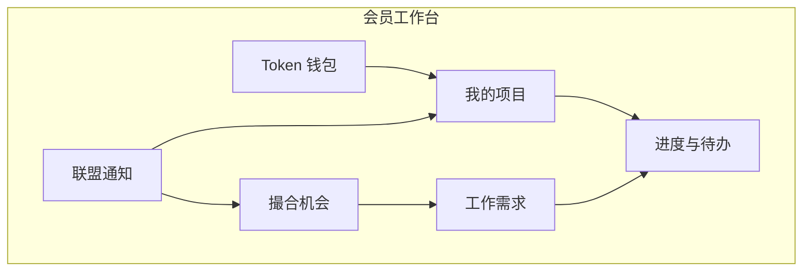

# 微短剧产业服务 SaaS · 产品需求文档（PRD）

> 版本：V1.1 Draft  
> 日期：2026-07-24  
> 状态：按业务方最新定位重写（先文档、后实现）  
> 定位校准：本平台**首先是会员机构的协作与经营中枢**，不是纯出海后台、也不是 C 端播放 App。  
> 出海能力是平台内的一条专业服务线；Token、撮合、通知与项目管理才是日常主路径。

---

## 0. 一句话定位

**让会员机构在一个站里：管自己的项目、发/接工作需求、看进度、买/转售 Token、发现撮合机会、接收联盟通知。**

---

## 1. 产品要解决什么

会员单位今天的真实工作流散落在微信群、表格、口头对接里：

| 日常动作 | 现在怎么做 | 平台应提供 |
|----------|------------|------------|
| 管自身项目 | 表格/群聊 | 项目空间 + 里程碑 + 协作成员 |
| 对接工作需求 | 群里喊一嗓子 | 标准化需求发布 / 接单 / 状态流转 |
| 看工作进度 | 反复催人 | 统一进度视图 + 待办 + SLA |
| 获取 Token | 各家模型各自充值 | 统一钱包购买、配额、API Key |
| 转售 Token | 私下倒卖，无台账 | 合规转售挂单 / 成交 / 审计 |
| 撮合机会 | 路演靠人脉 | 机会广场 + 智能/人工撮合 |
| 联盟通知 | 群消息刷屏遗漏 | 公告、定向通知、已读回执 |

---

## 2. 目标用户

| 角色 | 是谁 | 主要使用 |
|------|------|----------|
| 会员机构管理员 | 制片公司/服务商负责人 | 项目、成员、钱包、机构资料 |
| 项目经理 / 执行人 | 机构内部同事 | 任务进度、需求对接 |
| 联盟秘书处 | 产业联盟运营 | 撮合、通知、审核、活动 |
| 服务中心专员 | 审批/出海/投流/版权/AI | 承接服务工单、专业模块 |
| 平台超管 | 运营主体 | 租户、计费、风控、审计 |

---

## 3. 核心能力地图（P0 主路径）



### 3.1 自身项目管理（P0）

**目标：** 机构管理自己的短剧/服务项目，而不是只给中心填表。

必备能力：

- 创建项目：名称、类型（自制/承制/出海/投放/版权/其他）、阶段、负责人、成员
- 里程碑与任务：待办、截止日期、完成率
- 文件与版本：剧本/成片链接/合同（分级权限）
- 项目进度看板：筹备 → 拍摄 → 后期 → 发行/出海 → 结案
- 关联：可关联「工作需求单」「中心服务工单」「Token 消耗」

验收：机构 A 可独立维护 ≥1 个项目全生命周期，机构 B 不可见。

### 3.2 对接工作需求（P0）

**目标：** 把“找编剧/找演员/找译制/找投放/找场地”变成可追踪工单。

需求单字段：

- 需求类型、紧急度、预算区间、期望交付日
- 需要什么 / 能提供什么（供需双侧，延续现有撮合模型）
- 可见范围：仅秘书处 / 全联盟 / 定向机构

流转：

```
草稿 → 已发布 → 对接中 → 已成交/已关闭
```

能力：

- 发布、编辑、下架
- 报名/应征、沟通纪要
- 秘书处协助撮合标注
- 成交后可一键生成「协作任务」挂到项目

### 3.3 查看工作进度（P0）

**目标：** 任何人打开工作台就知道「我该干什么、卡在哪」。

- 个人待办：我负责的任务/需求/审批
- 项目进度：按项目聚合完成率与阻塞
- 服务进度：提交给中心的工单状态（审批/出海/投流等）
- 超时标红、筛选「仅看阻塞」
- 进度时间线（谁在何时推进了什么）

### 3.4 Token：获取与转售（P0/P1）

**目标：** 参考 OpenRouter 思路，做联盟内统一 AI Token 能力；并支持机构间合规转售。

#### 获取 Token（P0）

- 钱包：余额、本月用量、套餐购买
- 统一 API Key、轮换密钥
- 模型目录：chat/embedding/image/video，标价与状态
- 流水：充值 / 消耗 / 退款
- 项目维度用量归因（可选绑定 project_id）

#### 转售 Token（P1，必须产品化设计，不可私下无台账）

- 卖家挂单：数量、单价、有效期、最低成交量
- 买家下单：冻结 → 成交过户 → 手续费（平台抽成可配置）
- 风控：实名机构、日限额、异常撤单、禁止拆分洗量
- 全程审计；支持争议工单

> 合规说明：转售对象是平台发行的**预付额度凭证**，不是虚拟货币投机盘；需在用户协议与风控策略中写清。

### 3.5 撮合机会（P0）

**目标：** 让机会可发现、可响应、可沉淀。

机会类型：

- 供需撮合（需求广场）
- 作品/场地推荐（展示与精选）
- 路演/对接会报名位
- 中心发布的服务包/试点名额
- 出海选品征集、投放联合测试等

能力：

- 机会卡片：标题、标签、截止、适合谁
- 一键表达意向 / 报名 / 私信秘书处
- 匹配建议（规则：题材×能力标签×地域）
- 成交与未成交原因沉淀

### 3.6 联盟通知（P0）

**目标：** 替代“重要消息淹没在群里”。

- 公告：全体 / 按会员层级 / 按标签定向
- 通知类型：系统、撮合、项目、Token、活动、合规
- 已读/未读、强制已读（重要公告）
- 站内信 + 邮件（P1）+ 企微/飞书（P2）
- 通知中心跳转到业务对象（项目/需求/机会）

---

## 4. 与「出海/五大中心」的关系

本平台是**会员经营层**；五大中心是**专业服务层**。

| 层级 | 模块 | 谁用 |
|------|------|------|
| 会员经营层（主） | 项目、需求、进度、Token、撮合、通知 | 全体会员 |
| 专业服务层 | 审批、出海、发行投流、版权、AI | 中心专员 + 提交服务的会员 |
| 联盟治理层 | 会员管理、活动、章程、KPI | 秘书处 |

出海模块（原 PRD V1.0）降级为：**专业服务线之一**，在会员项目中可「申请出海服务」，进度回写到会员进度视图。详见附录 A。

---

## 5. 信息架构（目标）

### 5.1 会员端（默认首页）

1. 工作台（待办 / 通知 / 进度摘要）  
2. 我的项目  
3. 工作需求（我发布的 / 我可接的）  
4. 撮合机会  
5. Token 钱包（购买 / 流水 / 转售）  
6. 消息中心  
7. 机构与成员设置  

### 5.2 秘书处

1. 运营总览  
2. 会员与认证  
3. 撮合工作台  
4. 机会与展示管理  
5. 通知发布  
6. 活动  
7. KPI  

### 5.3 五大中心（保留）

专业工单与出海等深度能力；从会员项目「发起服务」进入。

---

## 6. 关键业务规则

1. **数据隔离：** 默认机构数据互不可见；发布到联盟广场的需求/作品按可见范围开放。  
2. **进度唯一真源：** 任务状态以系统为准，群聊不算完成。  
3. **Token 过户必须走平台订单**，禁止仅改余额无订单。  
4. **重要联盟通知**可配置强制已读后才能继续敏感操作（可选）。  
5. **撮合成交**需双方确认或秘书处确认，留痕后方可改状态为已成交。  
6. 项目删除为软删；与 Token 消耗、合同关联的项目不可物理删除。

---

## 7. 分期路线图

### Phase 0 — 文档校准（当前）

- 本 PRD V1.1 确认六大主能力
- 技术设计同步调整（见 ARCHITECTURE）

### Phase 1 — 会员主路径 MVP

必须可演示且可真实试用：

1. 账号/机构/成员  
2. 我的项目 + 任务进度  
3. 工作需求发布与对接  
4. 个人工作台（待办+进度）  
5. Token 购买/钱包/流水/API Key（先做获取）  
6. 撮合机会列表与意向  
7. 联盟通知（发布/已读）  

### Phase 2 — 增强

- Token 转售市场与风控  
- 匹配推荐  
- 邮件/企微通知  
- 与出海/审批等服务工单深度双向同步  

### Phase 3 — 平台化

- 多城市租户  
- 开放 API  
- 更完整计费与发票  

---

## 8. 验收用例（Phase 1）

1. 机构管理员创建项目并邀请成员，成员只能看到被授权项目。  
2. 发布「找译制」需求 → 另一机构应征 → 秘书处标记撮合中 → 双方确认成交。  
3. 工作台显示：我的逾期任务、待确认撮合、未读通知。  
4. 购买 Token 套餐后余额增加，调用/模拟消耗后流水可查。  
5. 秘书处发定向通知，目标会员未读计数 +1，打开后已读。  
6. 从项目发起「出海诊断」服务，会员进度页能看到服务状态回写（可先人工改状态）。  

---

## 9. 现状差距（相对当前代码）

| 能力 | 现状 | 目标 |
|------|------|------|
| 自身项目 | 弱/分散（作品展示雏形在其他分支） | 完整项目+任务 |
| 工作需求 | 有供需字段，流程浅 | 发布-应征-成交闭环 |
| 进度 | 几乎靠表格眼神 | 工作台+时间线 |
| Token 获取 | 其他分支有购买演示 | 合入主路径并持久化 |
| Token 转售 | 无 | P1 订单市场 |
| 撮合机会 | 撮合页较薄 | 机会广场+意向 |
| 联盟通知 | 无真正通知中心 | 公告+已读+跳转 |

---

## 10. 开放问题（请业务方拍板）

1. Token 转售是否 Phase 1 就要上，还是先只做「官方购买」？  
2. 需求默认可见范围：全联盟 or 仅秘书处可见再分发？  
3. 会员端是否需要 App/企微，还是先 Web？  
4. 项目类型字典是否与五大中心服务一一对应？  
5. 通知强制已读是否用于「合规/章程类」公告？  

---

## 附录 A. 出海专业线（从属能力）

出海选品/译制/渠道/结算仍按原专业 SOP 建设，但入口改为：

`我的项目 → 申请服务(P07/P08) → 中心处理 → 进度回写会员工作台`

详细字段与状态机见历史文档段落归档：`docs/archive/PRD-overseas-v1.0.md`（若拆分）或 `ARCHITECTURE` 中 overseas bounded context。

---

## 变更记录

| 版本 | 日期 | 说明 |
|------|------|------|
| V1.0 | 2026-07-24 | 以出海运营为主线的初稿 |
| V1.1 | 2026-07-24 | **按业务方校准**：主路径改为项目/需求/进度/Token/撮合/通知 |
