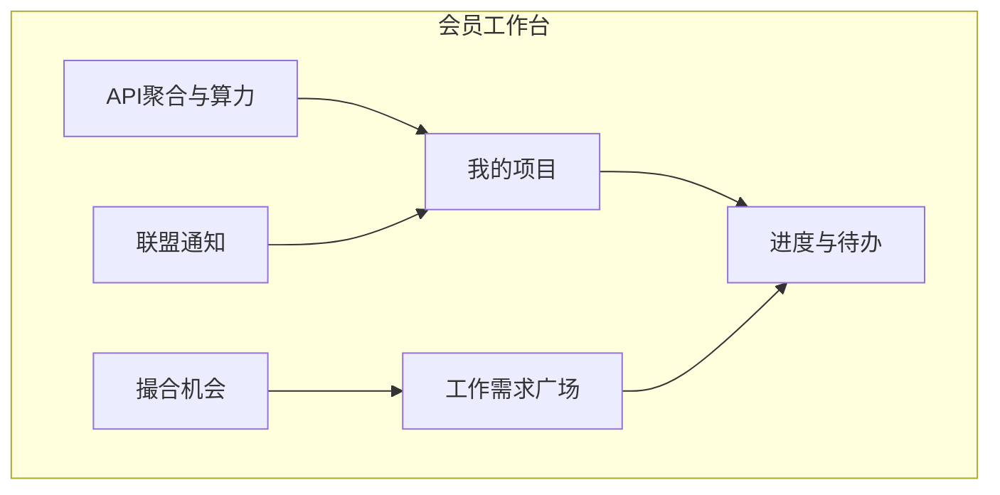

# 微短剧产业服务 SaaS · 产品需求文档（PRD）

> 版本：V1.2 Draft  
> 日期：2026-07-24  
> 状态：业务决策已确认；**实现边界与验收见** [P1_BOUNDARY.md](./P1_BOUNDARY.md) · [ACCEPTANCE.md](./ACCEPTANCE.md) · [API_CONTRACT.md](./API_CONTRACT.md)  
>  
> **已拍板：**  
> 1. 工作需求 **全联盟可见**  
> 2. **不做** Token 转售  
> 3. 要做 **API 聚合** + **算力调度**（统一网关、多模型/算力路由、计量计费）  
>  
> **协作：** 本仓库文档线负责需求/架构/契约/验收审核；实现由其他 Agent 按契约交付。UI 审美不作为文档线主责。

---

## 0. 一句话定位

**会员机构协作中枢：管项目、发/接全联盟可见的工作需求、看进度、通过统一 API 聚合网关使用模型与算力、发现撮合机会、接收联盟通知。**

---

## 1. 产品要解决什么

| 日常动作 | 现在怎么做 | 平台应提供 |
|----------|------------|------------|
| 管自身项目 | 表格/群聊 | 项目空间 + 里程碑 + 成员 |
| 对接工作需求 | 群里喊一嗓子 | 全联盟可见的需求广场 + 应征成交 |
| 看工作进度 | 反复催人 | 工作台待办 + 项目/服务进度 |
| 用 AI / 算力 | 各家控制台各自充值、各自 Key | **API 聚合网关** + 钱包计费 + **算力调度** |
| 撮合机会 | 靠人脉 | 机会广场 + 意向 + 秘书处协助 |
| 联盟通知 | 群消息遗漏 | 公告、定向通知、已读回执 |

### 明确不做

- Token / 额度 **转售、挂单倒卖**
- C 端短剧播放与硬币充值
- 加密货币或投机盘形态

---

## 2. 目标用户

| 角色 | 主要使用 |
|------|----------|
| 会员机构管理员 | 项目、成员、钱包充值、机构资料 |
| 项目执行人 | 任务进度、需求应征、调用聚合 API |
| 联盟秘书处 | 撮合、通知、机会、会员治理 |
| 服务中心专员 | 专业服务工单（出海/审批等） |
| 平台超管 / AI 运维 | 模型接入、算力池、路由策略、限流与对账 |

---

## 3. 核心能力（主路径）



### 3.1 自身项目管理（P0）

- 创建/编辑项目：类型、阶段、负责人、成员
- 里程碑与任务、完成率、阻塞标记
- 附件与链接（分级权限）
- 可关联：工作需求、中心服务工单、**API/算力用量**

### 3.2 对接工作需求（P0）— 全联盟可见

**决策：已发布需求默认对全联盟会员可见。**

字段：需求类型、紧急度、预算区间、期望交付、需要什么/可提供什么、联系方式（可对非应征方脱敏）。

流转：

```
草稿 → 已发布(alliance可见) → 对接中 → 已成交 / 已关闭
```

能力：

- 全联盟需求广场浏览与搜索（题材、类型、地区）
- 应征、沟通纪要、秘书处标注撮合
- 成交后可生成协作任务挂到项目
- 仅「草稿」与「已关闭」对广场不可见；发布后不可改成私下可见（如需下架用关闭）

### 3.3 查看工作进度（P0）

- 个人待办、项目进度、服务工单进度
- 超时标红、阻塞筛选、时间线

### 3.4 API 聚合 + 算力调度（P0 核心）

**替代「Token 转售」的能力重心。** 参考 OpenRouter 类统一网关，服务短剧产线（剧本、译制、素材、合规辅助、图/视频生成等）。

#### A. API 聚合网关

- **统一接入点**：OpenAI 兼容协议（如 `/v1/chat/completions`、后续 `/v1/images` `/v1/videos`）
- **统一 API Key**（机构级），支持轮换；按成员子 Key 归 **Phase 2**
- **模型目录**：多供应商（DeepSeek、通义、OpenAI 兼容源、图像/视频模型等），统一标价（按 Token 或按次）
- **路由策略**：按模型名指定，或按「任务类型 + 成本/时延」自动路由
- **计量计费**：请求级用量入账，扣减机构钱包余额；余额不足拒绝
- **限额**：RPM/TPM、日限额、项目配额
- **可观测**：延迟、错误率、模型可用性；维护/限流状态展示
- **审计**：谁、哪个项目、哪个模型、消耗多少

#### B. 算力调度

面向渲染/批量译制/AIGC 长任务，不只是同步 Chat：

- **算力池登记**：自有 GPU / 合作算力 / 云厂商队列（一期可先「逻辑池 + 手工节点」）
- **作业（Job）**：提交任务类型（字幕批处理、配音、图生视频等）、优先级、项目归属、输入/输出资产
- **调度策略**：队列、优先级、并发槽位、超时重试、失败转移
- **状态机**：`queued → running → succeeded / failed → cancelled`
- **回写**：完成后通知项目进度与资产链接；消耗记入同一钱包或「算力点」账本
- **运维台**：队列深度、节点心跳、熔断

#### C. 钱包（仅官方获取，不转售）

- 套餐购买 / 充值（一期可模拟支付回调）
- 余额、本月用量、流水（充值、API 消耗、算力消耗、退款）
- **禁止**机构间余额转让与挂单交易

### 3.5 撮合机会（P0）

- 需求广场之外的机会：路演位、精选作品/场地、试点名额、联合测试
- 意向报名、匹配建议、成交沉淀

### 3.6 联盟通知（P0）

- 全体 / 按层级 / 按标签定向
- 已读回执、跳转业务对象
- 类型含：系统、撮合、项目、**API/算力告警**、活动、合规

---

## 4. 与五大中心的关系

| 层级 | 内容 |
|------|------|
| 会员经营层（主） | 项目、需求、进度、API/算力、撮合、通知 |
| 专业服务层 | 审批、出海、发行投流、版权、AI 训战 |
| 联盟治理层 | 会员、活动、KPI、机会运营 |

会员从项目「申请中心服务」；进度回写工作台。

---

## 5. 信息架构

### 会员端

1. 工作台  
2. 我的项目  
3. 工作需求（全联盟广场 / 我发布的 / 我应征的）  
4. 撮合机会  
5. **API 与算力**（Key、模型目录、用量、作业队列、充值）  
6. 消息中心  
7. 机构设置  

### 秘书处 / 超管

- 撮合、通知、机会、会员  
- **模型与路由配置、算力池与调度策略、计费套餐、风控限额**

---

## 6. 关键业务规则

1. 机构私有数据默认隔离；**已发布工作需求全联盟可见**。  
2. 进度以系统状态为准。  
3. 任何余额变动必须有账本流水；**无转售、无人为直接改余额（超管调账除外且强审计）**。  
4. API 请求与算力作业尽量绑定 `project_id`（可配置强制）。  
5. 撮合成交需双方或秘书处确认留痕。  
6. 算力作业失败可重试；扣费策略：预授权冻结 → 成功实扣 / 失败释放（P0 可先成功后扣 + 人工纠偏）。

---

## 7. 分期

### Phase 1 — MVP

1. 账号/机构/成员  
2. 项目 + 任务进度  
3. 全联盟工作需求广场 + 应征成交  
4. 工作台待办  
5. **API 聚合网关（Chat 兼容）+ 钱包购买/计量**  
6. **算力作业队列（最小调度：单队列 + 状态）**  
7. 撮合机会意向  
8. 联盟通知已读  

### Phase 2

- 多模型自动路由、图像/视频端点  
- 算力多池、优先级、失败转移  
- 子 Key、项目强制配额  
- 邮件/企微通知  
- 与出海等服务工单双向同步  

### Phase 3

- 多租户城市复制、发票、更完整 SLA 对账  

---

## 8. 验收用例（Phase 1）

1. 机构 A 发布需求后，机构 B 在广场可见并可应征。  
2. 项目任务逾期出现在工作台。  
3. 购买套餐后，用统一 API Key 调用聚合网关，余额按用量下降，流水可查。  
4. 提交一个算力作业 → 入队 → 标记运行/成功 → 项目收到完成事件。  
5. 余额不足时 API 返回明确错误，不执行上游调用。  
6. 系统中不存在转售/挂单入口。  
7. 秘书处发通知，会员未读→已读可追踪。  

---

## 9. 现状差距

| 能力 | 现状 | 目标 |
|------|------|------|
| 项目 | 弱 | 完整项目+任务 |
| 需求 | 浅、可见性不清 | 全联盟广场闭环 |
| 进度 | 缺工作台 | 待办+时间线 |
| API 聚合 | 演示级 Token 页（他支） | 真网关+计量 |
| 算力调度 | 无 | Job 队列+状态机 |
| Token 转售 | 曾讨论 | **明确砍掉** |
| 通知 | 无 | 公告+已读 |

---

## 10. 开放问题（P1 决议）

| # | 问题 | P1 决议 |
|---|------|---------|
| 1 | 会员端是否只要 Web？ | **Web only** |
| 2 | 算力是否先人工回调？ | **是**（运维 transition）；真实 Worker 协议后置 |
| 3 | BYOK？ | **否**；平台托管上游 Key |
| 4 | 通知强制已读？ | 字段预留；P1 **不做强制阻断 UX** |

细则见 [docs/README.md](./README.md)。

---

## 变更记录

| 版本 | 说明 |
|------|------|
| V1.0 | 出海主线 |
| V1.1 | 会员六大能力；含 Token 转售设想 |
| V1.2 | **需求全联盟可见；取消转售；确立 API 聚合 + 算力调度** |
| V1.2-doc | 澄清子 Key→Phase2；固化开放问题决议；挂接边界/契约/验收文档 |
