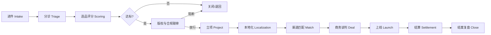

# 微短剧出海服务中心 SaaS · 产品需求文档（PRD）

> 版本：V1.0 Draft  
> 日期：2026-07-24  
> 状态：待评审（先文档、后重构实现）  
> 依据：西安微短剧产业服务中心建设方案附件 B/E/F/G/H/K；海外微短剧分发市场实践（ReelShort / DramaBox / ShortMax / DramaWave 等）  
> 对照现状：当前仓库 `xian-drama-saas` V2.0 出海门户仅为**演示壳**（静态表 + 阶段下拉），不具备真实运营可用性。本文档定义“可运营、可考核、可结算”的目标产品。

---

## 1. 背景与问题

### 1.1 业务背景

海外微短剧已进入基础设施竞争阶段：平台侧（ReelShort、DramaBox、ShortMax、DramaWave、NetShort、GoodShort、FlexTV 等）需要稳定片源；制作侧缺的不是“能不能拍”，而是：

1. **选品是否匹配目标市场**（题材、时长、受众、付费模型）
2. **版权链是否可授权出海**
3. **本地化是否达标**（字幕 / 配音 / 文化改编，而非机翻搬运）
4. **能否对接到正确平台与条款**（分成 / 买断 / 预付款 / 联合发行）
5. **上线后能否对账回款**（账期、汇率、税务、争议）

西安服务中心定位是“抱团出海”的公共服务枢纽：对企业提供**可预约、可追踪、可评价**的出海服务产品（P07 选品诊断、P08 本地化与渠道对接），而不是再做一个内容播放 App。

### 1.2 核心痛点（必须被系统解决）

| 痛点 | 今天怎么发生 | 系统应如何解决 |
|------|--------------|----------------|
| 进件无标准 | 微信/邮件乱投材料 | 结构化进件 + 材料清单 + SLA |
| 选品凭感觉 | 口头说“适合北美” | 评分卡 + 市场情报 + 评审留痕 |
| 版权卡死 | 上线前才发现权属不清 | 出海前强制版权联审门禁 |
| 译制黑盒 | Excel 跟进度，延误无人知 | 任务看板 + 供应商 SLA + 质检 |
| 渠道靠人脉 | 对接人离职即失效 | 渠道主数据 + 合作履历 + 活跃度 |
| 谈判无纪要 | 口头条件、无法复盘 | 条款结构化 + 版本对比 + 审批 |
| 结算靠截图 | 对不上账、纠纷难举证 | 账期对账工作台 + 差异单 |
| 无法考核 | KPI 靠手填周报 | 服务量/转化/时效自动统计 |

### 1.3 产品定位（一句话）

**面向服务中心运营团队与会员制片方的 B2B 出海运营系统**：以「项目」为主线，贯通进件 → 选品 → 合规 → 译制 → 商务 → 上线 → 结算 → 结案复盘，支撑公益诊断与半公益/市场化增值服务的边界管理。

### 1.4 非目标（明确不做）

- 不做 C 端播放器 / 硬币充值 / 广告投放买量平台本体
- 不做券商式自动分账支付（可对接银行/第三方，本系统做台账与流程）
- 第一期不做完整跨境税务引擎
- 不替代企业法务终审与平台官方后台

---

## 2. 目标与成功标准

### 2.1 业务目标（对齐建设方案）

| 周期 | 目标 | 可验证指标 |
|------|------|------------|
| 90 天 | 出海中枢可用 | 渠道库 ≥30；可出海项目库 ≥20；深度诊断 ≥5；进入译制/谈判 ≥3 |
| 12 个月 | 服务成体系 | 促成出海签约 ≥15；诊断→谈判转化可统计；周报/KPI 自动出数 |

### 2.2 产品成功标准（验收）

1. 一个真实项目可在系统内从进件走到结案，**不依赖微信群传文件当主流程**
2. 每个关键状态变更有**操作人、时间、备注、附件**
3. 版权不清项目**无法进入渠道推介**（硬门禁）
4. 运营可按 SLA 看到超时工单；主任办可导出周报/KPI
5. 制片方可自助查看进度与待办，无需反复催问运营

---

## 3. 用户与角色

### 3.1 角色矩阵

| 角色 | 典型用户 | 核心诉求 | 权限摘要 |
|------|----------|----------|----------|
| 制片方客户 | 会员制作公司联系人 | 提交项目、看进度、收意见、对账确认 | 仅本机构数据 |
| 出海运营 | 出海中心专员 | 推进漏斗、匹配渠道、跟译制 | 本中心项目读写 |
| 出海主管 | 出海中心负责人 | 分派、审批高风险条款、KPI | 中心全量 + 审批 |
| 本地化 PM | 译制协调 | 任务拆分、供应商、质检 | 译制模块 |
| 商务经理 | BD | 渠道维护、谈判、合同 | 渠道/交易 |
| 财务对账 | 财务/结算岗 | 账期核对、差异、打款登记 | 结算模块 |
| 版权顾问 | 版权中心联审 | 权属审核、阻断/放行 | 联审意见 |
| 主任办 / 管理员 | 服务中心管理层 | 租户配置、审计、报表 | 全局只读/配置 |
| 供应商（二期） | 译制/配音公司 | 接单、回传成片 | 外协门户 |

### 3.2 租户模型（SaaS）

| 租户类型 | 说明 |
|----------|------|
| 服务中心租户 | 西安微短剧产业服务中心（运营主体） |
| 机构租户（制片方） | 入驻会员单位，数据按 `org_id` 隔离 |
| 平台方（可选二期） | 外部渠道账号只读协作 |

一期实现：**单服务中心租户 + 多机构（制片方）**；代码与表结构预留 `tenant_id`，以便未来复制给其他城市服务中心。

---

## 4. 服务产品与收费边界（必须产品化）

对齐附件 B：

| 产品编号 | 名称 | 属性 | SLA | 系统承载 |
|----------|------|------|-----|----------|
| P07 | 出海选品诊断 | 公益 | 7 个工作日出具意见 | 进件 → 评分卡 → 诊断报告 |
| P08 | 出海本地化与渠道对接 | 半公益/增值 | 按项目合同 | 译制工单 + 渠道匹配 + 谈判；对接免费，译制/投放市场化 |

系统要求：

- 每个工单/项目绑定产品编号与收费属性
- 公益额度、超额转市场化有记录
- 禁止强制捆绑第三方服务商（可推荐，不可锁死）

---

## 5. 核心业务流程（端到端）



### 5.1 状态机（项目主状态）

允许流转（非法跳转系统拒绝）：

```
draft → submitted → triage → scoring → compliance
  → approved → localizing → dealmaking → launched → settling → closed
任意非终态 → on_hold / rejected / cancelled（需原因码）
```

附加规则：

- `dealmaking` 前必须 `compliance=passed`
- `launched` 前至少 1 条 `deal.status=signed` 或买断完成
- `closed` 必须填写成功/失败因素各 ≥3 条（SOP 要求沉淀 5 条，系统最低 3，主管可配置）

---

## 6. 功能需求（按模块）

> 优先级：P0 必须上线才算可用；P1 首个正式运营季；P2 增强。

### 6.1 机构与账号（P0）

- 机构建档：名称、信用代码、类型、联系人、会员层级、能力标签（含“出海”）
- 邀请成员、角色分配、禁用账号
- 登录：邮箱/手机号 + 密码；二期 SSO/企微
- 操作审计：登录、导出、状态变更、附件下载

### 6.2 进件与分诊（P0）

**制片方提交：**

- 剧名、集数、单集时长、竖/横、题材标签、目标市场（多选）
- 成片/样片链接（加密、有效期）、字幕语言、是否已有译制
- 版权声明附件、权利链勾选（剧本/改编/音乐/肖像）
- 期望服务：仅 P07 / P07+P08 / 仅咨询

**运营分诊：**

- 材料完整性检查清单（缺项不可进入评分）
- 优先级、负责人、SLA 截止日期自动计算（P07：提交日+7 工作日）
- 退回补件（带原因模板）

### 6.3 选品评分与诊断报告（P0）

评分维度（默认，可配置权重；对齐附件 H 并扩展出海）：

| 维度 | 建议权重 | 说明 |
|------|----------|------|
| 版权清晰 | 20 | 无完整权属不得高分 |
| 完成度 | 15 | 成片/准成片 |
| 目标市场适配 | 25 | 题材×市场情报 |
| 本地化成本可控 | 15 | 语种、改幅、敏感内容量 |
| 团队配合度 | 10 | 响应、材料 |
| 示范/战略价值 | 15 | 西安关联、可沉淀 SOP |

产出：

- 结构化诊断报告（通过/有条件通过/不建议）
- 建议市场、建议平台短名单、风险清单
- PDF/在线版可分享给客户（水印 + 权限）

### 6.4 版权与合规联审（P0）

- 联审工单派发给版权/审批角色
- 意见：通过 / 修改后重审 / 阻断
- **阻断时系统禁止：渠道推介、对外路演、签约推进**
- 敏感内容改造任务可生成本地化子任务

### 6.5 项目工作台（P0）

- 项目详情：时间线、待办、附件、干系人、SLA 灯
- 里程碑看板（按阶段）
- @提醒、站内信、邮件（P1）
- 与中心工单号关联（`XA-WO-YYYY-###`）

### 6.6 本地化 / 译制管理（P0）

任务类型：字幕、配音、本土化改编、审校、母带封装

字段：语种、供应商、报价、币种、工期、质检状态、文件版本

能力：

- 从项目一键拆任务（按目标市场语种模板）
- 供应商比选记录（至少 2 家报价才可审批，可配置）
- 质检驳回闭环
- 成本汇总进项目预算

### 6.7 渠道主数据（P0）

对齐附件 K「出海渠道库」：

- 类型：平台 / 发行代理 / 本地化供应商 / 投放服务商
- 覆盖市场、合作方式、分成/费用口径、对接人、活跃度、风险备注
- 合作履历：历史项目、成交条款摘要（脱敏级别控制）
- 活跃度规则：N 天未联系自动降级提醒

一期内置渠道种子（可编辑）：ReelShort、DramaBox、ShortMax、DramaWave、GoodShort、NetShort、FlexTV、Melolo 等，并标注题材偏好与常见合作模型（分成/买断/混合）。

### 6.8 渠道匹配与商务谈判（P0）

- 基于市场+题材+完成度推荐渠道（规则引擎一期即可）
- 创建 Deal：类型（授权/分账/买断/联合发行）、地域、期限、排他、预付款、分成比、素材交付物、上线窗口
- 谈判纪要多版本；关键条款变更需主管审批
- 合同附件 + 关键字段抽取（手工结构化，二期 OCR/抽取）
- 签约后自动推进项目阶段

### 6.9 上线与运营数据回流（P1）

- 上线登记：平台、地区、上线日、剧集 ID、素材版本
- 周期数据录入/导入：曝光、完播、付费转化、收入（支持 CSV）
- 与投流中心数据打通预留（不在一期强依赖）

### 6.10 结算对账（P0 最小可用 / P1 完整）

P0：

- 账期单：项目、平台、周期、币种、流水、分成、税费备注、状态
- 状态：待提交 → 待核对 → 有差异 → 已确认 → 已打款登记
- 差异单：差异金额、原因、责任方、处理结论
- 客户侧确认动作留痕

P1：

- 多币种与汇率表
- 与合同条款自动校验（分成比、保底）
- 导出财务凭证模板

### 6.11 结案复盘与知识库（P0）

- 成功/失败因素结构化标签
- 自动沉淀到：驳回/失败原因库、市场情报、渠道评分
- 案例库（脱敏后可对会员共享）

### 6.12 通知、工单与 SLA（P0）

- 统一待办中心
- SLA：按产品与阶段配置工作日；超时标红并计入 KPI
- 站内通知；邮件 P1；企微/飞书 P2

### 6.13 报表与 KPI（P0）

对齐附件 G 出海指标：

| 指标 | 定义 |
|------|------|
| 诊断数 | 周期内完成的 P07 报告数 |
| 进入谈判/上线数 | 阶段到达 dealmaking / launched 的项目数 |
| 渠道库有效性 | 活跃渠道 / 渠道总数 |
| 时效 | P07 按时完成率、译制按时率 |
| 转化漏斗 | 进件→立项→谈判→上线→回款 |

支持：周报一键生成、月报导出、主任办看板。

### 6.14 权限、安全与脱敏（P0）

对齐附件 E：

- L1–L4 数据分级；合同关键条款默认 L3
- 成片链接默认 7–30 天失效；下载登记
- 对外简报强制脱敏模板
- 全量审计日志；导出二次确认

### 6.15 系统管理（P0）

- 字典：题材、市场、语种、原因码、产品目录
- 评分权重配置
- 工作日/节假日日历（影响 SLA）
- 功能开关与环境配置

---

## 7. 信息架构（目标 IA）

### 7.1 运营台

1. 工作台（我的待办 / 超时 / 今日节点）
2. 进件队列
3. 项目（列表 / 看板 / 详情）
4. 本地化
5. 渠道库
6. 商务/合同
7. 结算
8. 市场情报与案例库
9. KPI / 周报
10. 设置

### 7.2 制片方门户

1. 首页（进行中、待我处理）
2. 新建出海需求
3. 我的项目（进度时间线）
4. 文件与报告
5. 结算确认
6. 机构与成员

---

## 8. 关键业务规则（摘录）

1. 版权联审未通过 → 禁止渠道推介与签约推进  
2. 公益 P07 超时 → 计入个人与中心时效 KPI  
3. 同一成片重复进件 → 系统提示关联历史项目  
4. 买断类 Deal 结算按合同里程碑，不按月流水强行套分账模板  
5. 供应商报价与最终付款差异 > 阈值 → 需主管确认  
6. 删除项目仅软删；结案后锁定核心字段，变更走变更单  

---

## 9. 分期路线图

### Phase 0 — 文档与领域建模（当前）

- PRD + 技术设计评审通过
- 领域模型与状态机定稿
- 废弃“仅演示表单”作为交付标准

### Phase 1 — MVP（真正可用的最小闭环）

范围：账号机构、进件分诊、选品评分、版权门禁、项目工作台、译制任务、渠道库、谈判最小字段、结算台账、审计、KPI 基础、制片方门户。

验收：跑通 ≥3 个真实样例项目全流程。

### Phase 2 — 运营增强

匹配推荐、合同条款校验、数据回流导入、邮件通知、周报自动、供应商门户。

### Phase 3 — 平台化

多服务中心租户、开放 API、与外部译制/网盘/电子签集成、高级分析。

---

## 10. 现状差距（对当前 V2.0 演示的诚实评估）

| 能力 | 演示现状 | 目标 |
|------|----------|------|
| 多角色权限 | 两个按钮切换角色 | RBAC + 机构隔离 |
| 进件 | 简单表单写 JSON | 材料清单 + SLA + 退回 |
| 选品 | 一个 score 数字 | 多维评分卡 + 报告 |
| 版权门禁 | 无 | 硬阻断 |
| 译制 | 状态下拉 | 任务/供应商/质检/成本 |
| 渠道 | 静态卡片 | 主数据 + 履历 + 活跃度 |
| 商务 | 阶段下拉 | 条款结构化 + 审批 |
| 结算 | 状态下拉 | 账期/差异/确认 |
| 审计与安全 | 无 | 分级 + 日志 |
| 持久化 | JSON 文件 | PostgreSQL 规范化模型 |
| 可测试性 | 无业务测试 | 状态机与权限单测 |

**结论：演示版验证了信息架构方向，但不能作为“已交付 SaaS”。下一阶段按本 PRD Phase 1 重构实现。**

---

## 11. 验收用例（Phase 1 抽样）

1. 制片方提交缺版权附件的进件 → 无法提交 / 或提交后分诊退回  
2. 评分 < 阈值 → 可关闭并生成不建议报告  
3. 版权阻断后尝试创建渠道推介 → API/UI 均拒绝  
4. 创建英文字幕任务并质检驳回 → 状态回退进行中且通知运营  
5. 签约 Deal 后项目自动进入可上线准备  
6. 财务登记账期，客户确认后状态=已确认  
7. 导出周报含诊断数、谈判数、超时单  
8. 机构 A 无法读取机构 B 项目  

---

## 12. 开放问题（评审时拍板）

1. 第一期是否必须对接电子签，还是上传扫描件即可？  
2. 成片存储：中心对象存储 vs 企业自备网盘链接？  
3. 多币种结算一期是否只支持 USD+CNY？  
4. 是否与联盟会员系统账号打通，还是出海域独立账号？  
5. KPI 是否对个人绩效强制挂钩（影响权限与不可篡改要求）？

---

## 13. 文档变更记录

| 版本 | 日期 | 说明 |
|------|------|------|
| V1.0 Draft | 2026-07-24 | 首版：基于服务中心附件与海外分发实践，明确可用闭环与现状差距 |
