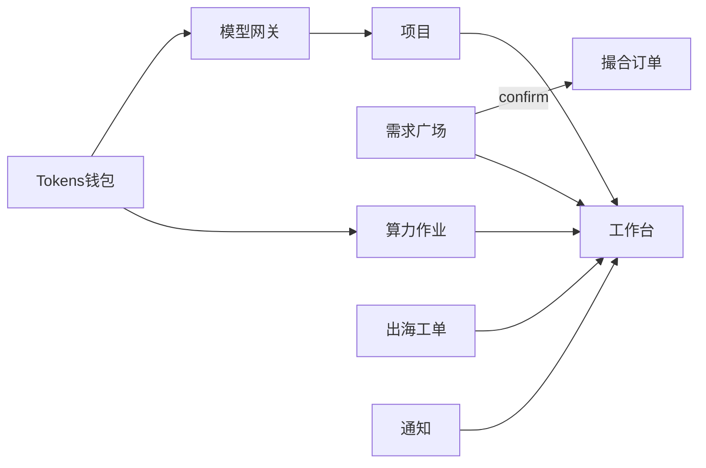

# 微短剧产业服务 SaaS · 产品需求文档（PRD）

> 版本：**V1.3**  
> 日期：2026-07-24  
> 状态：业务决策已确认；**用户侧需求真源**见 [USER_REQUIREMENTS.md](./USER_REQUIREMENTS.md) U1.0；升级说明见 [SCHEME_V13.md](./SCHEME_V13.md)  
> 实现边界 / 契约 / 验收：[P1_BOUNDARY.md](./P1_BOUNDARY.md) · [API_CONTRACT.md](./API_CONTRACT.md) · [ACCEPTANCE.md](./ACCEPTANCE.md)  
>  
> **已拍板：**  
> 1. 工作需求 **全联盟可见**  
> 2. Tokens **进/转/出（D1.3）**：官方购额 → 订单托管+生产消耗 → C 环法币合同和/或 Earned **官方回收销毁退 ¥**；禁互兑/挂单/购入即兑（[DECISION_TOKEN_SETTLEMENT.md](./DECISION_TOKEN_SETTLEMENT.md)）  
> 3. **API 聚合** + **算力调度**（统一网关、Tokens 计量）  
> 4. **产品三角**：会员中枢（主）· 出海专业服务线 · 撮合履约网络  
>  
> **协作：** 文档线负责需求/架构/契约/验收；实现 Agent 按契约交付。UI 审美不作为文档线主责。  
> **阅读顺序：** [USER_REQUIREMENTS](./USER_REQUIREMENTS.md) → [PAIN…](./PAIN_FIRST_PRINCIPLES.md) → [ECOSYSTEM…](./ECOSYSTEM_AND_USAGE.md) → [BUSINESS_LOGIC](./BUSINESS_LOGIC.md) → [DECISION_TOKEN_SETTLEMENT](./DECISION_TOKEN_SETTLEMENT.md) → 本文。

---

## 0. 一句话定位

**联盟会员协作中枢：管项目、发/接全联盟工作需求并生成撮合订单、看进度、用机构 Tokens 钱包调用统一模型网关与算力作业、接收联盟通知。出海译制等是挂接的专业服务线，不是另一套独立 SaaS。**

差异化：**统一模型网关 + 机构钱包计量（非 Token 转售）。**

---

## 0.1 产品三角

| 层 | 名称 | 用户感知 | 系统能力 |
|----|------|----------|----------|
| 主 | **会员协作中枢** | `/app` 日常经营 | 项目、需求、订单、Tokens、网关、算力、通知 |
| 专 | **出海专业服务** | 服务介绍 + 进件/工单 | `service_requests` 挂项目，进度回写工作台 |
| 履约 | **撮合履约网络** | 需求成交后的订单 | `match_orders`：T 托管节点、放款至 earned、争议；现金出口见官方回收 / C 环 |

禁止三套表面都自称「唯一出海 SaaS」。

---

## 1. 产品要解决什么

| 日常动作 | 现在怎么做 | 平台应提供 |
|----------|------------|------------|
| 管自身项目 | 表格/群聊 | 项目空间 + 任务 + 阻塞/逾期 |
| 对接工作需求 | 群里喊 | 全联盟广场 + 应征 + **撮合订单** |
| 看进度 | 反复催 | 工作台待办 + 工单/作业回写 |
| 用 AI / 算力 | 各家控制台 | **XD-Router** + Tokens + **算力 Job** |
| 出海服务 | 线下对接 | 服务进件 + 工单状态（专业线） |
| 联盟通知 | 群消息 | 公告 + 已读 + 跳转业务对象 |

### 明确不做

- Token / 额度 **转售、挂单、机构间转让**  
- 把算力做成可倒卖商品（算力 = 作业调度）  
- C 端播放与硬币充值、加密货币投机  
- 将「平台热度测试 / 版权链 / 等保多区域」宣称为 MVP 已交付  

---

## 2. 目标用户

| 角色 | 主要使用 |
|------|----------|
| 机构管理员 | 项目、成员、购额、确认应征、API Key |
| 项目执行人 | 任务、应征、调用网关、提交算力作业 |
| 联盟秘书处 | 通知、机会、撮合协助、订单争议仲裁 |
| 服务中心专员 | 出海等专业服务工单 |
| 平台运维 | 模型目录、作业推进、路由与对账 |

演示至少支持 **双机构三角色** 切换，以自证「发布→应征→确认」闭环。

---

## 3. 核心能力（主路径）

### 3.1 项目管理（P0）

- 创建/编辑：类型、阶段、负责人  
- 任务：状态、截止日期、阻塞原因；逾期进工作台  
- 可关联：需求、撮合订单、算力作业、服务工单、用量  

Phase 1.1+：成员、里程碑、附件。

### 3.2 工作需求（P0）— 全联盟可见

**已发布需求 `visibility = alliance` 固定；不可改回私下可见；下架用关闭。**

**品类枚举（P0）：** `翻译` | `配音` | `IP授权` | `海外发行` | `算力协助` | `其他`

**状态机（对外中英双语）：**

| 枚举 | 中文 |
|------|------|
| `draft` | 草稿 |
| `published` | 已发布 |
| `matching` | 对接中 |
| `deal` | 已成交 |
| `closed` | 已关闭 |

广场仅展示 `published | matching | deal`（产品可配置是否展示 deal；默认展示便于追踪）。草稿与 closed 不在广场。

**列表 Tab：** 全联盟广场 / 我发布的 / **我应征的**

**能力：** 发布、应征（禁本机构）、确认成交、（P1）搜索筛选、沟通纪要、秘书标注。

### 3.3 撮合订单（P0，V1.3 升格）

应征确认后 **必须** 生成订单，字段至少：

`orderId, demandId, publisherOrgId, applicantOrgId, amount, amountUnit, node, status`

**订单状态建议：** `escrowed` | `in_progress` | `released` | `disputed` | `closed`

**Tokens 托管结算（P0，对齐 D1.3）：**

- 撮合订单标价与托管单位 = **Tokens**；确认成交后从需求方钱包冻结 → 托管池 → 验收放款至供给方 **earned**（扣撮合费归平台）  
- **禁止**无订单的机构间余额划转、挂单转售、会员互兑  
- 需要稳定法币的供给：走 **C 环服务合同**，或对 earned 申请 **官方回收**（非自由提现）  
- 系统 **无** 转让/兑换所 API；页面须可读懂「进/转/出」  

### 3.4 工作台（P0）

必显：逾期任务、阻塞任务、待确认应征、未读通知、开放需求数、进行中算力作业、Tokens 余额。  
可选一条发行/分账提醒；不得压过上述主信号。

### 3.5 API 聚合 + 算力（P0）

#### A. 模型网关（XD-Router）

- OpenAI 兼容：`POST /v1/chat/completions`、`GET /v1/models`  
- 机构级 API Key；轮换；明文仅创建展示（目标存 hash）  
- 模型目录按模态：`chat` /（P2）`translate` `tts` `image`…  
- 计量单位：**Tokens**；官方购额 `¥ → Tokens`  
- 余额不足：`402` + `INSUFFICIENT_BALANCE`，**不执行上游**  
- 计费顺序目标：**预检 → 调上游 → 成功再扣**；上游失败不扣或自动退  

#### B. 算力作业

- 状态机：`queued → running → succeeded | failed`；`queued|running → cancelled`；`failed → queued`（重试）  
- 预扣 Tokens；**succeeded 实扣（预扣即实扣）**；**failed / cancelled 释放预扣**  
- 成功：通知 +（尽量）回写项目  
- Phase 1：运维 `transition` 模拟 Worker  

#### C. Tokens 钱包

- 分桶：`purchased` / `earned` / `frozen` / `bonus`；官方购额、订单放款、消耗、回收销毁、调账流水  
- **禁止**转售、机构间无订单转让、purchased 兑出  
- **允许** earned 官方回收（审批/折价/限额，见 D1.3）  

### 3.6 出海专业服务（P1 主做，P0 可链出）

- 营销页只负责卖点与进件  
- 系统：`service_requests` 状态  
  `intake → evaluating → quoted → in_delivery → accepted → settled|closed`  
- 进度回写会员工作台 / 项目  

### 3.7 撮合机会与通知（P0）

- 机会：路演/试点等非「人力需求」类；意向报名  
- 通知：已读回执；跳转需求/订单/钱包/作业；`forceRead` 不做阻断 UX  

### 3.8 明确延期（不进 MVP 导航）

| 能力 | 归期 | 说明 |
|------|------|------|
| 平台热度测试 | P2 | 需平台数据授权；演示可标实验 |
| 版权区块链 | P3/展望 | 禁止「司法采信 100%」无证据话术 |
| 企业存储大控台 | P2 | 工作台保留用量指标即可 |
| 子 Key / 自动路由 / 多区域等保 | P2–P3 | 见分期 |

---

## 4. 与五大中心 / 外部演示的关系

| 层级 | 内容 |
|------|------|
| 会员经营层（主） | 中枢能力 §3 |
| 专业服务层 | 出海、审批等工单 |
| 联盟治理层 | 会员、活动、KPI、机会 |

外部 HTML 演示壳（如 hub v3.3）仅作叙事参考；**工程真源为本仓库 API + 本 PRD。**

---

## 5. 信息架构（会员端 V1.3）

**一级导航（默认）：**

1. 工作台  
2. 我的项目  
3. 工作需求（广场 / 我发布的 / 我应征的）  
4. 撮合订单  
5. 机构钱包  
6. 模型网关  
7. 算力作业  
8. 消息中心  
9. 机构设置  

**二级 / 折叠「专业服务」：** 出海译制进件、（实验）热度测试  

**秘书处：** 通知、机会、争议订单、会员；超管：模型/池/套餐/限额  

**不出现：** 转售、挂单、机构转余额、默认一级「版权链」。

---

## 6. 关键业务规则

1. 机构数据隔离；已发布需求全联盟可见且 visibility 锁定。  
2. 进度以系统状态为准。  
3. Tokens 变动必有流水；无转售；调账仅超管+审计。  
4. **撮合订单用钱包 T 托管放款；禁止无订单互转与自由兑出。**  
5. API/作业尽量绑定 `project_id`。  
6. 成交须确认留痕并生成订单。  
7. 算力：预扣 → 成功实扣 / 失败或取消释放。  
8. 对外材料区分「演示现状 / 建设目标」。  

---

## 7. 分期

### Phase 1 — MVP

1. 账号/机构/角色  
2. 项目 + 任务 + 工作台逾期  
3. 全联盟需求 + 我应征的 + 应征确认  
4. **撮合订单最小闭环**  
5. Tokens 购额 + 流水  
6. Chat 网关计量 + 402  
7. 算力作业 + 退款/释放 + 成功通知  
8. 通知已读  
9. 无转售回归  

### Phase 1.1

- 出海服务工单同步、订单托管细化、usage_records、Key 哈希、鉴权加固、搜索筛选  

### Phase 2

- 多模态端点、自动路由、多池调度、子 Key、热度真数据、企微邮件  

### Phase 3

- 多租户、发票、等保与多区域建设  

---

## 8. 验收用例（Phase 1 / V1.3）

1. A 发布需求，B 广场可见并应征；A 确认后订单生成且状态可查。  
2. B 在「我应征的」看到记录。  
3. 逾期任务出现在工作台。  
4. 官方购额后 Tokens 增加；Chat 调用后下降；流水可查。  
5. 余额不足返回 402 且不调用上游。  
6. 算力作业 queued→running→succeeded 有完成通知；failed 或 cancelled 预扣释放入账。  
7. 无转售/转让入口；订单放款叙事不导向 Token 互转。  
8. 秘书处通知未读→已读可追踪。  

---

## 9. 开放问题决议（沿用并增补）

| # | 问题 | 决议 |
|---|------|------|
| 1 | 客户端形态 | Web only（P1） |
| 2 | 算力 Worker | 先人工 transition |
| 3 | BYOK | 否 |
| 4 | 强制已读 UX | 否 |
| 5 | 订单金额单位 | **撮合订单以 T 托管结算**；C 环服务工单走法币合同 |
| 6 | 热度/链 | 不进 MVP 验收 |

---

## 变更记录

| 版本 | 说明 |
|------|------|
| V1.0 | 出海主线 |
| V1.1 | 会员能力；含转售设想 |
| V1.2 | 全联盟需求；砍转售；API+算力 |
| V1.2-doc | 契约/验收挂接 |
| **V1.3** | 产品三角；撮合订单；双账户；我应征的；品类枚举；延期热度/链；验收升级 |
| **V1.3.1** | 对齐结算 D1.3：订单 T 托管；钱包分桶；官方回收；废止「订单与钱包永久分账」旧述 |
