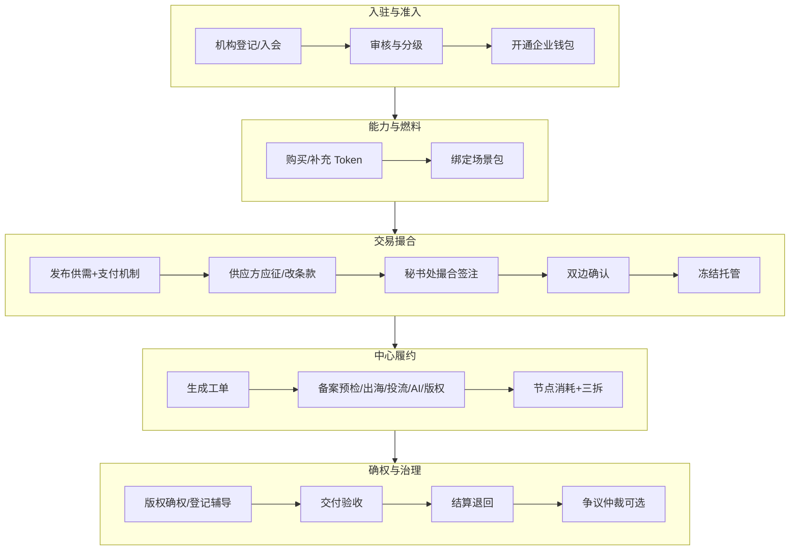

# 产业服务全流程 SOP · 标准作业手册

> **SOP 版本**：1.8.1  
> **对象**：联盟秘书处、会员单位、五大中心专员、协作验证方（Minimax / Trae）  
> **基线**：`xian-drama-saas` v1.8.1  
> **读法**：先看总览泳道，再按章节执行；每步标注【已落地】或【SOP 设计】（演示约定，代码未全开）

配套阅读：[`TRANSACTION.md`](./TRANSACTION.md)（钱怎么走）· [`PRD.md`](./PRD.md)（验收故事）

---

## 0. 总览：一条片子从入会到闭环



| 阶段 | 主责 | 系统入口 | 产出物 |
|------|------|----------|--------|
| 1 登记入会 | 秘书处 + 申请机构 | `/alliance/console/members` | 有效会员、企业档案 |
| 2 购 Token | 会员 / 中心 | 会员项目钱包；`/center/console/tokens` | `OrgWallet` / `TokenWallet` |
| 3 发布与应征 | 需求方 / 供给方 | `/alliance/member/needs` | `MatchNeed` + `MatchBid` |
| 4 撮合签注 | 秘书处 | `/alliance/console/matching` | 成交条款、最终支付机制 |
| 5 确认与托管 | 双方 / 系统 | Deal `confirm` + `close` | `escrow` / `locked` |
| 6 中心履约 | 五大中心 | 中心工单 + 生态闭环模拟 | ledger 消耗/三拆 |
| 7 确权登记 | 版权中心 | `/center/...` 版权案件 | 确权/登记结论 |
| 8 验收结算 | 买方 + 秘书处 | `/alliance/console/loop` | 激励释放、退款、闭环 |
| 9 仲裁 | 秘书处主持 | 【SOP 设计】争议单 | 裁定、补偿流水 |

---

## 1. 机构登记与入会 SOP

### 1.1 目的
把「能对接的合法经营主体」登记进联盟名册，赋予发布供需、开钱包、接单资格。

### 1.2 角色
- **申请方**：影视公司 / 译制 / 投流 / 场地方等  
- **审核方**：联盟秘书处  
- **协办**：审批中心（必要时做合规背景提示）

### 1.3 标准步骤

| 步 | 动作 | 操作位置 | 通过标准 | 状态 |
|----|------|----------|----------|------|
| 1 | 收集机构信息：名称、类型、城市、联系人、电话、擅长标签 | 会员管理新建 / 线下表单录入 | 字段齐全、电话可联 | 【已落地】会员 CRUD |
| 2 | 核验主体：营业执照/介绍材料（演示可跳过） | 线下或附件【SOP 设计】 | 主体真实、无重大失信 | 【SOP 设计】 |
| 3 | 定级：核心 / 专业 / 观察会员 | `Member.tier` | 与贡献能力匹配 | 【已落地】字段 |
| 4 | 状态改为「有效」；「待审」不可成交 | `Member.status` | 有效才可被撮合 | 【已落地】 |
| 5 | 开通企业钱包：可用余额初始额度（演示种子已预置） | `orgWallets` | 有余额或可一键补额 | 【已落地】 |
| 6 | 通知会员登录入口与演示账号规则 | `/alliance/login` | 会员能进门户 | 【已落地】 |

### 1.4 异常
- **材料不全**：保持「待审」，开联盟工单「会员入会审核」跟进。  
- **退出**：状态改「退出」，关闭其开放供需，在途 Deal 仍须履约完结。

### 1.5 SLA（运营约定）
- 入会初审：2 个工作日  
- 补正后复审：1 个工作日  

---

## 2. 购买 / 补充 Token SOP

### 2.1 先分清两层 Token

| 层 | 谁持有 | 用途 | 入口 |
|----|--------|------|------|
| **机构履约 Token** | 会员 `OrgWallet` | 成交冻结、托管燃烧、激励入账 | 会员「项目钱包」一键补 50k；成交前自动补额 |
| **中心燃料 Token** | 中心 `TokenWallet` | 中心侧模型/产能用量叙事与套餐购买 | `/center/console/tokens` |

> Token **不是**游戏币：机构层是托管媒介；中心层是履约产能计量。详见 TRANSACTION。

### 2.2 会员补充机构 Token（买方准备开单）

| 步 | 动作 | 通过标准 | 状态 |
|----|------|----------|------|
| 1 | 登录会员门户 →「项目钱包」 | 看到可用 / 锁定 | 【已落地】 |
| 2 | 余额不足以覆盖「机制锁定金额」时点击「补充 50k」或成交时由秘书处触发补额 | `balance` 上升 | 【已落地】 |
| 3 | 成交瞬间：按支付机制从 `balance` → `locked`，写入 Deal `escrow` | 锁定成功才开工单 | 【已落地】 |

**锁定金额速查**

| 支付机制 | 开单冻结 |
|----------|----------|
| 预付 | 预算 100% |
| 过程支付 | 预算 40%（履约不足再追加） |
| 验收后支付 | 预算 100%（激励暂挂） |

### 2.3 中心购买套餐 Token

| 步 | 动作 | 通过标准 | 状态 |
|----|------|----------|------|
| 1 | 中心登录 → Token 服务 | 见套餐/模型目录/API Key | 【已落地】 |
| 2 | 选择套餐「购买」（演示入账，非法币） | `tokenWallet.balance`↑，流水「充值」 | 【已落地】 |
| 3 | 履约消耗时中心侧可记一笔关联消耗（与 Deal 联动） | 流水可追溯 | 【已落地】部分 |
| 4 | 需要时「重新生成 API Key」 | 旧 Key 作废叙事 | 【已落地】 |

### 2.4 异常
- **余额不足无法冻结**：提示充值；禁止无托管空转工单。  
- **误充**：演示环境用「重置演示数据」；生产需财务冲正【SOP 设计】。

---

## 3. 供需发布与应征 SOP

### 3.1 需求方发布

| 步 | 动作 | 字段 | 状态 |
|----|------|------|------|
| 1 | 会员 →「发布供需」 | 我需要 / 我可提供 | 【已落地】 |
| 2 | **设定支付机制**：预付 / 过程支付 / 验收后支付 + 说明 | `preferredPayMechanism` | 【已落地】 |
| 3 | 提交 → 状态「开放」 | 秘书处撮合池可见 | 【已落地】 |

### 3.2 供应方应征（可要求改机制）

| 步 | 动作 | 通过标准 | 状态 |
|----|------|----------|------|
| 1 | 在开放供需列表选择他人要约 | 非本人供需 | 【已落地】 |
| 2 | 勾选「接受买方机制」或取消后选择主张机制 | `MatchBid` | 【已落地】 |
| 3 | 填写应征说明 / 改机制理由；可选报价 Tokens | 理由清楚可审 | 【已落地】 |
| 4 | 提交后状态「待审」；供需可转为「撮合中」 | 秘书处可见 | 【已落地】 |
| 5 | 可撤回待审应征 | 状态「撤回」 | 【已落地】 |

### 3.3 异常
- 重复待审应征：拒绝，先撤回再投。  
- 供需已成交/关闭：不可应征。

---

## 4. 撮合签注 SOP（秘书处核心）

「签注」= 秘书处对**对手方、场景包、支付机制、报价**做背书确认，并落成交。

### 4.1 签注检查清单（成交前必勾）

- [ ] 双方均为「有效」会员  
- [ ] 需求描述可执行，非纯闲聊  
- [ ] 场景包与需求匹配（出海/备案/投流/AI/场地）  
- [ ] 支付机制已谈拢：采纳应征 **或** 手动选定并注明来源（买方/供方/协商）  
- [ ] 买方可用余额 ≥ 机制首冻金额（不足先补额）  
- [ ] 无未结重大争议（见第 9 章）

### 4.2 操作步骤

| 步 | 动作 | 入口 | 状态 |
|----|------|------|------|
| 1 | 打开供需流水线，阅读买方机制与应征条款 | `/alliance/console/matching` | 【已落地】 |
| 2 | **签注路径 A**：点「采纳并成交」→ 以供方主张机制/报价开 Deal | `reviewBid accept` | 【已落地】 |
| 3 | **签注路径 B**：选用条款后改供给方/场景/机制 →「成交并开预算」 | `closeDeal` | 【已落地】 |
| 4 | 系统自动：双边确认（演示）、冻结托管、生成中心/联盟工单 | Deal + WorkOrder | 【已落地】 |
| 5 | 在 ledger 首条可见「托管锁定」与机制说明 | 可审计 | 【已落地】 |

### 4.3 签注话术模板（可贴工单备注）

```
【撮合签注】
供需：{matchId} {buyer} × {supplier}
场景包：{sceneName} / 预算 {budget}
支付机制：{payMechanism}（来源：买方设定|供方主张|协商）
应征依据：{bidId 或 无}
风险提示：{无 / 简述}
签注人：{秘书处姓名} 日期：{date}
```

---

## 5. 双边确认与托管 SOP

| 步 | 动作 | 系统 | 状态 |
|----|------|------|------|
| 1 | 买方确认标的与对价 | `confirm` side=buyer | 【已落地】API；演示成交常自动确认 |
| 2 | 卖方确认可交付 | `confirm` side=supplier | 【已落地】 |
| 3 | 双侧确认后进入「托管中」；未确认不得消耗 | phase 校验 | 【已落地】 |
| 4 | 按机制冻结：预付/验收后 100%；过程 40% | `lockAmount` | 【已落地】 |

**原则**：无 escrow，中心不接扣费（先锁定再干活）。

---

## 6. 五大中心履约 SOP

### 6.1 通用节点（所有中心）

| 步 | 动作 | 通过标准 | 状态 |
|----|------|----------|------|
| 1 | 认领关联工单（`dealId`） | 工单状态→处理中 | 【已落地】工单 |
| 2 | 按里程碑推进；每节点从托管池 `consume` | ledger 有消耗+三拆 | 【已落地】生态页模拟 |
| 3 | 填写节点交付物摘要（意见书/译制包/复盘等） | 备注可查 | 【部分】summary |
| 4 | 预算将尽时提醒买方补额或收尾结算 | 过程支付可自动追加冻结 | 【已落地】追加冻结 |

### 6.2 分中心要点

| 中心 | 典型产品 | 关键产出 | 扣费触发 |
|------|----------|----------|----------|
| **审批** | 备案材料预检、风险会诊 | 风险结论、送审建议 | 预检提交/意见出具 |
| **出海** | 选品诊断、合规、译制 | 市场评分、译制交付 | 诊断/译制节点 |
| **发行投流** | 新剧体检、冷启动、复盘 | ROI/素材策略 | 冷启动任务 |
| **版权** | 确权、登记辅导、授权、维权 | 见第 7 章 | 案件阶段推进 |
| **AI** | 剧本/素材/合规辅助 | 产线产出物 | 跑批用量 |

演示：秘书处/运营可在 `/alliance/console/loop` 点「履约释放」模拟中心扣费。

---

## 7. 确权 / 登记辅导 SOP（版权中心）

### 7.1 目的
为剧本、成片、素材、商标等建立**可出示的权属与登记路径**，降低授权与出海纠纷。

### 7.2 案件类型（系统字段）

`确权` | `登记辅导` | `授权` | `维权`

### 7.3 确权标准步骤

| 步 | 动作 | 产出 | 状态 |
|----|------|------|------|
| 1 | 收件：作品名称、权利人、创作说明、权属证明扫描件 | 版权案件「进行中」 | 【已落地】案件列表 |
| 2 | 形式审查：主体一致、权属链完整 | 补正清单或进入实审 | 【SOP 设计】清单 |
| 3 | 出具《权属核验意见》（演示：案件备注/结果） | 可对接授权与出海 | 【SOP 设计】文书 |
| 4 | 需要登记的：进入「登记辅导」——材料清单、渠道指引、进度回传 | 状态「已完成」或「转介」外官登记 | 【已落地】状态枚举 |
| 5 | 与 Deal 关联（若由撮合触发）：节点消耗计入托管 | ledger | 【SOP 设计】强关联 |

### 7.4 登记辅导材料清单（运营用）

1. 权利人主体证件  
2. 作品说明书 / 分集大纲或成片哈希/样片  
3. 合作创作协议或职务作品说明  
4. 授权链路（若非原始权利人）  
5. 联系人与送达地址  

### 7.5 SLA
- 形式审查：3 个工作日  
- 核验意见：5 个工作日（复杂权属可延期并书面告知）

---

## 8. 验收与结算 SOP

### 8.1 验收（买方主导）

| 步 | 动作 | 说明 | 状态 |
|----|------|------|------|
| 1 | 对照里程碑与 `consideration` 标的验收 | 译制分钟/意见书/复盘等 | 【SOP 设计】勾选 UI |
| 2 | 机制=验收后支付：验收通过后才释放 `heldBroker` / `heldSupplier` | 结算接口释放 | 【已落地】结算释放 |
| 3 | 机制=预付/过程：激励多已随消耗入账；验收主要确认交付 | — | 【已落地】 |

### 8.2 结算

| 步 | 动作 | 结果 | 状态 |
|----|------|------|------|
| 1 | 秘书处或买方触发「结算并退回剩余托管」 | `/loop` 或 API `settle` | 【已落地】 |
| 2 | 释放暂挂激励 → 各方钱包 | held→earned | 【已落地】 |
| 3 | 未消耗 escrow 退回买方 `balance`，减少 `locked` | 退款流水 | 【已落地】 |
| 4 | Deal phase=`已闭环`；工单完结 | 可评价【SOP 设计】 | 【已落地】闭环 |

---

## 9. 争议与仲裁 SOP

> 当前代码无独立争议单实体；本章为**运营 SOP + 下一迭代数据模型约定**。演示期可用联盟工单标题加前缀「【争议】」。

### 9.1 可仲裁范围
- 交付是否达标（对照 consideration / 里程碑）  
- 支付机制理解争议（是否应改预付等）  
- 激励/退款计算异议  
- 权属冲突影响履约  

**不可仲裁（须外送）**：刑事案件、行政诉讼、已诉讼保全的案件。

### 9.2 流程

| 步 | 动作 | 时限 | 状态 |
|----|------|------|------|
| 1 | **提起**：任一方在会员服务申请或联系秘书处；说明 Deal 编号、诉请、证据 | 履约中或结算后 10 日内 | 【SOP 设计】 |
| 2 | **立案**：秘书处开「【争议】」工单；项目可「暂停」消耗 | 1 个工作日 | 【SOP 设计】暂停枚举已有 |
| 3 | **调解**：组织双方书面/会议调解；可调里程碑或机制 | 5 个工作日 | 【SOP 设计】 |
| 4 | **裁决**：秘书处出具一页裁定（责任、Token 调整方向） | 调解失败后 3 日 | 【SOP 设计】 |
| 5 | **执行**：按裁定补扣/退回/释放暂挂；ledger 记「退款/补预算」等 | 2 个工作日 | 【部分】已有流水类型 |
| 6 | **结案**：争议工单完结；必要时报版权中心「维权」 | — | 【已落地】维权类型 |

### 9.3 裁定原则（内部）
1. 以托管池与 ledger 为准，口头约定不对抗流水  
2. 验收后支付争议：未验收不强制释放供给激励  
3. 恶意拖延验收：秘书处可代理验收节点并记录  
4. 明显欺诈：会员降级/退出，在途单保护善意方  

### 9.4 争议单字段（下迭代建议）

```
Dispute {
  id, dealId, raisedBy, reason,
  status: 调解中|已裁决|已撤回|已执行,
  claimTokens, decision, decidedBy, createdAt
}
```

---

## 10. 活动、展示与日常运营 SOP（简表）

| 事项 | 步骤摘要 | 入口 | 状态 |
|------|----------|------|------|
| 活动运营 | 创建活动→报名中→控制名额→结束后沉淀供需 | `/alliance/console/events` | 【已落地】 |
| 作品展示 | 会员上传作品信息→秘书处精选→发现页曝光 | 会员作品 / 内容推荐 | 【已落地】 |
| 场地推荐 | 维护场地标签与状态→会员发现页对接 | 场地数据 | 【已落地】 |
| 联盟工单 | 入会审核、协调类非 Deal 事务 | `/alliance/console/orders` | 【已落地】 |
| KPI | 周看会员数、开放供需、在途 Deal、撮合费 | `/alliance/console/kpi` | 【已落地】 |
| 演示复位 | 验证前 `resetDemo` / API reset | 顶栏「重置演示」 | 【已落地】 |

---

## 11. 端到端演练脚本（30 分钟）

按此跑一遍即覆盖 SOP 主干：

1. **秘书处**登录 → 会员管理确认「长安映缔影视」有效  
2. **会员**登录 → 项目钱包看余额；不足则补 50k  
3. **会员**发布供需，选「验收后支付」  
4. 换视角/种子数据：在开放供需下以他司逻辑应征，要求改为「预付」  
5. **秘书处**撮合页采纳应征或手动成交 → 得 DEAL  
6. **生态闭环**履约释放一笔 → 看三拆；若验收后则看「暂挂」  
7. **结算** → 暂挂释放 + 剩余退回  
8. **中心**登录版权 → 看确权/登记案件状态叙事  
9. **中心** Token 页购买套餐，讲清与机构托管是两层  

验收记录模板见 [`MVP-VALIDATION.md`](./MVP-VALIDATION.md)。

---

## 12. RACI（谁负责）

| 事项 | 会员需求方 | 会员供给方 | 秘书处 | 中心 |
|------|:----------:|:----------:|:------:|:----:|
| 入会材料 | A | A | R | C |
| 购机构 Token | R | C | C | I |
| 发布供需/设机制 | R | I | C | I |
| 应征/改机制 | I | R | C | I |
| 撮合签注成交 | C | C | R | I |
| 履约消耗 | C | C | A | R |
| 确权登记 | C | C | A | R（版权） |
| 验收 | R | C | A | C |
| 结算 | C | C | R | I |
| 仲裁 | C | C | R | C |

R=执行 A=问责 C=协商 I=知情

---

## 13. 落地状态总表

| SOP 章节 | 已落地 | 设计中（下迭代） |
|----------|--------|------------------|
| 入会登记 | 会员 CRUD、分级状态 | 证照附件、自动核验 |
| 购 Token | 机构补额、中心套餐 | 法币支付、发票 |
| 发布/应征/机制 | 全流程 | 消息通知 |
| 撮合签注 | 成交+应征采纳 | 签注文书 PDF |
| 确认托管 | escrow/机制/暂挂 | 强制人工双确认 UI |
| 中心履约 | 工单+consume 模拟 | 工单状态自动 consume |
| 确权登记 | 案件类型与状态 | 材料清单与文书 |
| 验收结算 | settle 释放/退款 | 验收勾选清单 |
| 仲裁 | 工单+暂停状态可借用 | Dispute 实体与执行器 |

---

## 14. 修订

| 版本 | 日期 | 说明 |
|------|------|------|
| 1.0 | 2026-07-26 | 首版全流程 SOP，对齐 v1.8 支付机制与应征 |
| 1.8.1 | 2026-07-26 | 与产品 v1.8.1 对齐；提供可打印版 |
