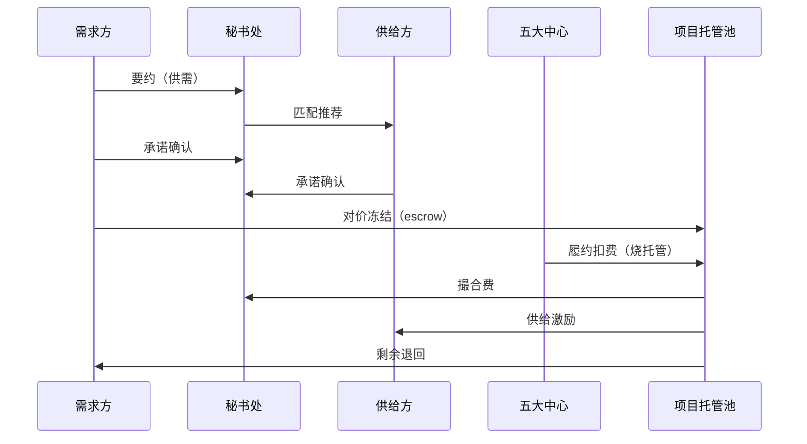

# 交易本质逻辑 · 撮合生态的「钱与信任」怎么走

> 给产品 / Minimax / Trae / 内部讲清楚：**我们到底在交易什么**。  
> 代码基线：v1.8+（托管 escrow + 支付机制 + 供应方应征改条款）  
> 作业步骤与角色职责见 [`SOP.md`](./SOP.md)

---

## 1. 一句话

微短剧产业里的「成交」，不是改一个状态按钮，而是：

**用可托管的对价（Token），把不确定的人情协作，变成可履约、可分账、可追溯的项目契约。**

---

## 2. 交易的七个本质动作

任何健康交易都可拆成七步（本系统映射如下）：

| # | 本质 | 人类语言 | 系统对象 |
|---|------|----------|----------|
| 1 | **要约 Offer** | 「我需要…，我能提供…」 | `MatchNeed` |
| 2 | **匹配 Match** | 秘书处找到对手方与场景 | `suggestedPartner` + `ScenePackage` |
| 3 | **承诺 Acceptance** | 买方/卖方点头（或秘书处代理确认） | `buyerAccepted` / `supplierAccepted` |
| 4 | **对价 Consideration** | 这笔合作「值多少履约燃料」 | 场景包 `tokens` + `consideration` 文案 |
| 5 | **托管 Escrow** | 钱先冻住，谁也别先吃完 | `deal.escrow`；买方 `locked` |
| 6 | **履约 Performance** | 中心按节点干活并烧预算 | `consume` + `milestones` |
| 7 | **结算 Settlement** | 分账落袋，剩余退回，信用沉淀 | `已结算`；未用 escrow 退买方 |



---

## 3. 我们真正交易的「标的」是什么？

不是 Token 本身。Token 只是**计价与托管媒介**。

每笔 Deal 的标的（`consideration`）是一类**可交付产能**：

| 场景包 | 标的（人对人能听懂） |
|--------|----------------------|
| 出海译制 | 译制分钟数 + 合规意见 + 渠道诊断 |
| 备案预检 | 材料风险结论 + 送审建议 |
| 投流冷启动 | 体检报告 + 素材策略 + 复盘 |
| AI 包 | 大纲/素材产能时段 |
| 场地协调 | 档期与许可协调结果 |

**定价原则**：场景包价格 = 完成该类标的的「可信履约成本」演示值，而不是模型 API 牌价。

---

## 4. 资金占用：为什么必须有托管（Escrow）

### 错误模型（旧直觉）

> 成交时直接把 Token「花掉」→ 供给方激励像凭空印钞。

### 正确模型（本质）

```
买方 free balance
    │ 成交锁定
    ▼
deal.escrow（项目托管池）──── 履约消耗 ──► 拆成三笔去向
                              ├─ 中心履约成本（燃烧/平台）
                              ├─ 秘书处撮合费（服务对价）
                              └─ 供给方激励（交付对价）
    │
    └─ 结算时剩余 ──退回──► 买方 free balance
```

机构钱包字段：

- `balance`：可自由支配（可再开新单）  
- `locked`：已进入各项目托管、尚未消耗或退回的合计  

**会计恒等式（演示层）**

```
买方：Δbalance = -锁定 + 退回
项目：escrow = budget - spent（近似，spent 为已从托管释放总额）
分账：每次 consume 的 amount = 中心保留 + 撮合费 + 供给激励
```

---

## 5. 阶段状态机（比「预算已开/履约中」更接近交易）

| phase | 含义 | 谁推动 | 资金 |
|-------|------|--------|------|
| `要约中` | 仅有供需，未锁定对手 | 会员/秘书处 | 无 |
| `待双边确认` | 已指定对手与场景，等点头 | 买方/卖方 | 尚未锁定 |
| `托管中` | 对价已冻结，等待开工 | 系统/秘书处 | escrow = budget |
| `履约中` | 至少一次有效消耗 | 中心 | escrow 下降 |
| `结算中` | 预算耗尽或主动收尾 | 秘书处/系统 | 准备退款 |
| `已闭环` | 分账完成、剩余退回 | 系统 | escrow=0 |

产品层 `status` 仍可对运营简化为：`待确认` / `预算已开` / `履约中` / `已结算` / `暂停`。

---

## 6. 分账的本质：不是「奖励」，是「对价切割」

每次履约消耗 `spend`：

| 去向 | 比例来源 | 付给谁 | 买的是什么 |
|------|----------|--------|------------|
| 撮合费 | `brokerFeeRate` | 秘书处 | 匹配、背书、盯单 |
| 供给激励 | `supplierShare` | 供给方 | 产能/版权/渠道交付 |
| 中心保留 | `1 - 上两者` | 平台/中心成本池 | 审批/译制/投流/AI 真干活 |

因此激励**必须来自买方托管**，绝不能从系统外增发。

---

## 7. 支付机制（可协商条款）

需求方发布供需时可自由设定机制；供给方应征（`MatchBid`）时可接受或**要求改变机制**。秘书处成交时采纳应征或手动选定最终机制。

| 机制 | 开单冻结 | 履约时激励 | 典型诉求 |
|------|----------|------------|----------|
| **预付** | 预算 100% | 随 consume 即时入账 | 供给方要资金保障 |
| **过程支付** | 预算 40%；不足时追加冻结（`unfunded`↓） | 随 consume 即时入账 | 买方平滑现金流 |
| **验收后支付** | 预算 100%（担保） | 撮合费/激励进 `held*`，结算才释放 | 买方要验收后再付钱感 |

```
要约（买方设 preferredPayMechanism）
  → 应征（supplier 可 proposedPayMechanism ≠ 买方）
  → 成交（最终 payMechanism + payMechanismSource）
  → 按机制冻结 lockAmount
  → 履约 / 结算
```

API：`POST /alliance/bids`、`POST /alliance/bids/:id/review`（accept/reject/withdraw）、`close` 可带 `bidId` / `payMechanism`。

---

## 8. 信任最小单元

交易要降低的不是信息搜索成本 alone，而是四类不信任：

1. **对手方不靠谱** → 双边确认 + 秘书处背书  
2. **钱付了没交付** → 托管，按节点烧  
3. **交付了不给钱** → 激励随 consume 计提（验收后则结算释放）  
4. **扯皮无证据** → ledger 全流水  

MVP 用「下一步文案 + 流水」承载信任；下一迭代可加评分与争议单。

---

## 9. 产品原则（后续迭代勿破）

1. **先锁定再干活**：无 escrow 不履约扣费  
2. **消耗必三拆**：流水里能看见费/激励/燃烧  
3. **剩钱要退**：结算不得吞没未用托管  
4. **人话标的**：页面先写 consideration，再写 Token 数字  
5. **角色下一步永远可见**：买方/卖方/经纪/中心各一句话  
6. **机制可协商**：买方可设、供方可改、成交记来源  

---

## 10. 与代码映射

| 逻辑 | 文件 |
|------|------|
| 阶段/托管/机制/结算 | `src/utils/dealLoop.ts`、`server/dealLoop.mjs` |
| API | `POST /alliance/deals/close`、`/bids`、`/confirm`、`/consume`、`/settle` |
| 讲解页 | `/alliance/console/loop` 交易本质区 |
| 会员感知 | `/alliance/member/needs` 发布机制+应征；`/wallets` 托管钱包；`/deals` 项目 |
| 钱包中心 | `/alliance/console/wallets`、`/alliance/member/wallets`、快捷 `/wallets` |

---

## 11. 给验证者的判据

讲清楚下面四句，才算「理解交易本质」：

1. Token 是托管媒介，标的是场景产能。  
2. 激励来自买方冻结资金的切割，不是平台空投。  
3. 结算 = 分账落袋（含暂挂释放）+ 剩余退回 + 项目闭环。  
4. 支付机制由买方设定、供方可应征改条款，成交时落地为托管规则。
